## Source Documents


```r
#load requeried library

library("readxl")
```

```
Warning: package 'readxl' was built under R version 3.4.4
```

```r
#load file

case_data <- data.frame(read_excel("C:\\Users\\melis\\OneDrive\\Desktop\\SMU\\MSDS 6306 - Data Science\\Case Study 2\\CaseStudy2-data.xlsx"))

#Remove redundandt info
df <- case_data[,-c(9,10,22,27)]
```

Find correlation between parameters and Attrition


```r
# Convert characters to factors. First load required libraries; then code.
library(purrr)
library(dplyr)
```

```

Attaching package: 'dplyr'
```

```
The following objects are masked from 'package:stats':

    filter, lag
```

```
The following objects are masked from 'package:base':

    intersect, setdiff, setequal, union
```

```r
df %>% map_if(is.character, as.factor) %>% as_data_frame -> df

#Adjust factor levels
levels(df$BusinessTravel)<-c("Non-Travel","Travel_Rarely","Travel_Frequently")

#make all variable numeric
numdf<-data.frame(sapply(df,as.numeric))

#Correlate variables
Attcor<-data.frame(cor(numdf))

#Create Attrition object
Attrition<- data.frame(Attcor$Attrition)

#Name attrition rows
Attrition$Parameter<-row.names(Attcor)

#Rename titles Attrition
names(Attrition)<-c("Correlation", "Parameter")

#Sort Attrition
SortAtt <- Attrition[order(-Attrition$Correlation),]

head(SortAtt,10)
```

   Correlation          Parameter
2   1.00000000          Attrition
20  0.24611799           OverTime
16  0.16207023      MaritalStatus
6   0.07792358   DistanceFromHome
14  0.06715150            JobRole
5   0.06399060         Department
19  0.04349374 NumCompaniesWorked
10  0.02945325             Gender
8   0.02684555     EducationField
18  0.01517021        MonthlyRate
Generate graphics


```r
plot(Attrition~OverTime, data=df)
```

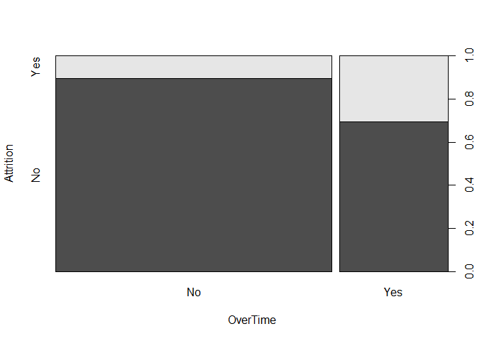<!-- -->

```r
plot(Attrition~MaritalStatus, data=df)
```

<!-- -->

```r
plot(Attrition~DistanceFromHome, data=df)
```

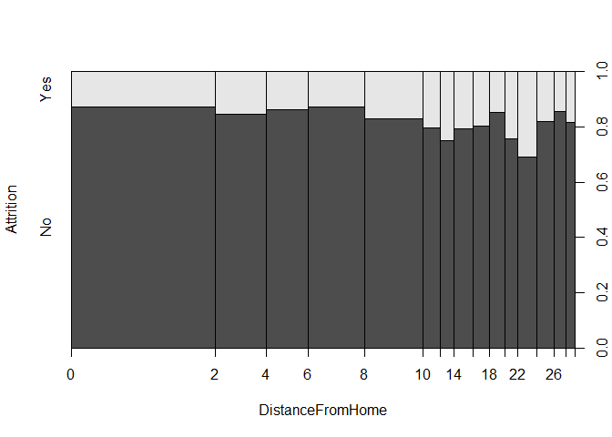<!-- -->

```r
plot(Attrition~JobRole, data=df)
```

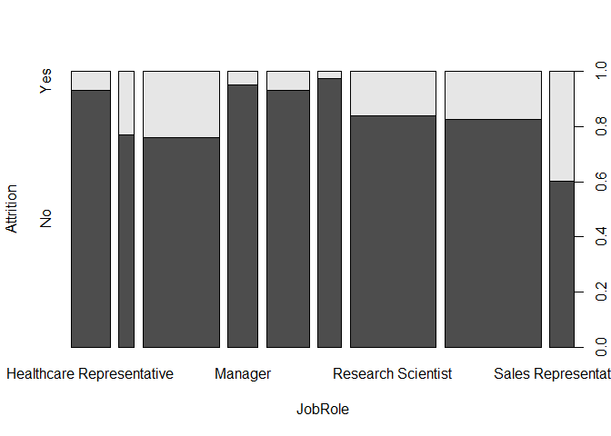<!-- -->

```r
plot(Attrition~Department, data=df)
```

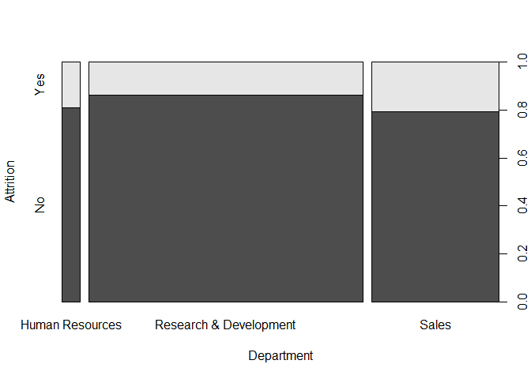<!-- -->

```r
plot(Attrition~NumCompaniesWorked, data=df)
```

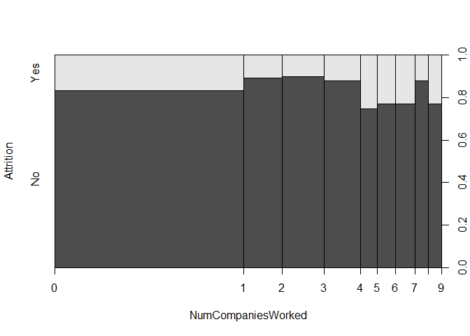<!-- -->

```r
plot(Attrition~Gender, data=df)
```

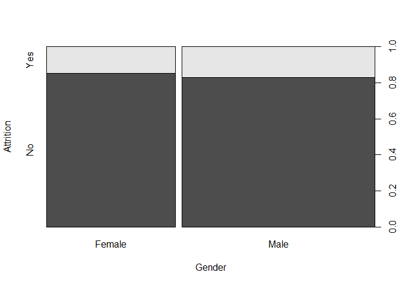<!-- -->

```r
plot(Attrition~EducationField, data=df)
```

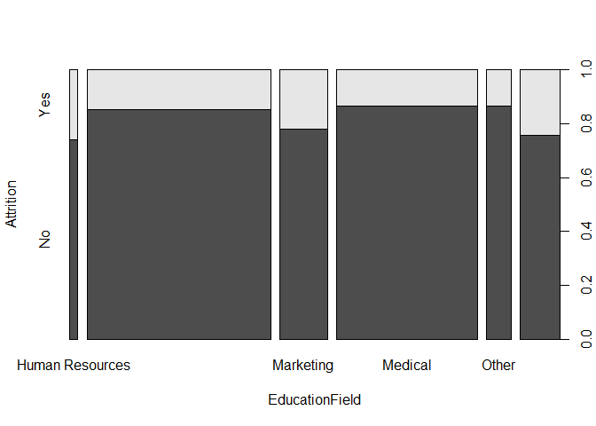<!-- -->

```r
plot(Attrition~MonthlyRate, data=df)
```

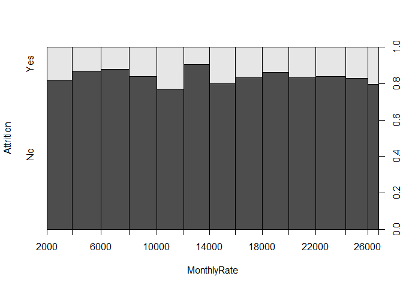<!-- -->

Check with absolute values

```r
Attrition$AbsAtt <- (Attrition$Correlation^2)^(1/2)
SortAbstAtt<- Attrition[order(-Attrition$AbsAtt),]
head(SortAbstAtt,10)
```

   Correlation            Parameter    AbsAtt
2    1.0000000            Attrition 1.0000000
20   0.2461180             OverTime 0.2461180
25  -0.1710632    TotalWorkingYears 0.1710632
13  -0.1691048             JobLevel 0.1691048
16   0.1620702        MaritalStatus 0.1620702
29  -0.1605450   YearsInCurrentRole 0.1605450
17  -0.1598396        MonthlyIncome 0.1598396
1   -0.1592050                  Age 0.1592050
31  -0.1561993 YearsWithCurrManager 0.1561993
24  -0.1371449     StockOptionLevel 0.1371449

```r
plot(Attrition~OverTime, data=df)
```

<!-- -->

```r
plot(Attrition~TotalWorkingYears, data=df)
```

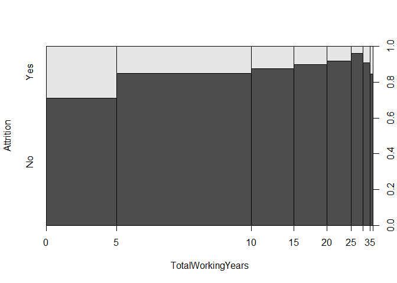<!-- -->

```r
plot(Attrition~JobRole, data=df)
```

<!-- -->

```r
plot(Attrition~ MaritalStatus, data=df)
```

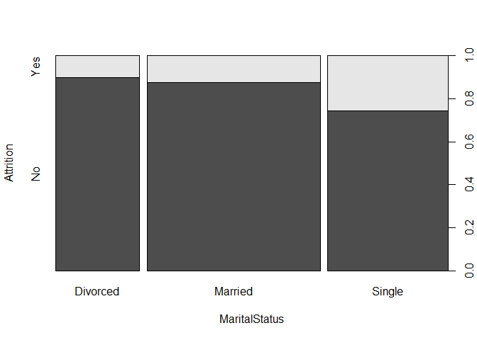<!-- -->

```r
plot(Attrition~YearsInCurrentRole, data=df)
```

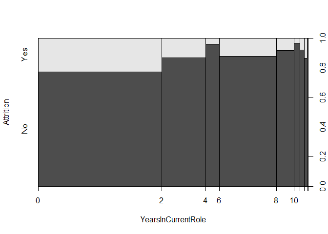<!-- -->

```r
plot(Attrition~MonthlyIncome, data=df)
```

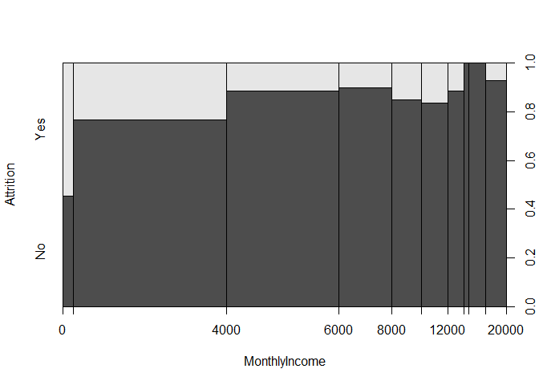<!-- -->

```r
plot(Attrition~Age, data=df)
```

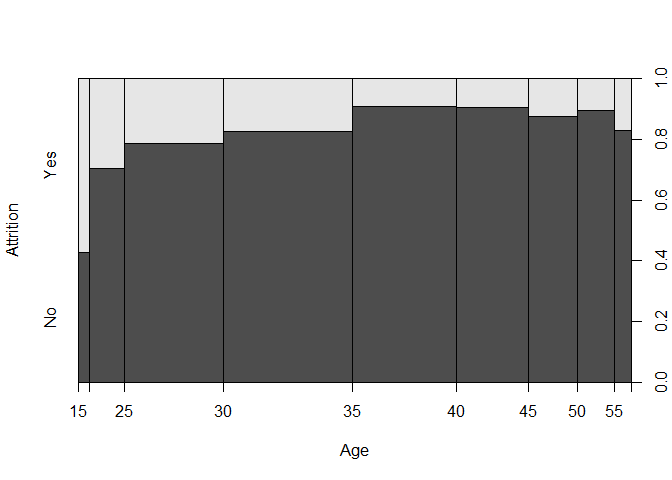<!-- -->

```r
plot(Attrition~YearsWithCurrManager, data=df)
```

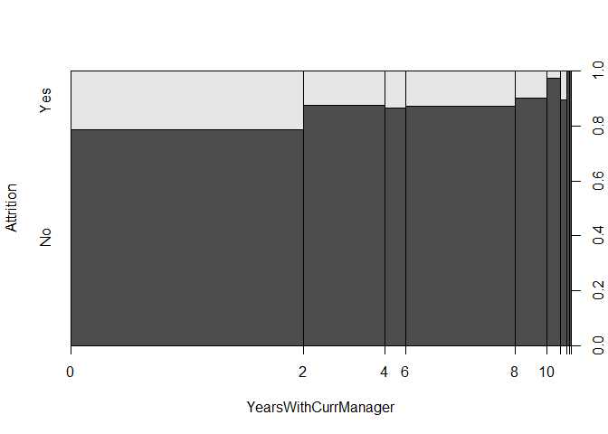<!-- -->

```r
plot(Attrition~StockOptionLevel, data=df)
```

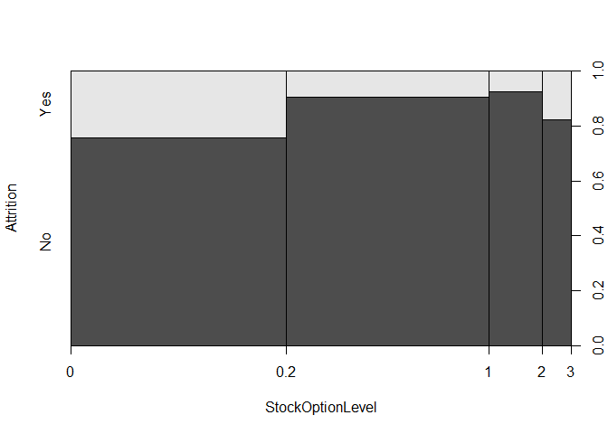<!-- -->

check scatterplot

