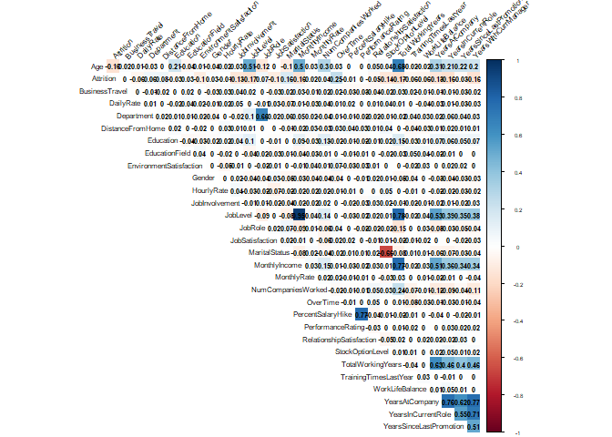
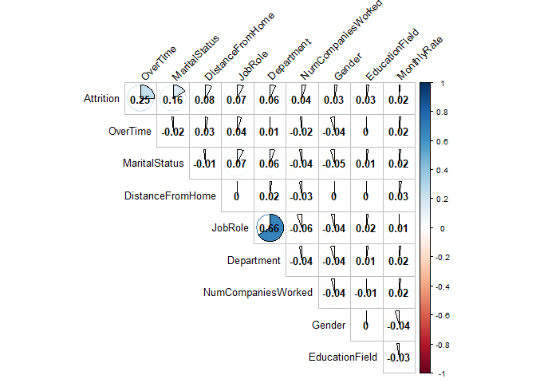
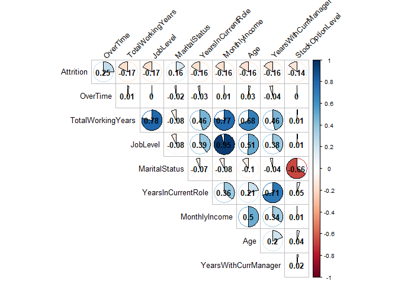
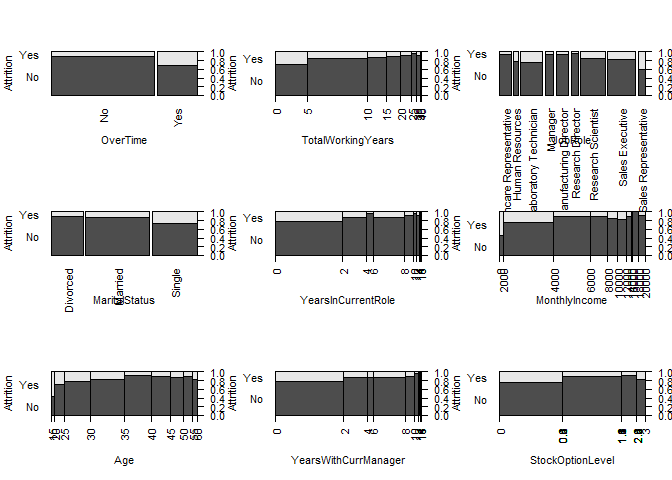

## Source Documents


```r
#load requeried library
library("readxl")
```

```
Warning: package 'readxl' was built under R version 3.4.4
```

```r
require(RCurl)
```

```
Loading required package: RCurl
```

```
Loading required package: bitops
```

```r
## Saved the xlsx documents on GitHub, the code below process information from GitHub instead of our local computers.

download.file("https://raw.githubusercontent.com/cyberkoolman/msds.6306.case.study.2/master/CaseStudy2-data.xlsx", "data2.xlsx", mode="wb")

## Assigned file to object 

case_data <- data.frame(read_excel("data2.xlsx"))
```


## Making the raw data tidy data


```r
#Remove redundandt info: EmployeeCount, EmployeeNumber, "Over18", "StandardHours"

df <- case_data[,-c(9,10,22,27)]

# First load required libraries.
library(purrr)
library(dplyr)
```

```
## 
## Attaching package: 'dplyr'
```

```
## The following objects are masked from 'package:stats':
## 
##     filter, lag
```

```
## The following objects are masked from 'package:base':
## 
##     intersect, setdiff, setequal, union
```

```r
library(knitr)

# Convert characters to factors.
df %>% map_if(is.character, as.factor) %>% as_data_frame -> df

#Adjust factor levels
levels(df$BusinessTravel)<-c("Non-Travel","Travel_Rarely","Travel_Frequently")

#make all variable numeric
numdf<-data.frame(sapply(df,as.numeric))
```


##Find correlation coeffientes between parameters and Attrition


```r
#Correlate variables
Attcor<-data.frame(cor(numdf))

#Create Attrition object for Attrition correlation coefficients 
Attrition<- data.frame(Attcor$Attrition)

#Name attrition rows
Attrition$Parameter<-row.names(Attcor)

#Rename titles Attrition
names(Attrition)<-c("Correlation", "Parameter")

#Sort Attrition
SortAtt <- Attrition[order(-Attrition$Correlation),]

#Display first 10
row.names(SortAtt)<-NULL
knitr::kable(head(SortAtt,10))
```


 Correlation  Parameter          
------------  -------------------
   1.0000000  Attrition          
   0.2461180  OverTime           
   0.1620702  MaritalStatus      
   0.0779236  DistanceFromHome   
   0.0671515  JobRole            
   0.0639906  Department         
   0.0434937  NumCompaniesWorked 
   0.0294533  Gender             
   0.0268455  EducationField     
   0.0151702  MonthlyRate        

## Generate graphics for visualization of coeffiecients and correlations


```r
# Load library to visualize correlations
library(corrplot)
```

```
## Warning: package 'corrplot' was built under R version 3.4.4
```

```
## corrplot 0.84 loaded
```

```r
#Full graphic
par(cex=.5)
corrplot(as.matrix(Attcor), method="color", 
         type="upper", 
         addCoef.col = "black",
         tl.col="black", tl.srt=45,
         sig.level = 0.05, insig = "blank", 
         diag=FALSE)
```

<!-- -->

```r
#Graphic with highest 10
par(cex=.8)
SA10<-c(head(SortAtt$Parameter,10))
corrplot(as.matrix(Attcor[SA10,SA10]), method="pie", 
         type="upper", 
         addCoef.col = "black",
         tl.col="black", tl.srt=45,
         sig.level = 0.05, insig = "blank", 
         diag=FALSE)
```

<!-- -->

```r
#Closer look
par(mfrow=c(3,3), las=2)
plot(Attrition~OverTime, data=df)
plot(Attrition~MaritalStatus, data=df)
plot(Attrition~DistanceFromHome, data=df)
plot(Attrition~JobRole, data=df)
plot(Attrition~Department, data=df)
plot(Attrition~NumCompaniesWorked, data=df)
plot(Attrition~Gender, data=df)
plot(Attrition~EducationField, data=df)
plot(Attrition~MonthlyRate, data=df)
```

<!-- -->

##Check with absolute values to look for highly correlated parameters with Attrition. And verify with graphics.

```r
##Calculate absolute value coefficients
Attrition$AbsAtt <- (Attrition$Correlation^2)^(1/2)
SortAbstAtt<- Attrition[order(-Attrition$AbsAtt),]

#Display first 10 Absolute Correlated Parameters
row.names(SortAbstAtt)<-NULL
knitr::kable(head(SortAbstAtt,10))
```


 Correlation  Parameter                  AbsAtt
------------  ---------------------  ----------
   1.0000000  Attrition               1.0000000
   0.2461180  OverTime                0.2461180
  -0.1710632  TotalWorkingYears       0.1710632
  -0.1691048  JobLevel                0.1691048
   0.1620702  MaritalStatus           0.1620702
  -0.1605450  YearsInCurrentRole      0.1605450
  -0.1598396  MonthlyIncome           0.1598396
  -0.1592050  Age                     0.1592050
  -0.1561993  YearsWithCurrManager    0.1561993
  -0.1371449  StockOptionLevel        0.1371449

```r
#Graphic with highest 10
par(cex=.8)
SAA10<-c(head(SortAbstAtt$Parameter,10))
corrplot(as.matrix(Attcor[SAA10,SAA10]), method="pie", 
         type="upper", 
         addCoef.col = "black",
         tl.col="black", tl.srt=45,
         sig.level = 0.05, insig = "blank", 
         diag=FALSE)
```

<!-- -->

```r
##Generate graphics
par(mfrow=c(3,3), las=2)
plot(Attrition~OverTime, data=df)
plot(Attrition~TotalWorkingYears, data=df)
plot(Attrition~JobRole, data=df)
plot(Attrition~ MaritalStatus, data=df)
plot(Attrition~YearsInCurrentRole, data=df)
plot(Attrition~MonthlyIncome, data=df)
plot(Attrition~Age, data=df)
plot(Attrition~YearsWithCurrManager, data=df)
plot(Attrition~StockOptionLevel, data=df)
```

<!-- -->

