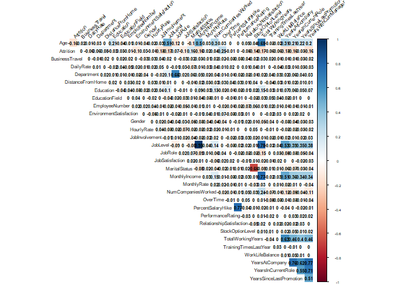
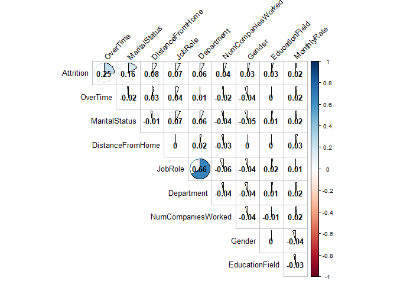
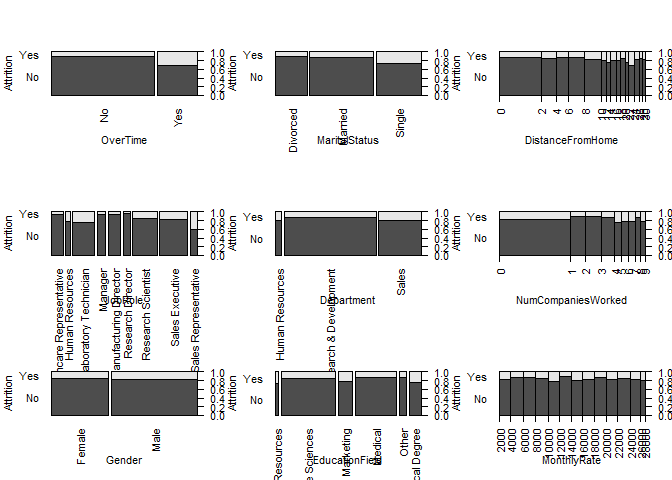
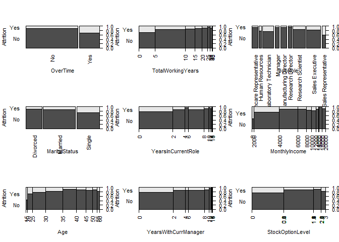
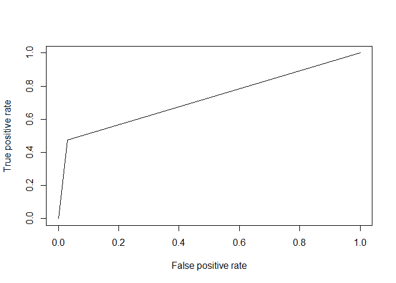
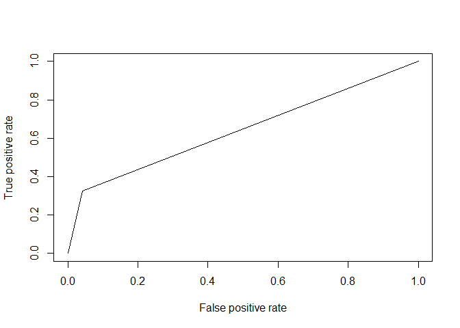

## Source Documents


```r
#load requeried library
library("readxl")
```

```
Warning: package 'readxl' was built under R version 3.4.4
```

```r
require(RCurl)
```

```
Loading required package: RCurl
```

```
Loading required package: bitops
```

```r
## Saved the xlsx documents on GitHub, the code below process information from GitHub instead of our local computers.

download.file("https://raw.githubusercontent.com/cyberkoolman/msds.6306.case.study.2/master/CaseStudy2-data.xlsx", "data2.xlsx", mode="wb")

## Assigned file to object 

case_data <- data.frame(read_excel("data2.xlsx"))
```


## Making the raw data tidy data


```r
#Remove redundandt info: EmployeeCount, EmployeeNumber, "Over18", "StandardHours"

df <- case_data[,-c(9,22,27)]

# First load required libraries.
library(purrr)
library(dplyr)
```

```
## 
## Attaching package: 'dplyr'
```

```
## The following objects are masked from 'package:stats':
## 
##     filter, lag
```

```
## The following objects are masked from 'package:base':
## 
##     intersect, setdiff, setequal, union
```

```r
library(knitr)

# Convert characters to factors.
df %>% map_if(is.character, as.factor) %>% as_data_frame -> df

#Adjust factor levels
levels(df$BusinessTravel)<-c("Non-Travel","Travel_Rarely","Travel_Frequently")

#make all variable numeric
numdf<-data.frame(sapply(df,as.numeric))
```


##Find correlation coeffientes between parameters and Attrition


```r
#Correlate variables
Attcor<-data.frame(cor(numdf))

#Create Attrition object for Attrition correlation coefficients 
Attrition<- data.frame(Attcor$Attrition)

#Name attrition rows
Attrition$Parameter<-row.names(Attcor)

#Rename titles Attrition
names(Attrition)<-c("Correlation", "Parameter")

#Sort Attrition
SortAtt <- Attrition[order(-Attrition$Correlation),]

#Display first 10
row.names(SortAtt)<-NULL
knitr::kable(head(SortAtt,10))
```


 Correlation  Parameter          
------------  -------------------
   1.0000000  Attrition          
   0.2461180  OverTime           
   0.1620702  MaritalStatus      
   0.0779236  DistanceFromHome   
   0.0671515  JobRole            
   0.0639906  Department         
   0.0434937  NumCompaniesWorked 
   0.0294533  Gender             
   0.0268455  EducationField     
   0.0151702  MonthlyRate        

## Generate graphics for visualization of coeffiecients and correlations


```r
# Load library to visualize correlations
library(corrplot)
```

```
## Warning: package 'corrplot' was built under R version 3.4.4
```

```
## corrplot 0.84 loaded
```

```r
#Full graphic
par(cex=.5)
corrplot(as.matrix(Attcor), method="color", 
         type="upper", 
         addCoef.col = "black",
         tl.col="black", tl.srt=45,
         sig.level = 0.05, insig = "blank", 
         diag=FALSE)
```

<!-- -->

```r
#Graphic with highest 10
par(cex=.8)
SA10<-c(head(SortAtt$Parameter,10))
corrplot(as.matrix(Attcor[SA10,SA10]), method="pie", 
         type="upper", 
         addCoef.col = "black",
         tl.col="black", tl.srt=45,
         sig.level = 0.05, insig = "blank", 
         diag=FALSE)
```

<!-- -->

```r
#Closer look
par(mfrow=c(3,3), las=2)
plot(Attrition~OverTime, data=df)
plot(Attrition~MaritalStatus, data=df)
plot(Attrition~DistanceFromHome, data=df)
plot(Attrition~JobRole, data=df)
plot(Attrition~Department, data=df)
plot(Attrition~NumCompaniesWorked, data=df)
plot(Attrition~Gender, data=df)
plot(Attrition~EducationField, data=df)
plot(Attrition~MonthlyRate, data=df)
```

<!-- -->

##Check with absolute values to look for highly correlated parameters with Attrition. And verify with graphics.

```r
##Calculate absolute value coefficients
Attrition$AbsAtt <- (Attrition$Correlation^2)^(1/2)
SortAbstAtt<- Attrition[order(-Attrition$AbsAtt),]

#Display first 10 Absolute Correlated Parameters
row.names(SortAbstAtt)<-NULL
knitr::kable(head(SortAbstAtt,10))
```


 Correlation  Parameter                  AbsAtt
------------  ---------------------  ----------
   1.0000000  Attrition               1.0000000
   0.2461180  OverTime                0.2461180
  -0.1710632  TotalWorkingYears       0.1710632
  -0.1691048  JobLevel                0.1691048
   0.1620702  MaritalStatus           0.1620702
  -0.1605450  YearsInCurrentRole      0.1605450
  -0.1598396  MonthlyIncome           0.1598396
  -0.1592050  Age                     0.1592050
  -0.1561993  YearsWithCurrManager    0.1561993
  -0.1371449  StockOptionLevel        0.1371449

```r
#Graphic with highest 10
par(cex=.8)
SAA10<-c(head(SortAbstAtt$Parameter,10))
corrplot(as.matrix(Attcor[SAA10,SAA10]), method="pie", 
         type="upper", 
         addCoef.col = "black",
         tl.col="black", tl.srt=45,
         sig.level = 0.05, insig = "blank", 
         diag=FALSE)
```

<!-- -->

```r
##Generate graphics
par(mfrow=c(3,3), las=2)
plot(Attrition~OverTime, data=df)
plot(Attrition~TotalWorkingYears, data=df)
plot(Attrition~JobRole, data=df)
plot(Attrition~ MaritalStatus, data=df)
plot(Attrition~YearsInCurrentRole, data=df)
plot(Attrition~MonthlyIncome, data=df)
plot(Attrition~Age, data=df)
plot(Attrition~YearsWithCurrManager, data=df)
plot(Attrition~StockOptionLevel, data=df)
```

<!-- -->

## Attemptinc logistic model


```r
#Converting numeric variables as factors
LM <- df
LM$Education <- as.factor(LM$Education)
LM$EnvironmentSatisfaction <- as.factor(LM$EnvironmentSatisfaction)
LM$JobInvolvement <- as.factor(LM$JobInvolvement)
LM$JobSatisfaction <- as.factor(LM$JobSatisfaction)
LM$PerformanceRating <- as.factor(LM$PerformanceRating)
LM$RelationshipSatisfaction <- as.factor(LM$RelationshipSatisfaction)
LM$WorkLifeBalance <- as.factor(LM$WorkLifeBalance)

## Creating a Training and Testing data set from sampling
smp<-floor(0.8*nrow(LM))
set.seed(1234)
ind <- sample(seq_len(nrow(LM)),size=smp)
train <- LM[ind,]
test <- LM[-ind,]

#Logistic Regression
model <- glm(Attrition ~ ., family = binomial(link = 'logit'), data = train)
cat(model$aic)
```

739.1682

```r
summary(model)
```


Call:
glm(formula = Attrition ~ ., family = binomial(link = "logit"), 
    data = train)

Deviance Residuals: 
    Min       1Q   Median       3Q      Max  
-1.9555  -0.4562  -0.1941  -0.0583   3.2417  

Coefficients:
                                   Estimate Std. Error z value Pr(>|z|)
(Intercept)                      -9.640e+00  6.702e+02  -0.014 0.988525
Age                              -2.381e-02  1.628e-02  -1.462 0.143642
BusinessTravelTravel_Rarely       2.301e+00  5.139e-01   4.478 7.55e-06
BusinessTravelTravel_Frequently   1.420e+00  4.742e-01   2.996 0.002738
DailyRate                        -6.263e-04  2.685e-04  -2.333 0.019668
DepartmentResearch & Development  1.264e+01  6.702e+02   0.019 0.984954
DepartmentSales                   1.254e+01  6.702e+02   0.019 0.985073
DistanceFromHome                  5.355e-02  1.301e-02   4.117 3.83e-05
Education2                        5.997e-02  3.867e-01   0.155 0.876754
Education3                       -1.193e-02  3.338e-01  -0.036 0.971489
Education4                       -4.138e-02  3.625e-01  -0.114 0.909118
Education5                       -2.515e-01  7.707e-01  -0.326 0.744172
EducationFieldLife Sciences      -1.207e+00  1.133e+00  -1.065 0.286720
EducationFieldMarketing          -7.075e-01  1.187e+00  -0.596 0.551144
EducationFieldMedical            -1.224e+00  1.131e+00  -1.083 0.278896
EducationFieldOther              -8.324e-01  1.201e+00  -0.693 0.488111
EducationFieldTechnical Degree   -7.799e-02  1.136e+00  -0.069 0.945282
EmployeeNumber                   -2.295e-04  1.833e-04  -1.252 0.210741
EnvironmentSatisfaction2         -1.394e+00  3.273e-01  -4.257 2.07e-05
EnvironmentSatisfaction3         -1.509e+00  3.070e-01  -4.916 8.85e-07
EnvironmentSatisfaction4         -1.831e+00  3.091e-01  -5.924 3.14e-09
GenderMale                        6.250e-01  2.247e-01   2.782 0.005409
HourlyRate                        1.368e-03  5.360e-03   0.255 0.798585
JobInvolvement2                  -8.720e-01  4.227e-01  -2.063 0.039126
JobInvolvement3                  -1.435e+00  3.973e-01  -3.612 0.000303
JobInvolvement4                  -2.736e+00  6.123e-01  -4.469 7.86e-06
JobLevel                         -4.601e-01  3.851e-01  -1.195 0.232198
JobRoleHuman Resources            1.328e+01  6.702e+02   0.020 0.984186
JobRoleLaboratory Technician      1.250e+00  5.466e-01   2.287 0.022196
JobRoleManager                   -1.327e+00  1.294e+00  -1.025 0.305393
JobRoleManufacturing Director     3.271e-01  5.792e-01   0.565 0.572218
JobRoleResearch Director         -1.592e+00  1.166e+00  -1.365 0.172313
JobRoleResearch Scientist         4.172e-01  5.586e-01   0.747 0.455146
JobRoleSales Executive            8.007e-01  1.662e+00   0.482 0.630038
JobRoleSales Representative       1.998e+00  1.710e+00   1.168 0.242617
JobSatisfaction2                 -8.246e-01  3.335e-01  -2.473 0.013407
JobSatisfaction3                 -8.237e-01  2.959e-01  -2.783 0.005380
JobSatisfaction4                 -1.295e+00  3.066e-01  -4.222 2.42e-05
MaritalStatusMarried              2.823e-01  3.216e-01   0.878 0.379978
MaritalStatusSingle               1.351e+00  4.199e-01   3.218 0.001290
MonthlyIncome                     1.293e-04  9.844e-05   1.313 0.189115
MonthlyRate                      -6.248e-07  1.475e-05  -0.042 0.966201
NumCompaniesWorked                1.933e-01  4.521e-02   4.276 1.91e-05
OverTimeYes                       2.150e+00  2.376e-01   9.049  < 2e-16
PercentSalaryHike                -2.492e-02  4.806e-02  -0.519 0.604045
PerformanceRating4                1.371e-01  4.863e-01   0.282 0.778066
RelationshipSatisfaction2        -7.873e-01  3.306e-01  -2.381 0.017250
RelationshipSatisfaction3        -1.081e+00  3.092e-01  -3.497 0.000470
RelationshipSatisfaction4        -9.415e-01  3.092e-01  -3.045 0.002329
StockOptionLevel                 -1.875e-01  1.976e-01  -0.949 0.342724
TotalWorkingYears                -9.186e-02  3.701e-02  -2.482 0.013073
TrainingTimesLastYear            -2.404e-01  8.857e-02  -2.715 0.006635
WorkLifeBalance2                 -9.404e-01  4.243e-01  -2.216 0.026686
WorkLifeBalance3                 -1.638e+00  3.993e-01  -4.102 4.10e-05
WorkLifeBalance4                 -1.136e+00  4.904e-01  -2.317 0.020482
YearsAtCompany                    1.638e-01  4.661e-02   3.513 0.000442
YearsInCurrentRole               -1.345e-01  5.414e-02  -2.484 0.012985
YearsSinceLastPromotion           1.524e-01  5.131e-02   2.970 0.002981
YearsWithCurrManager             -2.143e-01  5.515e-02  -3.886 0.000102
                                    
(Intercept)                         
Age                                 
BusinessTravelTravel_Rarely      ***
BusinessTravelTravel_Frequently  ** 
DailyRate                        *  
DepartmentResearch & Development    
DepartmentSales                     
DistanceFromHome                 ***
Education2                          
Education3                          
Education4                          
Education5                          
EducationFieldLife Sciences         
EducationFieldMarketing             
EducationFieldMedical               
EducationFieldOther                 
EducationFieldTechnical Degree      
EmployeeNumber                      
EnvironmentSatisfaction2         ***
EnvironmentSatisfaction3         ***
EnvironmentSatisfaction4         ***
GenderMale                       ** 
HourlyRate                          
JobInvolvement2                  *  
JobInvolvement3                  ***
JobInvolvement4                  ***
JobLevel                            
JobRoleHuman Resources              
JobRoleLaboratory Technician     *  
JobRoleManager                      
JobRoleManufacturing Director       
JobRoleResearch Director            
JobRoleResearch Scientist           
JobRoleSales Executive              
JobRoleSales Representative         
JobSatisfaction2                 *  
JobSatisfaction3                 ** 
JobSatisfaction4                 ***
MaritalStatusMarried                
MaritalStatusSingle              ** 
MonthlyIncome                       
MonthlyRate                         
NumCompaniesWorked               ***
OverTimeYes                      ***
PercentSalaryHike                   
PerformanceRating4                  
RelationshipSatisfaction2        *  
RelationshipSatisfaction3        ***
RelationshipSatisfaction4        ** 
StockOptionLevel                    
TotalWorkingYears                *  
TrainingTimesLastYear            ** 
WorkLifeBalance2                 *  
WorkLifeBalance3                 ***
WorkLifeBalance4                 *  
YearsAtCompany                   ***
YearsInCurrentRole               *  
YearsSinceLastPromotion          ** 
YearsWithCurrManager             ***
---
Signif. codes:  0 '***' 0.001 '**' 0.01 '*' 0.05 '.' 0.1 ' ' 1

(Dispersion parameter for binomial family taken to be 1)

    Null deviance: 1033.57  on 1175  degrees of freedom
Residual deviance:  621.17  on 1117  degrees of freedom
AIC: 739.17

Number of Fisher Scoring iterations: 15

```r
#run anova
knitr::kable(anova(model, test = 'Chisq'))
```

                            Df     Deviance   Resid. Df   Resid. Dev    Pr(>Chi)
-------------------------  ---  -----------  ----------  -----------  ----------
NULL                        NA           NA        1175    1033.5728          NA
Age                          1   34.5356675        1174     999.0371   0.0000000
BusinessTravel               2   17.5472581        1172     981.4898   0.0001548
DailyRate                    1    7.6473120        1171     973.8425   0.0056857
Department                   2    3.8698049        1169     969.9727   0.1444384
DistanceFromHome             1    6.7929361        1168     963.1798   0.0091519
Education                    4    0.9340428        1164     962.2457   0.9196268
EducationField               5    6.9382172        1159     955.3075   0.2252759
EmployeeNumber               1    0.4104317        1158     954.8971   0.5217505
EnvironmentSatisfaction      3   31.9303947        1155     922.9667   0.0000005
Gender                       1    3.9620178        1154     919.0047   0.0465379
HourlyRate                   1    0.0036240        1153     919.0011   0.9519965
JobInvolvement               3   28.1646242        1150     890.8364   0.0000034
JobLevel                     1   28.1207922        1149     862.7156   0.0000001
JobRole                      8   11.5898951        1141     851.1257   0.1704609
JobSatisfaction              3   12.1671193        1138     838.9586   0.0068321
MaritalStatus                2   29.9533989        1136     809.0052   0.0000003
MonthlyIncome                1    3.8892116        1135     805.1160   0.0485972
MonthlyRate                  1    0.3871914        1134     804.7288   0.5337794
NumCompaniesWorked           1   11.1766342        1133     793.5522   0.0008283
OverTime                     1   89.3857289        1132     704.1665   0.0000000
PercentSalaryHike            1    0.2176656        1131     703.9488   0.6408244
PerformanceRating            1    0.0012614        1130     703.9475   0.9716683
RelationshipSatisfaction     3   10.4274776        1127     693.5201   0.0152610
StockOptionLevel             1    2.4812611        1126     691.0388   0.1152098
TotalWorkingYears            1    4.4331120        1125     686.6057   0.0352482
TrainingTimesLastYear        1    8.2046665        1124     678.4010   0.0041783
WorkLifeBalance              3   20.9442809        1121     657.4567   0.0001081
YearsAtCompany               1    3.0247955        1120     654.4319   0.0820007
YearsInCurrentRole           1   10.6057272        1119     643.8262   0.0011274
YearsSinceLastPromotion      1    7.6059550        1118     636.2203   0.0058176
YearsWithCurrManager         1   15.0520926        1117     621.1682   0.0001046

```r
## Model 2 - Creating a Logistic Regression Model by removing not statistically significant variables to reduce AIC value

model2 <- glm(Attrition ~ Age + BusinessTravel + DistanceFromHome + EnvironmentSatisfaction +   JobInvolvement + JobRole + JobSatisfaction + MaritalStatus + NumCompaniesWorked + OverTime +   RelationshipSatisfaction + TrainingTimesLastYear + WorkLifeBalance + YearsAtCompany + YearsInCurrentRole + YearsSinceLastPromotion + YearsWithCurrManager, family = binomial(link = 'logit'), data = train)

model2$aic
```

[1] 732.6354

```r
summary(model2)
```


Call:
glm(formula = Attrition ~ Age + BusinessTravel + DistanceFromHome + 
    EnvironmentSatisfaction + JobInvolvement + JobRole + JobSatisfaction + 
    MaritalStatus + NumCompaniesWorked + OverTime + RelationshipSatisfaction + 
    TrainingTimesLastYear + WorkLifeBalance + YearsAtCompany + 
    YearsInCurrentRole + YearsSinceLastPromotion + YearsWithCurrManager, 
    family = binomial(link = "logit"), data = train)

Deviance Residuals: 
    Min       1Q   Median       3Q      Max  
-2.1200  -0.4649  -0.2178  -0.0769   3.3182  

Coefficients:
                                Estimate Std. Error z value Pr(>|z|)    
(Intercept)                      1.08558    0.97918   1.109 0.267573    
Age                             -0.04879    0.01363  -3.579 0.000344 ***
BusinessTravelTravel_Rarely      2.02296    0.48603   4.162 3.15e-05 ***
BusinessTravelTravel_Frequently  1.26672    0.45062   2.811 0.004938 ** 
DistanceFromHome                 0.04740    0.01232   3.847 0.000119 ***
EnvironmentSatisfaction2        -1.29418    0.31304  -4.134 3.56e-05 ***
EnvironmentSatisfaction3        -1.26831    0.28381  -4.469 7.86e-06 ***
EnvironmentSatisfaction4        -1.63164    0.29078  -5.611 2.01e-08 ***
JobInvolvement2                 -0.71925    0.39607  -1.816 0.069376 .  
JobInvolvement3                 -1.32355    0.37538  -3.526 0.000422 ***
JobInvolvement4                 -2.44555    0.57997  -4.217 2.48e-05 ***
JobRoleHuman Resources           1.45512    0.67453   2.157 0.030988 *  
JobRoleLaboratory Technician     1.58501    0.46621   3.400 0.000674 ***
JobRoleManager                  -0.95711    0.89596  -1.068 0.285407    
JobRoleManufacturing Director    0.32220    0.56576   0.570 0.569017    
JobRoleResearch Director        -1.49217    0.98829  -1.510 0.131081    
JobRoleResearch Scientist        0.74637    0.46853   1.593 0.111162    
JobRoleSales Executive           1.01309    0.45625   2.220 0.026388 *  
JobRoleSales Representative      2.26081    0.54243   4.168 3.07e-05 ***
JobSatisfaction2                -0.67708    0.31523  -2.148 0.031722 *  
JobSatisfaction3                -0.77194    0.27559  -2.801 0.005093 ** 
JobSatisfaction4                -1.28349    0.29352  -4.373 1.23e-05 ***
MaritalStatusMarried             0.35072    0.29883   1.174 0.240533    
MaritalStatusSingle              1.49589    0.30280   4.940 7.81e-07 ***
NumCompaniesWorked               0.14803    0.04134   3.581 0.000343 ***
OverTimeYes                      1.97247    0.22221   8.877  < 2e-16 ***
RelationshipSatisfaction2       -0.70059    0.31233  -2.243 0.024891 *  
RelationshipSatisfaction3       -0.92764    0.29178  -3.179 0.001476 ** 
RelationshipSatisfaction4       -0.81301    0.29185  -2.786 0.005340 ** 
TrainingTimesLastYear           -0.24427    0.08427  -2.899 0.003749 ** 
WorkLifeBalance2                -0.92350    0.40509  -2.280 0.022624 *  
WorkLifeBalance3                -1.52544    0.38073  -4.007 6.16e-05 ***
WorkLifeBalance4                -1.03315    0.46977  -2.199 0.027860 *  
YearsAtCompany                   0.09112    0.03743   2.434 0.014919 *  
YearsInCurrentRole              -0.12842    0.05098  -2.519 0.011769 *  
YearsSinceLastPromotion          0.16574    0.04825   3.435 0.000592 ***
YearsWithCurrManager            -0.20387    0.05279  -3.862 0.000112 ***
---
Signif. codes:  0 '***' 0.001 '**' 0.01 '*' 0.05 '.' 0.1 ' ' 1

(Dispersion parameter for binomial family taken to be 1)

    Null deviance: 1033.57  on 1175  degrees of freedom
Residual deviance:  658.64  on 1139  degrees of freedom
AIC: 732.64

Number of Fisher Scoring iterations: 7

```r
#run anova
knitr::kable(anova(model2, test = 'Chisq'))
```

                            Df     Deviance   Resid. Df   Resid. Dev    Pr(>Chi)
-------------------------  ---  -----------  ----------  -----------  ----------
NULL                        NA           NA        1175    1033.5728          NA
Age                          1   34.5356675        1174     999.0371   0.0000000
BusinessTravel               2   17.5472581        1172     981.4898   0.0001548
DistanceFromHome             1    7.0951076        1171     974.3947   0.0077295
EnvironmentSatisfaction      3   30.7121272        1168     943.6826   0.0000010
JobInvolvement               3   30.0050456        1165     913.6776   0.0000014
JobRole                      8   43.0339545        1157     870.6436   0.0000009
JobSatisfaction              3   12.4848302        1154     858.1588   0.0058941
MaritalStatus                2   29.6174159        1152     828.5414   0.0000004
NumCompaniesWorked           1   11.0016144        1151     817.5397   0.0009103
OverTime                     1   85.0556283        1150     732.4841   0.0000000
RelationshipSatisfaction     3    9.4742624        1147     723.0098   0.0236067
TrainingTimesLastYear        1    9.3375744        1146     713.6723   0.0022450
WorkLifeBalance              3   19.7387813        1143     693.9335   0.0001923
YearsAtCompany               1    0.0238453        1142     693.9096   0.8772791
YearsInCurrentRole           1   10.4511426        1141     683.4585   0.0012257
YearsSinceLastPromotion      1   10.0078164        1140     673.4507   0.0015588
YearsWithCurrManager         1   14.8152721        1139     658.6354   0.0001186

```r
## Model 3 - Creating a Logistic Regression Model with hightes 3 statitstically significant parameters

model3 <- glm(Attrition ~ EnvironmentSatisfaction + MaritalStatus + OverTime , family = binomial(link = 'logit'), data = train)

model3$aic
```

[1] 902.2549

```r
## Prediction for the train data

predmodel2 <- round(predict(model2,train,type='response'),digits=0)
comparison2 <- data.frame(predmodel2,train$Attrition,train$EmployeeNumber)
names(comparison2)<- c("Predicted","Actual","EmployeeNumber")
knitr::kable(head(comparison2))
```


 Predicted  Actual    EmployeeNumber
----------  -------  ---------------
         0  No                   228
         0  No                  1278
         0  No                  1250
         0  No                  2065
         1  Yes                 1767
         0  No                  1308

```r
pred2 <- ifelse(predmodel2>0.5,2,1)

library(ROCR)
```

```
Warning: package 'ROCR' was built under R version 3.4.4
```

```
Loading required package: gplots
```

```

Attaching package: 'gplots'
```

```
The following object is masked from 'package:stats':

    lowess
```

```r
library(Metrics)
```

```
Warning: package 'Metrics' was built under R version 3.4.4
```

```r
library(pROC)
```

```
Warning: package 'pROC' was built under R version 3.4.4
```

```
Type 'citation("pROC")' for a citation.
```

```

Attaching package: 'pROC'
```

```
The following object is masked from 'package:Metrics':

    auc
```

```
The following objects are masked from 'package:stats':

    cov, smooth, var
```

```r
pr <- prediction(pred2,train$Attrition)
perf <- performance(pr,measure = "tpr",x.measure = "fpr")
plot(perf)
```

<!-- -->

```r
auc(train$Attrition,pred2)
```

Area under the curve: 0.722

```r
## Prediction for the test data

predmodel3 <- round(predict(model2,test,type='response'),digits=0)
comparison3 <- data.frame(predmodel3,test$Attrition,test$EmployeeNumber)
names(comparison3)<- c("Predicted","Actual","EmployeeNumber")
knitr::kable(head(comparison3))
```


 Predicted  Actual    EmployeeNumber
----------  -------  ---------------
         0  No                     8
         0  No                    22
         0  No                    23
         0  Yes                   31
         1  Yes                   33
         0  No                    41

```r
pred3 <- ifelse(predmodel3>0.5,2,1)

pr3 <- prediction(pred3,test$Attrition)
perf3 <- performance(pr3,measure = "tpr",x.measure = "fpr")
plot(perf3)
```

<!-- -->

```r
auc(test$Attrition,pred3)
```

Area under the curve: 0.6429

Ref.:
https://www.hackerearth.com/practice/machine-learning/machine-learning-algorithms/logistic-regression-analysis-r/tutorial/
