# Executive Summary

# Introduction
DDSAnalytics is an analytics company that specializes in talent management solutions for Fortune 1000 companies. Talent management is defined as the iterative process of developing and retaining employees. It may include workforce planning, employee training programs, identifying high-potential employees and reducing/preventing voluntary employee turnover (attrition). To gain a competitive edge over its competition, DDSAnalytics decided to leverage data science for talent management. The executive leadership identified predicting employee turnover as its first application of data science for talent management. Before the business green lights the project, they tasked the data science team to conduct an analysis of existing employee data. The scope of this report is to summarize those findings.

To conduct exploratory data analysis (EDA), the data science team was provided with CaseStudy2Data.zip file to determine factors that lead to attrition. From this data, the team was asked to identify (at least) the top three factors that contribute to turnover, to learn about any job role specific trends that may exist in the data set (e.g., "Data Scientists have the highest job satisfaction") and to provide any other interesting trends and observations. All the Experiments and analysis were conducted in R. 

#EDA

## Loading data file from GitHub
1. Saved the excel fie into GitHub. The code below reads straight from GitHubs URL.


```r
#load requeried library
library("readxl")
```

```
Warning: package 'readxl' was built under R version 3.4.4
```

```r
require(RCurl)
```

```
Loading required package: RCurl
```

```
Loading required package: bitops
```

```r
## After unziping the provided datafile, the .xlsl document was loaded on GitHub, the code below process information from GitHub instead of our local computers.

download.file("https://raw.githubusercontent.com/cyberkoolman/msds.6306.case.study.2/master/CaseStudy2-data.xlsx", "data2.xlsx", mode="wb")

## Assign file to object 

case_data <- data.frame(read_excel("data2.xlsx"))
```


## Making the raw data tidy data

###1. Removing non-value added variables from the data set:

Justification for dropping the following variables: EmployeeCount, Over18 and StandardHours

EmployeeCount: Always 1, since the data set is by employee. 
Over18: All employees are "Y. Since we have Age, this variable is more useful. 
StandardHours: All are "80".


```r
#Remove redundandt info: EmployeeCount, Over18, StandardHours

df <- case_data[,-c(9,22,27)]
```

###2. Covertiving character variables to factors and factors to numeric variables as need

To evaluate correlations we will use numeric variables, and evaluate whether the correlations are positive or negative for teh character variables. Later we will use the factor variables for further analysis. Here will ended up with two data frames, one with level and numeric variables and one with only numeric variables.


```r
# First load required libraries.

library(purrr)
library(dplyr)
```

```
## 
## Attaching package: 'dplyr'
```

```
## The following objects are masked from 'package:stats':
## 
##     filter, lag
```

```
## The following objects are masked from 'package:base':
## 
##     intersect, setdiff, setequal, union
```

```r
library(knitr)

# Convert characters to factors.
df %>% map_if(is.character, as.factor) %>% as_data_frame -> df

#Adjust factor levels as needed
levels(df$BusinessTravel)<-c("Non-Travel","Travel_Rarely","Travel_Frequently")

#make all variable numeric
numdf<-data.frame(sapply(df,as.numeric))
```


##Find correlation coeffientes between parameters and Attrition
Calculate correlation coefficients between numeric variables. Pay closer attention to highest correating coeffients with Attrition


```r
#Correlate variables
Attcor<-data.frame(cor(numdf))

#Create Attrition object for Attrition correlation coefficients 
Attrition<- data.frame(Attcor$Attrition)

#Name attrition rows
Attrition$Parameter<-row.names(Attcor)

#Rename titles Attrition
names(Attrition)<-c("Correlation", "Parameter")

#Sort positive Attrition
SortAtt <- Attrition[order(-Attrition$Correlation),]

#Display top 10 positive correlations
row.names(SortAtt)<-NULL
knitr::kable(head(SortAtt,10))
```


 Correlation  Parameter          
------------  -------------------
   1.0000000  Attrition          
   0.2461180  OverTime           
   0.1620702  MaritalStatus      
   0.0779236  DistanceFromHome   
   0.0671515  JobRole            
   0.0639906  Department         
   0.0434937  NumCompaniesWorked 
   0.0294533  Gender             
   0.0268455  EducationField     
   0.0151702  MonthlyRate        

## Generate graphics for visualization of coeffiecients and correlations


```r
# Load library to visualize correlations
library(corrplot)
```

```
## Warning: package 'corrplot' was built under R version 3.4.4
```

```
## corrplot 0.84 loaded
```

```r
#Display graphic with all correlations
par(cex=.5)
corrplot(as.matrix(Attcor), method="color", 
         type="upper", 
         addCoef.col = "black",
         tl.col="black", tl.srt=45,
         sig.level = 0.05, insig = "blank", 
         diag=FALSE)
```

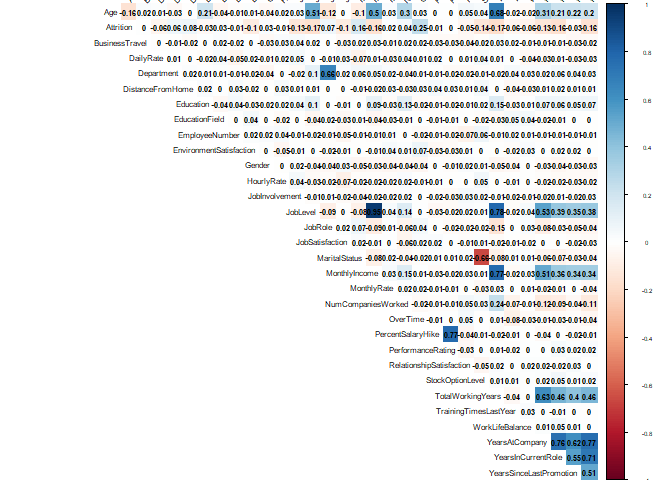<!-- -->

```r
#Display graphic with the top 10 positively correlated parameter
par(cex=.8)
SA10<-c(head(SortAtt$Parameter,10))
corrplot(as.matrix(Attcor[SA10,SA10]), method="pie", 
         type="upper", 
         addCoef.col = "black",
         tl.col="black", tl.srt=45,
         sig.level = 0.05, insig = "blank", 
         diag=FALSE)
```

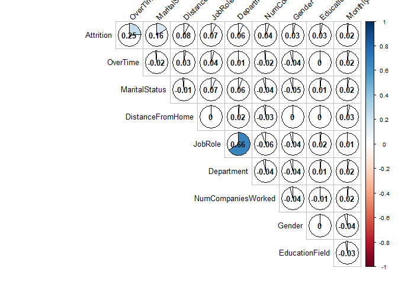<!-- -->

```r
# Further look at top 10 positively correlated parameters with Attrition
par(mfrow=c(3,3), las=2)
plot(Attrition~OverTime, data=df)
plot(Attrition~MaritalStatus, data=df)
plot(Attrition~DistanceFromHome, data=df)
plot(Attrition~JobRole, data=df)
plot(Attrition~Department, data=df)
plot(Attrition~NumCompaniesWorked, data=df)
plot(Attrition~Gender, data=df)
plot(Attrition~EducationField, data=df)
plot(Attrition~MonthlyRate, data=df)
```

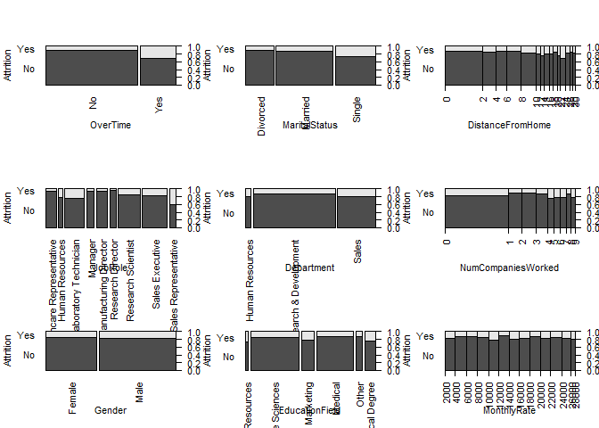<!-- -->

##Check with absolute values to look for highly correlated parameters with Attrition. And verify with graphics.
Because the level variables were converted to numeric variables, it is possible that strong correlations are reported as negative correlations. To account for this fact, we looked at the correlation absolute values as well.


```r
##Calculate absolute value coefficients
Attrition$AbsAtt <- (Attrition$Correlation^2)^(1/2)
SortAbstAtt<- Attrition[order(-Attrition$AbsAtt),]

#Display top 10 Absolute Correlated Parameters
row.names(SortAbstAtt)<-NULL
knitr::kable(head(SortAbstAtt,10))
```


 Correlation  Parameter                  AbsAtt
------------  ---------------------  ----------
   1.0000000  Attrition               1.0000000
   0.2461180  OverTime                0.2461180
  -0.1710632  TotalWorkingYears       0.1710632
  -0.1691048  JobLevel                0.1691048
   0.1620702  MaritalStatus           0.1620702
  -0.1605450  YearsInCurrentRole      0.1605450
  -0.1598396  MonthlyIncome           0.1598396
  -0.1592050  Age                     0.1592050
  -0.1561993  YearsWithCurrManager    0.1561993
  -0.1371449  StockOptionLevel        0.1371449

```r
#Display graphic with top 10 Absolute Correlated Parameters
par(cex=.8)
SAA10<-c(head(SortAbstAtt$Parameter,10))
corrplot(as.matrix(Attcor[SAA10,SAA10]), method="pie", 
         type="upper", 
         addCoef.col = "black",
         tl.col="black", tl.srt=45,
         sig.level = 0.05, insig = "blank", 
         diag=FALSE)
```

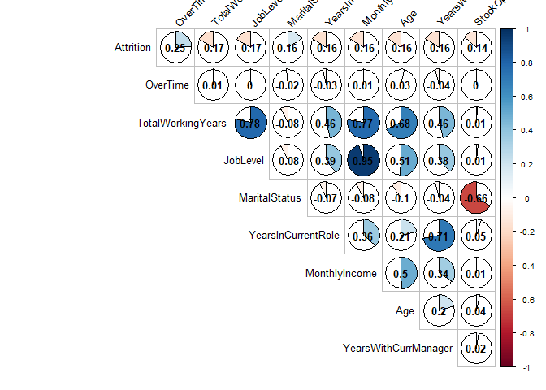<!-- -->

```r
#Further look at top 10 absolute correlated parameters with Attrition
par(mfrow=c(3,3), las=2)
plot(Attrition~OverTime, data=df)
plot(Attrition~TotalWorkingYears, data=df)
plot(Attrition~JobLevel, data=df)
plot(Attrition~ MaritalStatus, data=df)
plot(Attrition~YearsInCurrentRole, data=df)
plot(Attrition~MonthlyIncome, data=df)
plot(Attrition~Age, data=df)
plot(Attrition~YearsWithCurrManager, data=df)
plot(Attrition~StockOptionLevel, data=df)
```

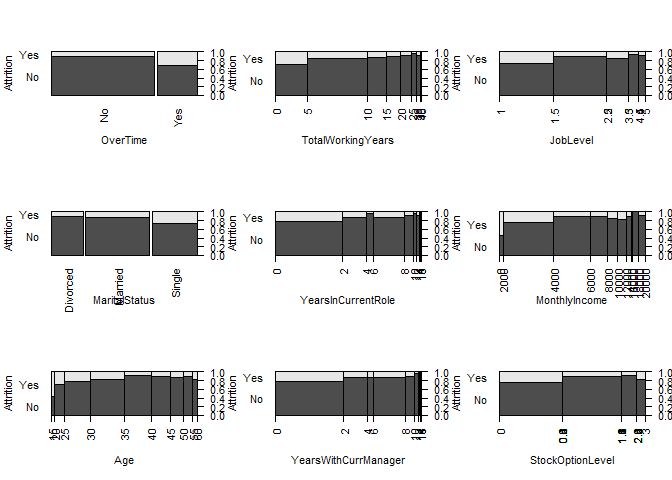<!-- -->

# Looking at Job Role Specific Trends
To answer question regarding Job specific trends. First look at Job Role and its relation with attrition. And look at correlations between parameters and Job Role

```r
# Display Job Role and Attrition correlation bar graph
par(mar=c(12, 5, 5, 2.1),mgp=c(10, 1, 0),las=2)
plot(Attrition~JobRole, data=df, main="Attrition vs. Job Role")
```

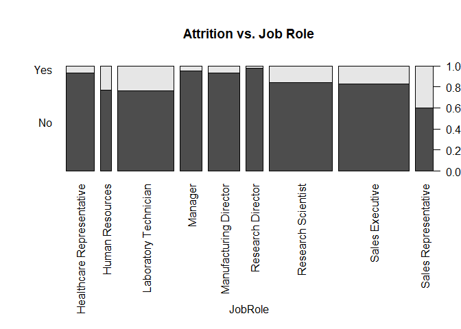<!-- -->

```r
#Generate object for Job Role correlation coefficients 
JobRole<- data.frame(Attcor$JobRole)

#Name JobRole rows
JobRole$Parameter<-row.names(Attcor)

#Rename titles Attrition
names(JobRole)<-c("Correlation", "Parameter")

##Calculate absolute value coefficients
JobRole$Abs <- (JobRole$Correlation^2)^(1/2)
SortJobRole<- JobRole[order(-JobRole$Abs),]

#Display top 5 Absolute Correlated Parameters
row.names(SortJobRole)<-NULL
knitr::kable(head(SortJobRole))
```


 Correlation  Parameter                  Abs
------------  ------------------  ----------
   1.0000000  JobRole              1.0000000
   0.6624312  Department           0.6624312
  -0.1454391  TotalWorkingYears    0.1454391
  -0.1224267  Age                  0.1224267
  -0.0939511  MonthlyIncome        0.0939511
  -0.0854574  JobLevel             0.0854574

```r
#Display graphic with top 4 Absolute Correlated Parameters
par(cex=.8)
SJR5<-c(head(SortJobRole$Parameter,5))
corrplot(as.matrix(Attcor[SJR5,SJR5]), method="pie", 
         type="upper", 
         addCoef.col = "black",
         tl.col="black", tl.srt=45,
         sig.level = 0.05, insig = "blank", 
         diag=FALSE)
```

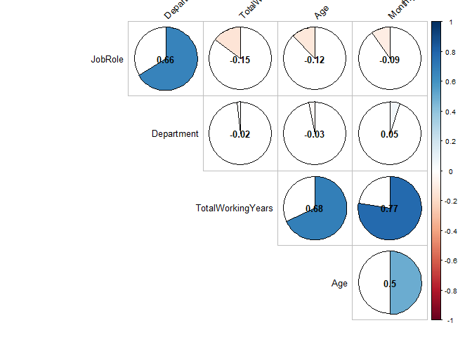<!-- -->

```r
#Further look at top 4 absolute correlated parameters with Job ROle
par( las=2)
par(mar=c(12, 12, 5, 2.1),mgp=c(10, 1, 0),las=2)
plot(TotalWorkingYears~JobRole, data=df)
```

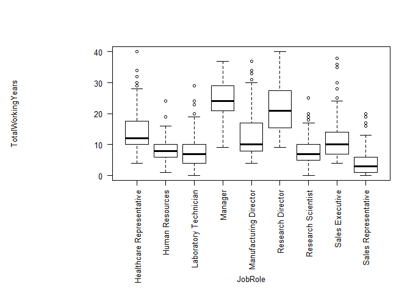<!-- -->

```r
plot(Age~JobRole, data=df)
```

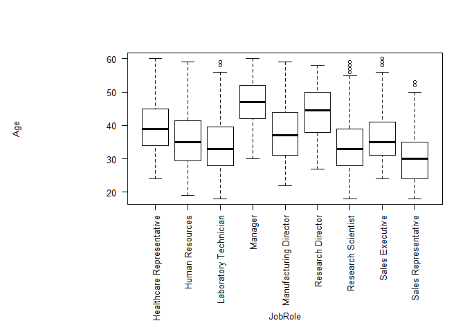<!-- -->

```r
plot(MonthlyIncome~JobRole, data=df)
```

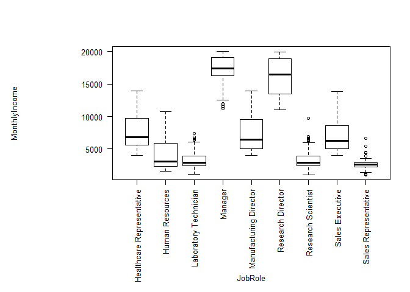<!-- -->

# Logistic Regression Model

## Creating Sampling Set

Generating traing and testing data as sampling set


```r
# Converting numeric variables (of level parametets) to factors as needed
LM <- df
LM$Education <- as.factor(LM$Education)
LM$EnvironmentSatisfaction <- as.factor(LM$EnvironmentSatisfaction)
LM$JobInvolvement <- as.factor(LM$JobInvolvement)
LM$JobSatisfaction <- as.factor(LM$JobSatisfaction)
LM$PerformanceRating <- as.factor(LM$PerformanceRating)
LM$RelationshipSatisfaction <- as.factor(LM$RelationshipSatisfaction)
LM$WorkLifeBalance <- as.factor(LM$WorkLifeBalance)

## Creating a Training and Testing data set from sampling as a random 80% of the data set provided
smp<-floor(0.8*nrow(LM))
set.seed(123)
ind <- sample(seq_len(nrow(LM)),size=smp)
train <- LM[ind,]
test <- LM[-ind,]
```

## Start with a preliminary model
Start with a preliminary model with all the variables


```r
## Load requiered libraries

library(psych)
```

```
Warning: package 'psych' was built under R version 3.4.4
```

```r
library(DT)
```

```
Warning: package 'DT' was built under R version 3.4.4
```

```r
library(pander)
```

```
Warning: package 'pander' was built under R version 3.4.4
```

```r
#Logistic Regression
model <- glm(Attrition ~ ., family = 'binomial', data = train)
pander(summary(model))
```


--------------------------------------------------------------------------
               &nbsp;                   Estimate    Std. Error   z value  
------------------------------------- ------------ ------------ ----------
           **(Intercept)**               -11.38       651.5      -0.01747 

               **Age**                  -0.02016     0.01564      -1.289  

   **BusinessTravelTravel_Rarely**       2.156        0.5042      4.277   

 **BusinessTravelTravel_Frequently**     1.367        0.4659      2.935   

            **DailyRate**              -0.0004421   0.0002586     -1.709  

       **DepartmentResearch &            13.55        651.5      0.02081  
            Development**                                                 

         **DepartmentSales**              13.3        651.5      0.02041  

        **DistanceFromHome**            0.05312      0.01229      4.324   

           **Education2**               -0.1313       0.3738     -0.3513  

           **Education3**              -0.004705      0.3271     -0.01438 

           **Education4**               0.05363       0.3624      0.148   

           **Education5**                -0.343       0.7611     -0.4506  

        **EducationFieldLife             -1.54        0.9563      -1.61   
             Sciences**                                                   

     **EducationFieldMarketing**         -1.063       1.013       -1.049  

      **EducationFieldMedical**          -1.389       0.9543      -1.455  

       **EducationFieldOther**           -1.237       1.023       -1.209  

      **EducationFieldTechnical         -0.8544       0.9727     -0.8784  
              Degree**                                                    

         **EmployeeNumber**            -0.0002972   0.0001764     -1.684  

    **EnvironmentSatisfaction2**         -1.182       0.3227      -3.662  

    **EnvironmentSatisfaction3**         -1.148       0.2859      -4.013  

    **EnvironmentSatisfaction4**         -1.335       0.2888      -4.623  

           **GenderMale**                0.3252       0.2134      1.524   

           **HourlyRate**               0.001606     0.005138     0.3125  

         **JobInvolvement2**             -1.372       0.4332      -3.166  

         **JobInvolvement3**             -1.293       0.4041      -3.199  

         **JobInvolvement4**             -1.824       0.5338      -3.417  

            **JobLevel**                -0.1141       0.3649     -0.3129  

     **JobRoleHuman Resources**          14.46        651.5      0.02219  

         **JobRoleLaboratory             1.524        0.5504      2.769   
            Technician**                                                  

         **JobRoleManager**             -0.2101       1.088      -0.1932  

       **JobRoleManufacturing            0.2557       0.588       0.4348  
             Director**                                                   

    **JobRoleResearch Director**        -0.5552       1.051      -0.5283  

    **JobRoleResearch Scientist**        0.5669       0.5608      1.011   

     **JobRoleSales Executive**          1.319        1.497       0.8812  

           **JobRoleSales                2.186        1.548       1.412   
          Representative**                                                

        **JobSatisfaction2**            -0.4519       0.3088      -1.463  

        **JobSatisfaction3**            -0.7026       0.2835      -2.478  

        **JobSatisfaction4**             -1.463       0.3048      -4.802  

      **MaritalStatusMarried**           0.3498       0.3105      1.127   

       **MaritalStatusSingle**           1.426        0.4016       3.55   

          **MonthlyIncome**            6.397e-05     9.45e-05     0.6769  

           **MonthlyRate**             8.727e-06    1.449e-05     0.6022  

       **NumCompaniesWorked**            0.1351      0.04564       2.96   

           **OverTimeYes**               2.099        0.2235      9.393   

        **PercentSalaryHike**           -0.0183      0.04403     -0.4157  

       **PerformanceRating4**           0.003014      0.4661     0.006468 

    **RelationshipSatisfaction2**       -0.9431       0.3338      -2.826  

    **RelationshipSatisfaction3**        -0.88        0.2918      -3.016  

    **RelationshipSatisfaction4**        -0.987       0.2945      -3.351  

        **StockOptionLevel**            -0.06502      0.1795     -0.3623  

        **TotalWorkingYears**           -0.08139     0.03453      -2.357  

      **TrainingTimesLastYear**         -0.2478      0.08263      -2.999  

        **WorkLifeBalance2**            -0.5558       0.4425      -1.256  

        **WorkLifeBalance3**             -1.209       0.4164      -2.903  

        **WorkLifeBalance4**            -0.6955       0.4977      -1.397  

         **YearsAtCompany**             0.07435      0.04669      1.592   

       **YearsInCurrentRole**           -0.1509      0.05563      -2.712  

     **YearsSinceLastPromotion**         0.2053      0.05154      3.984   

      **YearsWithCurrManager**          -0.1453      0.05428      -2.678  
--------------------------------------------------------------------------

Table: Table continues below

 
-------------------------------------------------
               &nbsp;                  Pr(>|z|)  
------------------------------------- -----------
           **(Intercept)**              0.9861   

               **Age**                  0.1975   

   **BusinessTravelTravel_Rarely**     1.895e-05 

 **BusinessTravelTravel_Frequently**   0.003339  

            **DailyRate**               0.08743  

       **DepartmentResearch &           0.9834   
            Development**                        

         **DepartmentSales**            0.9837   

        **DistanceFromHome**           1.535e-05 

           **Education2**               0.7254   

           **Education3**               0.9885   

           **Education4**               0.8824   

           **Education5**               0.6523   

        **EducationFieldLife            0.1074   
             Sciences**                          

     **EducationFieldMarketing**        0.2941   

      **EducationFieldMedical**         0.1457   

       **EducationFieldOther**          0.2267   

      **EducationFieldTechnical         0.3797   
              Degree**                           

         **EmployeeNumber**             0.09209  

    **EnvironmentSatisfaction2**       0.0002502 

    **EnvironmentSatisfaction3**       5.995e-05 

    **EnvironmentSatisfaction4**       3.788e-06 

           **GenderMale**               0.1275   

           **HourlyRate**               0.7547   

         **JobInvolvement2**           0.001547  

         **JobInvolvement3**            0.00138  

         **JobInvolvement4**           0.0006337 

            **JobLevel**                0.7544   

     **JobRoleHuman Resources**         0.9823   

         **JobRoleLaboratory           0.005628  
            Technician**                         

         **JobRoleManager**             0.8468   

       **JobRoleManufacturing           0.6637   
             Director**                          

    **JobRoleResearch Director**        0.5973   

    **JobRoleResearch Scientist**       0.3121   

     **JobRoleSales Executive**         0.3782   

           **JobRoleSales               0.1579   
          Representative**                       

        **JobSatisfaction2**            0.1433   

        **JobSatisfaction3**            0.0132   

        **JobSatisfaction4**           1.57e-06  

      **MaritalStatusMarried**          0.2599   

       **MaritalStatusSingle**         0.0003845 

          **MonthlyIncome**             0.4984   

           **MonthlyRate**               0.547   

       **NumCompaniesWorked**          0.003075  

           **OverTimeYes**             5.809e-21 

        **PercentSalaryHike**           0.6776   

       **PerformanceRating4**           0.9948   

    **RelationshipSatisfaction2**      0.004717  

    **RelationshipSatisfaction3**       0.00256  

    **RelationshipSatisfaction4**      0.0008044 

        **StockOptionLevel**            0.7172   

        **TotalWorkingYears**           0.01843  

      **TrainingTimesLastYear**        0.002711  

        **WorkLifeBalance2**            0.2091   

        **WorkLifeBalance3**           0.003697  

        **WorkLifeBalance4**            0.1623   

         **YearsAtCompany**             0.1113   

       **YearsInCurrentRole**          0.006683  

     **YearsSinceLastPromotion**       6.763e-05 

      **YearsWithCurrManager**         0.007415  
-------------------------------------------------


(Dispersion parameter for  binomial  family taken to be  1 )


-------------------- ---------------------------
   Null deviance:     1034  on 1175  degrees of 
                               freedom          

 Residual deviance:   664  on 1117  degrees of  
                               freedom          
-------------------- ---------------------------

## Refine model - Reduced Model
Refine Logistic Regression Model by removing not statistically significant variables (p-value >0.05) to reduce AIC value.


```r
## Model 2 

model2 <- glm(Attrition ~ Age + BusinessTravel + DistanceFromHome + EnvironmentSatisfaction +   JobInvolvement + JobRole + JobSatisfaction + MaritalStatus + NumCompaniesWorked + OverTime +   RelationshipSatisfaction + TrainingTimesLastYear + WorkLifeBalance + YearsAtCompany + YearsInCurrentRole + YearsSinceLastPromotion + YearsWithCurrManager, family = 'binomial', data = train)

cat(model2$aic)
```

763.2289

```r
pander(summary(model2))
```


-----------------------------------------------------------------------------------
               &nbsp;                  Estimate   Std. Error   z value   Pr(>|z|)  
------------------------------------- ---------- ------------ --------- -----------
           **(Intercept)**              0.3174      1.015      0.3126     0.7546   

               **Age**                 -0.04131    0.01326     -3.114    0.001844  

   **BusinessTravelTravel_Rarely**      2.075       0.4875      4.256    2.083e-05 

 **BusinessTravelTravel_Frequently**     1.3        0.4522      2.875    0.004036  

        **DistanceFromHome**           0.04841     0.01182      4.095    4.226e-05 

    **EnvironmentSatisfaction2**        -1.101      0.3129     -3.518    0.0004351 

    **EnvironmentSatisfaction3**       -0.9925      0.2737     -3.627    0.0002872 

    **EnvironmentSatisfaction4**        -1.267      0.2811     -4.506    6.61e-06  

         **JobInvolvement2**            -1.22       0.4097     -2.977    0.002915  

         **JobInvolvement3**            -1.223      0.3792     -3.224    0.001263  

         **JobInvolvement4**            -1.743      0.5119     -3.404    0.000664  

     **JobRoleHuman Resources**         1.803       0.6202      2.907    0.003652  

         **JobRoleLaboratory            1.679       0.4815      3.488    0.0004873 
            Technician**                                                           

         **JobRoleManager**            -0.1384      0.787      -0.1758    0.8604   

       **JobRoleManufacturing           0.269       0.5773      0.466     0.6412   
             Director**                                                            

    **JobRoleResearch Director**       -0.5145      0.9042     -0.569     0.5693   

    **JobRoleResearch Scientist**       0.7686      0.4845      1.587     0.1126   

     **JobRoleSales Executive**         1.323       0.4728      2.798    0.005139  

           **JobRoleSales               2.195       0.552       3.976    7.006e-05 
          Representative**                                                         

        **JobSatisfaction2**           -0.4199      0.2981     -1.409      0.159   

        **JobSatisfaction3**            -0.685      0.2695     -2.542     0.01102  

        **JobSatisfaction4**            -1.441      0.292      -4.934    8.061e-07 

      **MaritalStatusMarried**          0.3468      0.2932      1.183     0.2368   

       **MaritalStatusSingle**          1.456       0.3017      4.826    1.394e-06 

       **NumCompaniesWorked**           0.1071     0.04299      2.492     0.01271  

           **OverTimeYes**              2.002       0.2138      9.365    7.593e-21 

    **RelationshipSatisfaction2**      -0.8518      0.3194     -2.667    0.007649  

    **RelationshipSatisfaction3**      -0.7248      0.2781     -2.607    0.009146  

    **RelationshipSatisfaction4**       -0.808      0.282      -2.865    0.004164  

      **TrainingTimesLastYear**        -0.2507     0.08081     -3.103    0.001918  

        **WorkLifeBalance2**           -0.5628      0.4322     -1.302     0.1929   

        **WorkLifeBalance3**            -1.111      0.4075     -2.728     0.00638  

        **WorkLifeBalance4**            -0.625      0.4899     -1.276      0.202   

         **YearsAtCompany**            0.02915     0.04033     0.7227     0.4699   

       **YearsInCurrentRole**          -0.1422     0.05249      -2.71    0.006733  

     **YearsSinceLastPromotion**        0.2028     0.04872      4.163    3.147e-05 

      **YearsWithCurrManager**         -0.1448     0.05207     -2.781    0.005414  
-----------------------------------------------------------------------------------


(Dispersion parameter for  binomial  family taken to be  1 )


-------------------- -----------------------------
   Null deviance:     1033.6  on 1175  degrees of 
                                freedom           

 Residual deviance:   689.2  on 1139  degrees of  
                                freedom           
-------------------- -----------------------------

```r
#run anova on model2
knitr::kable(anova(model2, test = 'Chisq'))
```

                            Df    Deviance   Resid. Df   Resid. Dev    Pr(>Chi)
-------------------------  ---  ----------  ----------  -----------  ----------
NULL                        NA          NA        1175    1033.5728          NA
Age                          1   32.370928        1174    1001.2018   0.0000000
BusinessTravel               2   18.370335        1172     982.8315   0.0001025
DistanceFromHome             1   12.674430        1171     970.1571   0.0003707
EnvironmentSatisfaction      3   16.609011        1168     953.5481   0.0008504
JobInvolvement               3   10.129088        1165     943.4190   0.0175001
JobRole                      8   41.942777        1157     901.4762   0.0000014
JobSatisfaction              3   20.013096        1154     881.4631   0.0001687
MaritalStatus                2   25.251629        1152     856.2115   0.0000033
NumCompaniesWorked           1    7.223823        1151     848.9876   0.0071942
OverTime                     1   98.568269        1150     750.4194   0.0000000
RelationshipSatisfaction     3    8.337437        1147     742.0819   0.0395292
TrainingTimesLastYear        1    9.708507        1146     732.3734   0.0018342
WorkLifeBalance              3   10.731155        1143     721.6423   0.0132721
YearsAtCompany               1    3.517464        1142     718.1248   0.0607253
YearsInCurrentRole           1    5.307596        1141     712.8172   0.0212326
YearsSinceLastPromotion      1   15.995743        1140     696.8215   0.0000635
YearsWithCurrManager         1    7.592588        1139     689.2289   0.0058609

## Evaluate top 3 parameters
Evaluate Logistic Regression Model with top 3 statisticaly significant variables (p-value <0.05) 


```r
# Model 3 - Logistic Regression Model with the top 3 statistially significant parameters 

model3 <- glm(Attrition ~ EnvironmentSatisfaction + MaritalStatus + OverTime , family = 'binomial', data = train)

cat(model3$aic)
```

913.0225

## Reduced Model Evaluation

```r
#Prediction for the test data

predmodel <- round(predict(model2,test,type='response'),digits=0)
comparison <- data.frame(predmodel,test$Attrition,test$EmployeeNumber)
names(comparison)<- c("Predicted","Actual","EmployeeNumber")
knitr::kable(head(comparison))
```


 Predicted  Actual    EmployeeNumber
----------  -------  ---------------
         0  No                     2
         0  No                     7
         0  No                    10
         0  No                    20
         0  Yes                   27
         0  No                    36

```r
pred <- ifelse(predmodel>0.5,2,1)

#Loading required libraries
library(ROCR)
```

```
Warning: package 'ROCR' was built under R version 3.4.4
```

```
Loading required package: gplots
```

```

Attaching package: 'gplots'
```

```
The following object is masked from 'package:stats':

    lowess
```

```r
library(Metrics)
```

```
Warning: package 'Metrics' was built under R version 3.4.4
```

```r
library(pROC)
```

```
Warning: package 'pROC' was built under R version 3.4.4
```

```
Type 'citation("pROC")' for a citation.
```

```

Attaching package: 'pROC'
```

```
The following object is masked from 'package:Metrics':

    auc
```

```
The following objects are masked from 'package:stats':

    cov, smooth, var
```

```r
pr <- prediction(pred,test$Attrition)
perf <- performance(pr,measure = "tpr",x.measure = "fpr")
plot(perf)
```

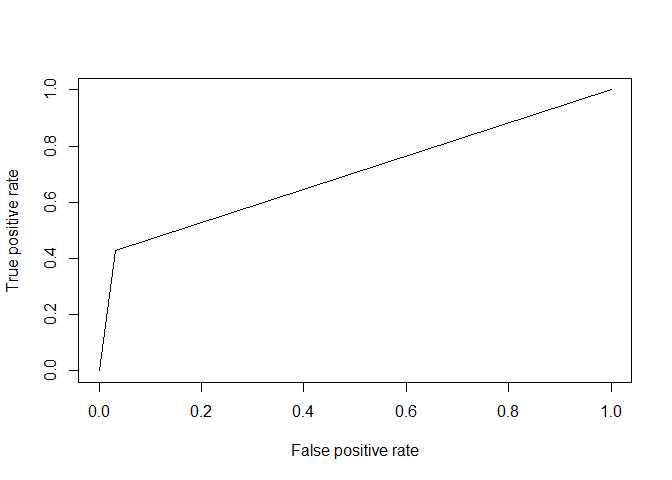<!-- -->

```r
auc(test$Attrition,pred)
```

Area under the curve: 0.698

## Prediction probabilities and results in comparison with actuals


```r
#Prediction probabilities and results in comparison with actuals

comparison2 <- cbind(predmodel,pred,test$Attrition,test$EmployeeNumber)
colnames(comparison2) <- c("Probability Greater Than .5 is Yes and Lower than .5 is No ", "Prediction - 2 Yes and 1 is No","Actual - 2 Yes and 1 is No","Employee Number")
DT::datatable(comparison2,filter = 'top',options = list(pageLength = 10,autoWidth = TRUE),class = 'cell-border stripe')
```

<!--html_preserve--><div id="htmlwidget-b86518a20035adddcc22" style="width:100%;height:auto;" class="datatables html-widget"></div>
<script type="application/json" data-for="htmlwidget-b86518a20035adddcc22">{"x":{"filter":"top","filterHTML":"<tr>\n  <td><\/td>\n  <td data-type=\"number\" style=\"vertical-align: top;\">\n    <div class=\"form-group has-feedback\" style=\"margin-bottom: auto;\">\n      <input type=\"search\" placeholder=\"All\" class=\"form-control\" style=\"width: 100%;\"/>\n      <span class=\"glyphicon glyphicon-remove-circle form-control-feedback\"><\/span>\n    <\/div>\n    <div style=\"display: none; position: absolute; width: 200px;\">\n      <div data-min=\"0\" data-max=\"1\"><\/div>\n      <span style=\"float: left;\"><\/span>\n      <span style=\"float: right;\"><\/span>\n    <\/div>\n  <\/td>\n  <td data-type=\"number\" style=\"vertical-align: top;\">\n    <div class=\"form-group has-feedback\" style=\"margin-bottom: auto;\">\n      <input type=\"search\" placeholder=\"All\" class=\"form-control\" style=\"width: 100%;\"/>\n      <span class=\"glyphicon glyphicon-remove-circle form-control-feedback\"><\/span>\n    <\/div>\n    <div style=\"display: none; position: absolute; width: 200px;\">\n      <div data-min=\"1\" data-max=\"2\"><\/div>\n      <span style=\"float: left;\"><\/span>\n      <span style=\"float: right;\"><\/span>\n    <\/div>\n  <\/td>\n  <td data-type=\"number\" style=\"vertical-align: top;\">\n    <div class=\"form-group has-feedback\" style=\"margin-bottom: auto;\">\n      <input type=\"search\" placeholder=\"All\" class=\"form-control\" style=\"width: 100%;\"/>\n      <span class=\"glyphicon glyphicon-remove-circle form-control-feedback\"><\/span>\n    <\/div>\n    <div style=\"display: none; position: absolute; width: 200px;\">\n      <div data-min=\"1\" data-max=\"2\"><\/div>\n      <span style=\"float: left;\"><\/span>\n      <span style=\"float: right;\"><\/span>\n    <\/div>\n  <\/td>\n  <td data-type=\"number\" style=\"vertical-align: top;\">\n    <div class=\"form-group has-feedback\" style=\"margin-bottom: auto;\">\n      <input type=\"search\" placeholder=\"All\" class=\"form-control\" style=\"width: 100%;\"/>\n      <span class=\"glyphicon glyphicon-remove-circle form-control-feedback\"><\/span>\n    <\/div>\n    <div style=\"display: none; position: absolute; width: 200px;\">\n      <div data-min=\"2\" data-max=\"2068\"><\/div>\n      <span style=\"float: left;\"><\/span>\n      <span style=\"float: right;\"><\/span>\n    <\/div>\n  <\/td>\n<\/tr>","data":[["1","2","3","4","5","6","7","8","9","10","11","12","13","14","15","16","17","18","19","20","21","22","23","24","25","26","27","28","29","30","31","32","33","34","35","36","37","38","39","40","41","42","43","44","45","46","47","48","49","50","51","52","53","54","55","56","57","58","59","60","61","62","63","64","65","66","67","68","69","70","71","72","73","74","75","76","77","78","79","80","81","82","83","84","85","86","87","88","89","90","91","92","93","94","95","96","97","98","99","100","101","102","103","104","105","106","107","108","109","110","111","112","113","114","115","116","117","118","119","120","121","122","123","124","125","126","127","128","129","130","131","132","133","134","135","136","137","138","139","140","141","142","143","144","145","146","147","148","149","150","151","152","153","154","155","156","157","158","159","160","161","162","163","164","165","166","167","168","169","170","171","172","173","174","175","176","177","178","179","180","181","182","183","184","185","186","187","188","189","190","191","192","193","194","195","196","197","198","199","200","201","202","203","204","205","206","207","208","209","210","211","212","213","214","215","216","217","218","219","220","221","222","223","224","225","226","227","228","229","230","231","232","233","234","235","236","237","238","239","240","241","242","243","244","245","246","247","248","249","250","251","252","253","254","255","256","257","258","259","260","261","262","263","264","265","266","267","268","269","270","271","272","273","274","275","276","277","278","279","280","281","282","283","284","285","286","287","288","289","290","291","292","293","294"],[0,0,0,0,0,0,0,1,0,1,0,0,1,0,0,0,0,0,0,0,0,0,0,0,0,0,1,0,0,0,0,0,0,0,0,0,0,0,0,0,0,0,0,0,0,0,0,0,0,0,0,0,0,1,0,0,0,0,0,0,0,0,0,0,0,0,0,0,0,0,1,0,0,0,0,0,0,0,0,0,0,0,0,0,0,0,0,1,0,0,0,0,0,0,0,0,0,1,0,0,0,0,0,0,0,1,0,0,0,0,0,0,0,0,0,0,0,0,0,0,0,0,0,1,0,0,0,0,0,0,1,0,0,0,0,0,0,1,0,0,1,0,1,0,0,0,1,0,0,0,0,0,0,0,0,0,0,0,0,0,1,0,0,0,0,0,0,0,0,0,0,0,0,0,0,0,0,0,0,0,0,0,0,0,0,0,0,0,0,0,0,0,0,0,1,0,1,0,0,0,0,0,0,1,0,0,0,0,0,1,0,1,1,0,0,0,0,1,0,0,0,0,1,0,0,0,1,0,0,0,0,0,0,0,0,0,0,0,0,0,0,0,0,1,0,0,0,0,0,0,0,0,0,0,0,0,0,0,0,0,0,0,0,0,0,0,1,0,0,0,0,0,0,1,0,0,0,0,0,0,0,0,0,0,0,0,0,0,0,1,0,0,0,0],[1,1,1,1,1,1,1,2,1,2,1,1,2,1,1,1,1,1,1,1,1,1,1,1,1,1,2,1,1,1,1,1,1,1,1,1,1,1,1,1,1,1,1,1,1,1,1,1,1,1,1,1,1,2,1,1,1,1,1,1,1,1,1,1,1,1,1,1,1,1,2,1,1,1,1,1,1,1,1,1,1,1,1,1,1,1,1,2,1,1,1,1,1,1,1,1,1,2,1,1,1,1,1,1,1,2,1,1,1,1,1,1,1,1,1,1,1,1,1,1,1,1,1,2,1,1,1,1,1,1,2,1,1,1,1,1,1,2,1,1,2,1,2,1,1,1,2,1,1,1,1,1,1,1,1,1,1,1,1,1,2,1,1,1,1,1,1,1,1,1,1,1,1,1,1,1,1,1,1,1,1,1,1,1,1,1,1,1,1,1,1,1,1,1,2,1,2,1,1,1,1,1,1,2,1,1,1,1,1,2,1,2,2,1,1,1,1,2,1,1,1,1,2,1,1,1,2,1,1,1,1,1,1,1,1,1,1,1,1,1,1,1,1,2,1,1,1,1,1,1,1,1,1,1,1,1,1,1,1,1,1,1,1,1,1,1,2,1,1,1,1,1,1,2,1,1,1,1,1,1,1,1,1,1,1,1,1,1,1,2,1,1,1,1],[1,1,1,1,2,1,2,2,1,2,1,1,1,1,1,1,1,1,1,1,1,1,1,1,1,1,2,1,1,1,1,1,1,1,1,1,1,2,1,1,1,2,1,1,1,1,2,2,2,1,1,1,1,2,1,1,1,1,1,1,1,1,1,1,1,1,1,1,1,1,2,1,1,1,1,2,1,1,1,1,1,2,1,2,1,1,1,2,1,1,1,1,1,1,1,1,1,2,1,1,1,1,1,1,1,2,1,1,1,1,1,1,1,1,1,1,1,1,1,1,1,1,1,1,1,1,1,1,1,1,2,1,1,1,1,1,1,2,1,1,2,1,1,1,1,1,2,2,1,1,2,1,2,1,1,1,1,1,1,1,2,1,2,1,2,1,1,1,1,1,1,1,1,1,1,1,1,2,1,1,1,1,1,1,1,1,1,1,1,1,2,1,1,1,2,1,2,1,1,1,1,1,1,2,1,2,1,1,1,2,1,2,1,1,1,1,1,1,2,2,1,1,1,1,1,1,1,1,1,1,1,2,1,1,1,1,1,1,1,1,1,2,1,2,1,1,1,1,2,1,1,1,1,1,1,1,1,1,1,1,1,1,1,1,1,1,2,1,1,2,1,1,1,2,1,1,2,2,1,1,1,1,1,1,1,1,1,2,2,1,1,1,1,1],[2,7,10,20,27,36,42,55,60,64,68,73,75,80,94,102,119,128,129,131,132,144,148,152,158,171,175,178,182,194,197,199,204,208,214,221,233,243,247,253,254,297,303,305,307,311,315,325,328,343,359,361,363,364,366,367,385,387,408,410,412,423,426,438,450,451,463,484,501,507,514,517,534,543,550,555,560,564,569,573,575,582,585,593,604,606,611,614,635,639,641,656,657,663,679,682,690,702,712,714,729,763,764,776,784,785,786,789,791,793,802,812,836,837,847,850,857,869,875,880,885,893,901,925,939,940,944,947,964,966,970,982,985,997,998,1002,1005,1010,1012,1015,1016,1029,1036,1050,1066,1068,1079,1082,1085,1094,1098,1102,1113,1120,1133,1136,1137,1154,1158,1161,1188,1201,1203,1204,1210,1216,1217,1218,1225,1228,1235,1238,1240,1252,1264,1268,1270,1277,1291,1297,1301,1306,1308,1312,1317,1322,1336,1363,1367,1369,1379,1392,1401,1407,1420,1422,1427,1430,1431,1435,1438,1446,1448,1458,1461,1467,1471,1475,1479,1487,1516,1537,1539,1544,1551,1552,1554,1556,1562,1572,1582,1592,1594,1601,1608,1609,1611,1613,1617,1618,1621,1639,1647,1650,1655,1658,1664,1665,1673,1676,1693,1702,1709,1716,1722,1724,1725,1728,1733,1735,1740,1744,1753,1770,1771,1778,1794,1800,1804,1813,1823,1827,1850,1852,1863,1864,1878,1882,1892,1905,1934,1937,1941,1944,1945,1951,1960,1967,1975,1981,1987,1994,1997,1999,2008,2013,2018,2027,2032,2040,2041,2046,2065,2068]],"container":"<table class=\"cell-border stripe\">\n  <thead>\n    <tr>\n      <th> <\/th>\n      <th>Probability Greater Than .5 is Yes and Lower than .5 is No <\/th>\n      <th>Prediction - 2 Yes and 1 is No<\/th>\n      <th>Actual - 2 Yes and 1 is No<\/th>\n      <th>Employee Number<\/th>\n    <\/tr>\n  <\/thead>\n<\/table>","options":{"pageLength":10,"autoWidth":true,"columnDefs":[{"className":"dt-right","targets":[1,2,3,4]},{"orderable":false,"targets":0}],"order":[],"orderClasses":false,"orderCellsTop":true}},"evals":[],"jsHooks":[]}</script><!--/html_preserve-->

```r
#Missclassification error 
tabb <- table(Predicted = pred, Actual = test$Attrition)
row.names(tabb) <- c("total number","total missclassifications")
knitr::kable(head(tabb))
```

                              No   Yes
--------------------------  ----  ----
total number                 237    28
total missclassifications      8    21

```r
#Missclassification percentage
1-sum(diag(tabb))/sum(tabb)
```

[1] 0.122449

```r
#Goodness of fit test

with(model2,pchisq(null.deviance-deviance,df.null-df.residual,lower.tail = F))
```

[1] 5.392816e-52

# Data Analysis and Discussion
After cleaning up the file, the variables were characterized as ether numbers or parameters with levels. The levels were then transformed to numbers to find correlations with the Attrition. Once those correlations were calculated, the correlation coefficients were sorted from highest to lowest. The top 3 parameters with the highest positive correlation coefficients were:
1.	Overtime
2.	Marital Status
3.	Distance from Home
Since two of these variables were factors converted to numbers a visual evaluation was recommended. Also, it was important to consider the absolute values of the correlations. Since several variables were factors. When studying the correlation bar graphs, there is a clear correlation between the first two parameters, over time and marital status with attrition, whereas the distance from home is not as evident. Regarding the usefulness of this information, the company can probably address overtime. Marital status and distance from home are a little more difficult. 
When evaluating the absolute value of the correlations, the top three parameters are:
1.	Overtime
2.	Total working years
3.	Job Level

Here it is clear that the negative correlation provides useful information because identifies a strong correlation between the few years" total working years", "job level" and "years with current manager" and attrition. Another interesting trend can be observed in the "years in current role". Where the trend shows a trend, looking like there is probably an expectation of promotion or salary increase. The data obtain here is data from variables that can be address from an organizational perspective. Having few total working years and a low job level might be related but required further analysis. Employees with few total working years and a low job level might be an easily trained or target group for retention. Other variables showed similar trends and similar behavior, years in current role, years with current manager, and monthly income.   
Another question looking to answer were trends related to job specific roles. When looking at the job roles. We get that Role with the highest attrition is Sales Representative and the one with the least is the Research Director. And in agreement with the previously discuss observations the Sales Representatives are, on average, the youngest with the less total working years and the lower monthly income. 
As data scientist the team provided a logistic regression model to help predict the probability of an employee to leave the company. The model requires refining with a data learning algorithm but at the moment presets an approximate accuracy of 70% AUX-ROC with a miscalculation of about 12% of the data provided.   The model was developed with a train test ratio of 90% of the data set. 

From the logistic regression model, the parameters with the highest logistic regression coefficients were
1.	Overtime
2.	Job Satisfaction
3.	Marital Status

The first parameter (overtime) presents itself as an overwhelming factor as for the second and third the models disagree. Job satisfaction is definitively an important parameter and if an employee satisfaction level is low the employee is more likely to leave than otherwise. However, the number of employees that leave and report low job satisfaction is significantly lower than the single employees. That said, the company can address employee satisfaction but can do little about the employee marital status. The regression model is intended to help identify areas of improvement and way to lower attrition rates.

# Conclusion

The data science team identified 
1.	Overtime
2.	Total working years
3.	Job Level
As the top three factor that lead to turnover. 
And observed that the Sales Representative were the most sensitive Job Role to attrition affected with factors such as total working years, job level and age.

Ref.:
https://www.hackerearth.com/practice/machine-learning/machine-learning-algorithms/logistic-regression-analysis-r/tutorial/
