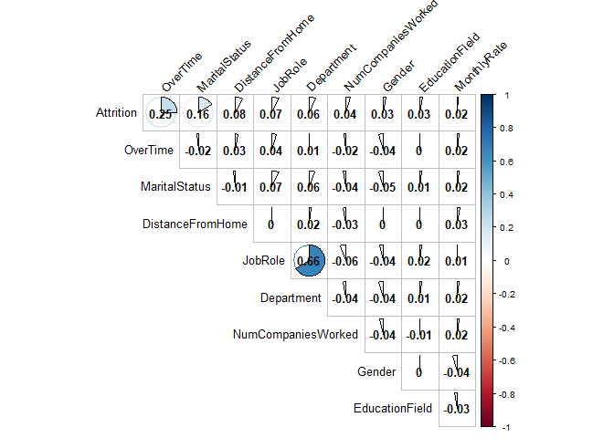

# Executive Summary

# Introduction
DDSAnalytics is an analytics company that specializes in talent management solutions for Fortune 1000 companies. Talent management is defined as the iterative process of developing and retaining employees. It may include workforce planning, employee training programs, identifying high-potential employees and reducing/preventing voluntary employee turnover (attrition). To gain a competitive edge over its competition, DDSAnalytics decided to leverage data science for talent management. The executive leadership identified predicting employee turnover as its first application of data science for talent management. Before the business green lights the project, they tasked the data science team to conduct an analysis of existing employee data. The scope of this report is to summarize those findings.

To conduct exploratory data analysis (EDA), the data science team was provided with CaseStudy2Data.zip file to determine factors that lead to attrition. From this data, the team was asked to identify (at least) the top three factors that contribute to turnover, to learn about any job role specific trends that may exist in the data set (e.g., "Data Scientists have the highest job satisfaction") and to provide any other interesting trends and observations. All the Experiments and analysis were conducted in R. 

#EDA

## Loading data file from GitHub
1. Saved the excel fie into GitHub. The code below reads straight from GitHubs URL.


```r
#load requeried library
library("readxl")
require(RCurl)
```

```
Loading required package: RCurl
```

```
Loading required package: bitops
```

```r
## After unziping the provided datafile, the .xlsl document was loaded on GitHub, the code below process information from GitHub instead of our local computers.

download.file("https://raw.githubusercontent.com/cyberkoolman/msds.6306.case.study.2/master/CaseStudy2-data.xlsx", "data2.xlsx", mode="wb")

## Assign file to object 

case_data <- data.frame(read_excel("data2.xlsx"))
```


## Making the raw data tidy data

###1. Removing non-value added variables from the data set:

The following variable were removed: EmployeeCount, Over18 and StandardHours.
These variables were removed because
1. EmployeeCount: Always 1, since the data set is by employee. 
2. Over18: All employees are "Y". Age is a more meaningful and relevant variable. 
3. StandardHours: All are "80".


```r
#Remove redundandt info: EmployeeCount, Over18, StandardHours

df <- case_data[,-c(9,22,27)]
```

###2. Covertiving character variables to factors and factors to numeric variables as need

To evaluate correlations we used use numeric variables, and evaluate whether the correlations were positive or negative for character variables. Later we used the factor variables for further analysis. Here used two data frames, one with level and numeric variables and one with only numeric variables.


```r
# First load required libraries.

library(purrr)
library(dplyr)
```

```
## 
## Attaching package: 'dplyr'
```

```
## The following objects are masked from 'package:stats':
## 
##     filter, lag
```

```
## The following objects are masked from 'package:base':
## 
##     intersect, setdiff, setequal, union
```

```r
library(knitr)
library(pander)

# Convert characters to factors.
df %>% map_if(is.character, as.factor) %>% as_data_frame -> df

#Adjust factor levels as needed
levels(df$BusinessTravel)<-c("Non-Travel","Travel_Rarely","Travel_Frequently")

#Make all variable numeric
numdf<-data.frame(sapply(df,as.numeric))
```

## Attrition in data set
Once the data set was ready for evaluation, the attrition content was determined.

```r
#Calculate attrition in data set
AT <- table(df$Attrition)
pander(AT)
```


------------
  No    Yes 
------ -----
 1233   237 
------------

```r
#And percentages
at<-data.frame(table(df$Attrition))
pander(prop.table(at[,2]))
```

_0.8388_ and _0.1612_
respectively.


##Find correlation coeffientes between parameters and Attrition
The correlation coefficients were calculated between numeric variables, paying closer attention to highest correating coeffients with Attrition


```r
#Correlate variables
Attcor<-data.frame(cor(numdf))

#Create Attrition object for Attrition correlation coefficients 
Attrition<- data.frame(Attcor$Attrition)

#Name attrition rows
Attrition$Parameter<-row.names(Attcor)

#Rename titles Attrition
names(Attrition)<-c("Correlation", "Parameter")

#Sort positive Attrition
SortAtt <- Attrition[order(-Attrition$Correlation),]

#Display top 10 Positively Correlated Parameters
row.names(SortAtt)<-NULL
knitr::kable(head(SortAtt,10))
```


 Correlation  Parameter          
------------  -------------------
   1.0000000  Attrition          
   0.2461180  OverTime           
   0.1620702  MaritalStatus      
   0.0779236  DistanceFromHome   
   0.0671515  JobRole            
   0.0639906  Department         
   0.0434937  NumCompaniesWorked 
   0.0294533  Gender             
   0.0268455  EducationField     
   0.0151702  MonthlyRate        

## Generate graphics for visualization of coeffiecients and correlations
Graphics will all the variables and just the highest correlations were generated. Also, bar graphs displayed for the highest correlations

```r
# Load library to visualize correlations
library(corrplot)
```

```
## corrplot 0.84 loaded
```

```r
#Display graphic with all correlations
par(cex=.5)
corrplot(as.matrix(Attcor), method="color", 
         type="upper", 
         addCoef.col = "black",
         tl.col="black", tl.srt=45,
         sig.level = 0.05, insig = "blank", 
         diag=FALSE)
```

<!-- -->

```r
#Display graphic with the top 10 positively correlated parameter
par(cex=.8)
SA10<-c(head(SortAtt$Parameter,10))
corrplot(as.matrix(Attcor[SA10,SA10]), method="pie", 
         type="upper", 
         addCoef.col = "black",
         tl.col="black", tl.srt=45,
         sig.level = 0.05, insig = "blank", 
         diag=FALSE)
```

<!-- -->

```r
# Further look at top 10 positively correlated parameters with Attrition
par(mfrow=c(3,3), las=2)
plot(Attrition~OverTime, data=df, main="Attrition vs Overtime")
plot(Attrition~MaritalStatus, data=df, main="Attrition vs Marital Status")
plot(Attrition~DistanceFromHome, data=df, main="Attrition vs Distance From Home")
plot(Attrition~JobRole, data=df, main="Attrition vs Job Role")
plot(Attrition~Department, data=df, main="Attrition vs Department")
plot(Attrition~NumCompaniesWorked, data=df, main= "Attrition vs Number of Companies Worked")
plot(Attrition~Gender, data=df, main= "Attrition vs Gender" )
plot(Attrition~EducationField, data=df, main="Attrition vs Eduaction Field")
plot(Attrition~MonthlyRate, data=df, main="Attrition vs Monlthly Rate")
```

<!-- -->

##Check the absolute values of the highly correlated parameters with Attrition. And verify with graphics.
Because the level variables were converted to numeric variables, it is possible that strong correlations are reported as negative correlations. To account for this fact, we looked at the correlation absolute values as well.


```r
##Calculate absolute value coefficients
Attrition$AbsAtt <- (Attrition$Correlation^2)^(1/2)
SortAbstAtt<- Attrition[order(-Attrition$AbsAtt),]

#Display top 10 Absolute Correlated Parameters
row.names(SortAbstAtt)<-NULL
knitr::kable(head(SortAbstAtt,10))
```


 Correlation  Parameter                  AbsAtt
------------  ---------------------  ----------
   1.0000000  Attrition               1.0000000
   0.2461180  OverTime                0.2461180
  -0.1710632  TotalWorkingYears       0.1710632
  -0.1691048  JobLevel                0.1691048
   0.1620702  MaritalStatus           0.1620702
  -0.1605450  YearsInCurrentRole      0.1605450
  -0.1598396  MonthlyIncome           0.1598396
  -0.1592050  Age                     0.1592050
  -0.1561993  YearsWithCurrManager    0.1561993
  -0.1371449  StockOptionLevel        0.1371449

```r
#Display graphic with top 10 Absolute Correlated Parameters
par(cex=.8)
SAA10<-c(head(SortAbstAtt$Parameter,10))
corrplot(as.matrix(Attcor[SAA10,SAA10]), method="pie", 
         type="upper", 
         addCoef.col = "black",
         tl.col="black", tl.srt=45,
         sig.level = 0.05, insig = "blank", 
         diag=FALSE)
```

<!-- -->

```r
#Further look at top 10 absolute correlated parameters with Attrition
par(mfrow=c(3,3), las=2)
plot(Attrition~OverTime, data=df, main="Attrition vs Overtime")
plot(Attrition~TotalWorkingYears, data=df, main="Attrition vs Total Working Years")
plot(Attrition~JobLevel, data=df, main="Attrition vs Job Level")
plot(Attrition~ MaritalStatus, data=df, main="Attrition vs Marital Status")
plot(Attrition~YearsInCurrentRole, data=df, main="Attrition vs Years in Current Role")
plot(Attrition~MonthlyIncome, data=df, main="Attrition vs Monthly Income")
plot(Attrition~Age, data=df, main="Attrition vs Age")
plot(Attrition~YearsWithCurrManager, data=df, main="Attrition vs Years with Current Manager")
plot(Attrition~StockOptionLevel, data=df, main="Attrition vs Stock Option Level")
```

<!-- -->

# Looking at Job Role Specific Trends
To answer question regarding Job specific trends. First we looked at Job Role and its relation with attrition. And then looked at correlations between the other parameters and Job Role

```r
# Display Job Role and Attrition correlation bar graph
par(mar=c(12, 5, 5, 2.1),mgp=c(10, 1, 0),las=2)
plot(Attrition~JobRole, data=df, main="Attrition vs. Job Role")
```

<!-- -->

```r
#Generate object for Job Role correlation coefficients 
JobRole<- data.frame(Attcor$JobRole)

#Name JobRole rows
JobRole$Parameter<-row.names(Attcor)

#Rename titles Attrition
names(JobRole)<-c("Correlation", "Parameter")

##Calculate absolute value coefficients
JobRole$Abs <- (JobRole$Correlation^2)^(1/2)
SortJobRole<- JobRole[order(-JobRole$Abs),]

#Display top 5 Absolute Correlated Parameters
row.names(SortJobRole)<-NULL
knitr::kable(head(SortJobRole))
```


 Correlation  Parameter                  Abs
------------  ------------------  ----------
   1.0000000  JobRole              1.0000000
   0.6624312  Department           0.6624312
  -0.1454391  TotalWorkingYears    0.1454391
  -0.1224267  Age                  0.1224267
  -0.0939511  MonthlyIncome        0.0939511
  -0.0854574  JobLevel             0.0854574

```r
#Display graphic with top 4 Absolute Correlated Parameters
par(cex=.8)
SJR5<-c(head(SortJobRole$Parameter,5))
corrplot(as.matrix(Attcor[SJR5,SJR5]), method="pie", 
         type="upper", 
         addCoef.col = "black",
         tl.col="black", tl.srt=45,
         sig.level = 0.05, insig = "blank", 
         diag=FALSE)
```

<!-- -->

```r
#Further look at top 4 absolute correlated parameters with Job ROle
par(las=2)
par(mar=c(12, 12, 5, 2.1),mgp=c(10, 1, 0),las=2)
plot(TotalWorkingYears~JobRole, data=df, main="Total Working Years vs Job Role")
```

<!-- -->

```r
plot(Age~JobRole, data=df, main="Age vs Job Role")
```

<!-- -->

```r
plot(MonthlyIncome~JobRole, data=df, main= "Montly Income vs Job Role")
```

<!-- -->

# Logistic Regression Model

## Creating Sampling Set

Generating traing and testing data as sampling set


```r
# Converting numeric variables (of level parametets) to factors as needed
LM <- df
LM$Education <- as.factor(LM$Education)
LM$EnvironmentSatisfaction <- as.factor(LM$EnvironmentSatisfaction)
LM$JobInvolvement <- as.factor(LM$JobInvolvement)
LM$JobSatisfaction <- as.factor(LM$JobSatisfaction)
LM$PerformanceRating <- as.factor(LM$PerformanceRating)
LM$RelationshipSatisfaction <- as.factor(LM$RelationshipSatisfaction)
LM$WorkLifeBalance <- as.factor(LM$WorkLifeBalance)

## Creating a Training and Testing data set from sampling as a random 80% of the data set provided
smp<-floor(0.9*nrow(LM))
set.seed(123)
ind <- sample(seq_len(nrow(LM)),size=smp)
train <- LM[ind,]
test <- LM[-ind,]
```

## Start with a preliminary model
Start with a preliminary model with all the variables


```r
## Load requiered libraries

library(psych)
library(pander)

#Logistic Regression
model <- glm(Attrition ~ ., family = 'binomial', data = train)

pander(model)
```


--------------------------------------------------------------------------
               &nbsp;                   Estimate    Std. Error   z value  
------------------------------------- ------------ ------------ ----------
           **(Intercept)**               -11.75       657.4      -0.01787 

               **Age**                  -0.02799     0.01492      -1.877  

   **BusinessTravelTravel_Rarely**       2.062        0.4638      4.447   

 **BusinessTravelTravel_Frequently**     1.209        0.4274      2.829   

            **DailyRate**              -0.0003337   0.0002423     -1.377  

       **DepartmentResearch &            13.58        657.4      0.02066  
            Development**                                                 

         **DepartmentSales**              13.2        657.4      0.02008  

        **DistanceFromHome**            0.05529      0.01171      4.723   

           **Education2**                0.106        0.3502      0.3025  

           **Education3**                0.1081        0.31       0.3487  

           **Education4**                0.1473       0.342       0.4307  

           **Education5**               -0.7129       0.7575     -0.9411  

        **EducationFieldLife             -1.089       0.888       -1.227  
             Sciences**                                                   

     **EducationFieldMarketing**         -0.397       0.9422     -0.4214  

      **EducationFieldMedical**         -0.9872       0.885       -1.115  

       **EducationFieldOther**           -1.08        0.9613      -1.123  

      **EducationFieldTechnical         -0.2024       0.9086     -0.2228  
              Degree**                                                    

         **EmployeeNumber**            -0.0002118   0.0001665     -1.272  

    **EnvironmentSatisfaction2**          -1.2        0.3049      -3.936  

    **EnvironmentSatisfaction3**         -1.167       0.2705      -4.316  

    **EnvironmentSatisfaction4**         -1.352       0.2733      -4.947  

           **GenderMale**                0.4234       0.2039      2.076   

           **HourlyRate**               0.001549     0.004869     0.3181  

         **JobInvolvement2**             -1.291       0.3966      -3.256  

         **JobInvolvement3**             -1.394       0.3702      -3.766  

         **JobInvolvement4**             -2.132       0.5103      -4.177  

            **JobLevel**                -0.07578      0.3421     -0.2215  

     **JobRoleHuman Resources**          14.82        657.4      0.02255  

         **JobRoleLaboratory             1.568        0.5123      3.061   
            Technician**                                                  

         **JobRoleManager**              0.1484       0.9581      0.1549  

       **JobRoleManufacturing            0.219        0.5629      0.389   
             Director**                                                   

    **JobRoleResearch Director**        -0.7706       1.014      -0.7596  

    **JobRoleResearch Scientist**        0.5726       0.5268      1.087   

     **JobRoleSales Executive**          1.277        1.201       1.064   

           **JobRoleSales                 2.41        1.263       1.908   
          Representative**                                                

        **JobSatisfaction2**            -0.5971       0.2948      -2.025  

        **JobSatisfaction3**            -0.7368       0.265       -2.78   

        **JobSatisfaction4**             -1.397       0.2849      -4.903  

      **MaritalStatusMarried**           0.4147       0.2928      1.416   

       **MaritalStatusSingle**            1.32        0.3766      3.504   

          **MonthlyIncome**            5.143e-05    9.026e-05     0.5698  

           **MonthlyRate**             7.881e-06    1.363e-05     0.578   

       **NumCompaniesWorked**            0.1921      0.04186      4.589   

           **OverTimeYes**                2.14        0.2142      9.992   

        **PercentSalaryHike**           -0.02394     0.04223     -0.5669  

       **PerformanceRating4**           0.03686       0.443      0.08322  

    **RelationshipSatisfaction2**        -1.004       0.3158      -3.181  

    **RelationshipSatisfaction3**       -0.9231       0.2766      -3.337  

    **RelationshipSatisfaction4**        -1.059       0.2795      -3.787  

        **StockOptionLevel**            -0.1941       0.1681      -1.155  

        **TotalWorkingYears**           -0.0836       0.0324      -2.58   

      **TrainingTimesLastYear**         -0.2473      0.08062      -3.068  

        **WorkLifeBalance2**            -0.5997       0.4069      -1.474  

        **WorkLifeBalance3**             -1.219       0.382       -3.192  

        **WorkLifeBalance4**            -0.6353       0.4539       -1.4   

         **YearsAtCompany**             0.08745       0.0431      2.029   

       **YearsInCurrentRole**           -0.1328      0.05035      -2.638  

     **YearsSinceLastPromotion**         0.191       0.04669      4.091   

      **YearsWithCurrManager**          -0.1399      0.05048      -2.771  
--------------------------------------------------------------------------

Table: Fitting generalized (binomial/logit) linear model: Attrition ~ . (continued below)

 
-------------------------------------------------
               &nbsp;                  Pr(>|z|)  
------------------------------------- -----------
           **(Intercept)**              0.9857   

               **Age**                  0.06054  

   **BusinessTravelTravel_Rarely**     8.707e-06 

 **BusinessTravelTravel_Frequently**   0.004668  

            **DailyRate**               0.1684   

       **DepartmentResearch &           0.9835   
            Development**                        

         **DepartmentSales**             0.984   

        **DistanceFromHome**           2.324e-06 

           **Education2**               0.7622   

           **Education3**               0.7273   

           **Education4**               0.6667   

           **Education5**               0.3466   

        **EducationFieldLife             0.22    
             Sciences**                          

     **EducationFieldMarketing**        0.6735   

      **EducationFieldMedical**         0.2646   

       **EducationFieldOther**          0.2613   

      **EducationFieldTechnical         0.8237   
              Degree**                           

         **EmployeeNumber**             0.2035   

    **EnvironmentSatisfaction2**       8.292e-05 

    **EnvironmentSatisfaction3**       1.588e-05 

    **EnvironmentSatisfaction4**       7.547e-07 

           **GenderMale**               0.03785  

           **HourlyRate**               0.7504   

         **JobInvolvement2**            0.00113  

         **JobInvolvement3**           0.0001656 

         **JobInvolvement4**           2.948e-05 

            **JobLevel**                0.8247   

     **JobRoleHuman Resources**          0.982   

         **JobRoleLaboratory           0.002206  
            Technician**                         

         **JobRoleManager**             0.8769   

       **JobRoleManufacturing           0.6973   
             Director**                          

    **JobRoleResearch Director**        0.4475   

    **JobRoleResearch Scientist**       0.2771   

     **JobRoleSales Executive**         0.2875   

           **JobRoleSales               0.05645  
          Representative**                       

        **JobSatisfaction2**            0.04283  

        **JobSatisfaction3**           0.005431  

        **JobSatisfaction4**           9.455e-07 

      **MaritalStatusMarried**          0.1567   

       **MaritalStatusSingle**         0.0004577 

          **MonthlyIncome**             0.5688   

           **MonthlyRate**              0.5633   

       **NumCompaniesWorked**          4.448e-06 

           **OverTimeYes**             1.656e-23 

        **PercentSalaryHike**           0.5708   

       **PerformanceRating4**           0.9337   

    **RelationshipSatisfaction2**      0.001468  

    **RelationshipSatisfaction3**      0.000847  

    **RelationshipSatisfaction4**      0.0001522 

        **StockOptionLevel**            0.2481   

        **TotalWorkingYears**          0.009881  

      **TrainingTimesLastYear**        0.002156  

        **WorkLifeBalance2**            0.1405   

        **WorkLifeBalance3**           0.001415  

        **WorkLifeBalance4**            0.1616   

         **YearsAtCompany**             0.04247  

       **YearsInCurrentRole**          0.008347  

     **YearsSinceLastPromotion**       4.286e-05 

      **YearsWithCurrManager**         0.005595  
-------------------------------------------------

```r
cat(model$aic)
```

853.6726

## Refine model - Reduced Model
Refine Logistic Regression Model by removing not statistically significant variables (p-value >0.05) to reduce AIC value.


```r
## Model 2 

model2 <- glm(Attrition ~ Age + BusinessTravel + DistanceFromHome + EnvironmentSatisfaction +   JobInvolvement + JobRole + JobSatisfaction + MaritalStatus + NumCompaniesWorked + OverTime +   RelationshipSatisfaction + TrainingTimesLastYear + WorkLifeBalance + YearsAtCompany + YearsInCurrentRole + YearsSinceLastPromotion + YearsWithCurrManager, family = 'binomial', data = train)

pander(model2)
```


-----------------------------------------------------------------------------------
               &nbsp;                  Estimate   Std. Error   z value   Pr(>|z|)  
------------------------------------- ---------- ------------ --------- -----------
           **(Intercept)**              0.4845      0.9487     0.5107     0.6096   

               **Age**                 -0.04915    0.01252     -3.926    8.627e-05 

   **BusinessTravelTravel_Rarely**       1.97       0.4478      4.399    1.088e-05 

 **BusinessTravelTravel_Frequently**    1.158       0.4146      2.793    0.005217  

        **DistanceFromHome**           0.05029     0.01122      4.482    7.381e-06 

    **EnvironmentSatisfaction2**        -1.136      0.2928     -3.879    0.0001048 

    **EnvironmentSatisfaction3**        -1.046      0.2576     -4.061    4.889e-05 

    **EnvironmentSatisfaction4**        -1.301      0.2647     -4.914    8.92e-07  

         **JobInvolvement2**            -1.095      0.3759     -2.914    0.003567  

         **JobInvolvement3**            -1.28       0.3497     -3.658    0.0002537 

         **JobInvolvement4**            -2.009      0.4867     -4.128    3.665e-05 

     **JobRoleHuman Resources**         1.871       0.5834      3.208    0.001338  

         **JobRoleLaboratory            1.712       0.4486      3.816    0.0001356 
            Technician**                                                           

         **JobRoleManager**              0.15       0.6702     0.2238     0.8229   

       **JobRoleManufacturing           0.2321      0.5533     0.4194     0.6749   
             Director**                                                            

    **JobRoleResearch Director**       -0.8238      0.8721     -0.9445    0.3449   

    **JobRoleResearch Scientist**       0.7388      0.4541      1.627     0.1038   

     **JobRoleSales Executive**         1.275       0.4418      2.887    0.003894  

           **JobRoleSales               2.377       0.5223      4.551    5.334e-06 
          Representative**                                                         

        **JobSatisfaction2**           -0.5114      0.2854     -1.792     0.07313  

        **JobSatisfaction3**            -0.675      0.2534     -2.663    0.007734  

        **JobSatisfaction4**            -1.345      0.2744     -4.902    9.488e-07 

      **MaritalStatusMarried**          0.4699      0.2774      1.694     0.09024  

       **MaritalStatusSingle**          1.518       0.2866      5.295    1.191e-07 

       **NumCompaniesWorked**           0.156      0.03903      3.996    6.434e-05 

           **OverTimeYes**              2.022       0.2041      9.907    3.865e-23 

    **RelationshipSatisfaction2**      -0.9077      0.3025     -3.001     0.00269  

    **RelationshipSatisfaction3**      -0.7546      0.2632     -2.867    0.004142  

    **RelationshipSatisfaction4**      -0.8598      0.2676     -3.213    0.001314  

      **TrainingTimesLastYear**        -0.2477     0.07848     -3.156     0.0016   

        **WorkLifeBalance2**           -0.6561      0.3973     -1.651     0.0987   

        **WorkLifeBalance3**            -1.18       0.3737     -3.157    0.001593  

        **WorkLifeBalance4**            -0.627      0.4467     -1.404     0.1604   

         **YearsAtCompany**            0.03607     0.03675     0.9813     0.3264   

       **YearsInCurrentRole**           -0.12      0.04793     -2.504     0.01228  

     **YearsSinceLastPromotion**        0.1928     0.04429      4.354    1.336e-05 

      **YearsWithCurrManager**         -0.1411     0.04864      -2.9     0.003726  
-----------------------------------------------------------------------------------

Table: Fitting generalized (binomial/logit) linear model: Attrition ~ Age + BusinessTravel + DistanceFromHome + EnvironmentSatisfaction + JobInvolvement + JobRole + JobSatisfaction + MaritalStatus + NumCompaniesWorked + OverTime + RelationshipSatisfaction + TrainingTimesLastYear + WorkLifeBalance + YearsAtCompany + YearsInCurrentRole + YearsSinceLastPromotion + YearsWithCurrManager

```r
#run anova on model2

pander(anova(model2, test = 'Chisq'))
```


-----------------------------------------------------------------------------------
            &nbsp;              Df   Deviance   Resid. Df   Resid. Dev   Pr(>Chi)  
------------------------------ ---- ---------- ----------- ------------ -----------
           **NULL**             NA      NA        1322         1158         NA     

           **Age**              1     32.95       1321         1125      9.464e-09 

      **BusinessTravel**        2     18.81       1319         1106      8.221e-05 

     **DistanceFromHome**       1     10.98       1318         1095      0.0009187 

 **EnvironmentSatisfaction**    3     21.53       1315         1074      8.162e-05 

      **JobInvolvement**        3     19.21       1312         1054      0.0002468 

         **JobRole**            8     49.79       1304         1005      4.494e-08 

     **JobSatisfaction**        3     19.18       1301        985.3      0.0002512 

      **MaritalStatus**         2     28.59       1299        956.7      6.202e-07 

    **NumCompaniesWorked**      1     15.34       1298        941.4      8.977e-05 

         **OverTime**           1     107.1       1297        834.3      4.292e-25 

 **RelationshipSatisfaction**   3     10.16       1294        824.2       0.01722  

  **TrainingTimesLastYear**     1     10.26       1293        813.9      0.001362  

     **WorkLifeBalance**        3     13.88       1290         800       0.003068  

      **YearsAtCompany**        1     1.466       1289        798.6        0.226   

    **YearsInCurrentRole**      1     5.519       1288         793        0.01881  

 **YearsSinceLastPromotion**    1     17.65       1287        775.4      2.658e-05 

   **YearsWithCurrManager**     1     8.282       1286        767.1      0.004004  
-----------------------------------------------------------------------------------

Table: Analysis of Deviance Table

```r
cat(model2$aic)
```

841.1039

## Evaluate top 3 parameters
Evaluate Logistic Regression Model with top 3 statisticaly significant variables (p-value <0.05) 


```r
# Model 3 - Logistic Regression Model with the top 3 statistially significant parameters 

model3 <- glm(Attrition ~ JobSatisfaction + MaritalStatus + OverTime , family = 'binomial', data = train)

cat(model3$aic)
```

1030.523

## Reduced Model Evaluation

```r
#Prediction for the test data

predmodel <- round(predict(model2,test,type='response'),digits=0)
comparison <- data.frame(predmodel,test$Attrition,test$EmployeeNumber)
names(comparison)<- c("Predicted","Actual","EmployeeNumber")
pred <- ifelse(predmodel>0.5,2,1)

#Loading required libraries
library(ROCR)
```

```
Loading required package: gplots
```

```

Attaching package: 'gplots'
```

```
The following object is masked from 'package:stats':

    lowess
```

```r
library(Metrics)
library(pROC)
```

```
Type 'citation("pROC")' for a citation.
```

```

Attaching package: 'pROC'
```

```
The following object is masked from 'package:Metrics':

    auc
```

```
The following objects are masked from 'package:stats':

    cov, smooth, var
```

```r
pr <- prediction(pred,test$Attrition)
perf <- performance(pr,measure = "tpr",x.measure = "fpr")
plot(perf)
```

<!-- -->

```r
auc(test$Attrition,pred)
```

Area under the curve: 0.7157

## Prediction probabilities and results in comparison with actuals


```r
#Prediction probabilities and results in comparison with actuals

comparison2 <- cbind(predmodel,pred,test$Attrition,test$EmployeeNumber)
colnames(comparison2) <- c("Probability Greater Than .5 is Yes and Lower than .5 is No ", "Prediction - 2 Yes and 1 is No","Actual - 2 Yes and 1 is No","Employee Number")

#Missclassification error 
tabb <- table(Predicted = pred, Actual = test$Attrition)
row.names(tabb) <- c("total number","total missclassifications")
knitr::kable(head(tabb))
```

                              No   Yes
--------------------------  ----  ----
total number                 114    14
total missclassifications      6    13

```r
#Missclassification percentage
cat(1-sum(diag(tabb))/sum(tabb))
```

0.1360544

```r
#Goodness of fit test

cat(with(model2,pchisq(null.deviance-deviance,df.null-df.residual,lower.tail = F)))
```

3.959023e-61

# Data Analysis and Discussion
After cleaning up the file, the variables were characterized as ether numbers or parameters with levels. The levels were then transformed to numbers to find correlations with the Attrition. Once those correlations were calculated, the correlation coefficients were sorted from highest to lowest. The top 3 parameters with the highest positive correlation coefficients were:

1.	Overtime  
2.	Marital Status  
3.	Distance from Home  

Since two of these variables were factors converted to numbers a visual evaluation was recommended. Also, it was important to consider the absolute values of the correlations. Since several variables were factors. When studying the correlation bar graphs, there is a clear correlation between the first two parameters, over time and marital status with attrition, whereas the distance from home is not as evident. Regarding the usefulness of this information, the company can probably address overtime. Marital status and distance from home are a little more difficult. 
When evaluating the absolute value of the correlations, the top three parameters are:

1.	Overtime  
2.	Total working years 
3.	Job Level 

Here it is clear that the negative correlation provides useful information because identifies a strong correlation between the few years" total working years", "job level" and "years with current manager" and attrition. Another interesting trend can be observed in the "years in current role". Where the trend shows a trend, looking like there is probably an expectation of promotion or salary increase. The data obtain here is data from variables that can be address from an organizational perspective. Having few total working years and a low job level might be related but required further analysis. Employees with few total working years and a low job level might be an easily trained or target group for retention. Other variables showed similar trends and similar behavior, years in current role, years with current manager, and monthly income.   
Another question looking to answer were trends related to job specific roles. When looking at the job roles. We get that Role with the highest attrition is Sales Representative and the one with the least is the Research Director. And in agreement with the previously discuss observations the Sales Representatives are, on average, the youngest with the less total working years and the lower monthly income. 
As data scientist the team provided a logistic regression model to help predict the probability of an employee to leave the company. The model requires refining with a data learning algorithm but at the moment presets an approximate accuracy of 70% AUC-ROC with a miscalculation of about 14% of the data provided.   The model was developed with a train test ratio of 90% of the data set. 

From the logistic regression model, the parameters with the highest logistic regression coefficients were 

1.	Overtime  
2.	Job Satisfaction  
3.	Marital Status

The first parameter (overtime) presents itself as an overwhelming factor as for the second and third the models disagree. Job satisfaction is definitively an important parameter and if an employee satisfaction level is low the employee is more likely to leave than otherwise. However, the number of employees that leave and report low job satisfaction is significantly lower than the single employees. That said, the company can address employee satisfaction but can do little about the employee marital status. The regression model is intended to help identify areas of improvement and way to lower attrition rates.

# Conclusion

The data science team identified 

1.	Overtime  
2.	Total working years 
3.	Job Level 

As the top three factor that lead to turnover.And observed that the Sales Representative were the most sensitive Job Role to attrition affected with factors such as total working years, job level and age.

Ref.:
https://www.hackerearth.com/practice/machine-learning/machine-learning-algorithms/logistic-regression-analysis-r/tutorial/
