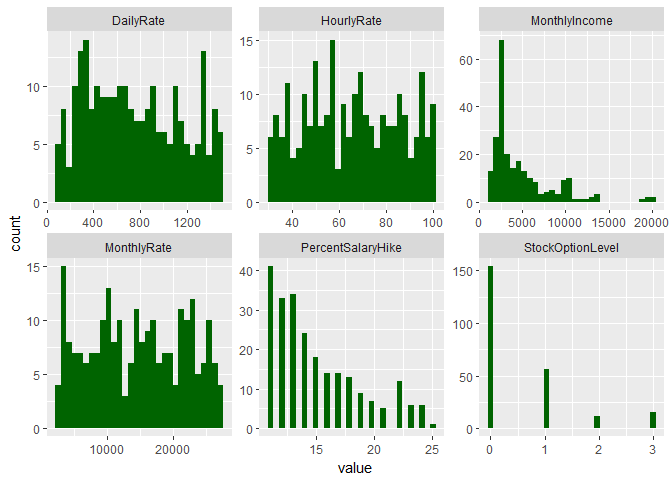
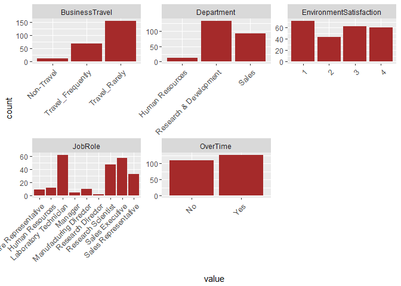
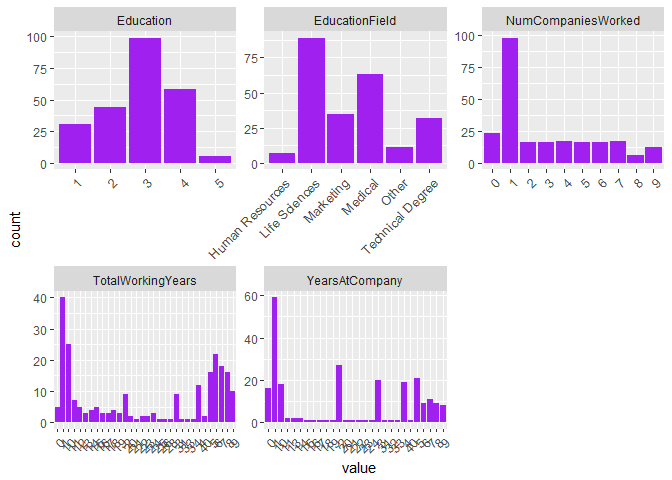
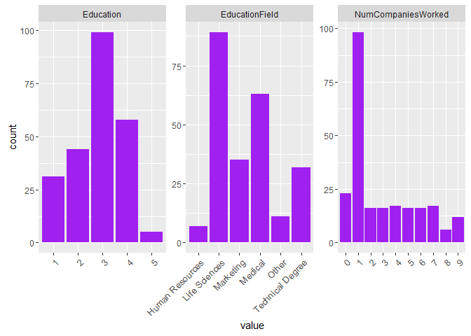
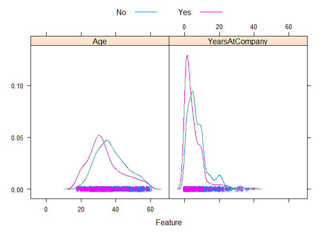
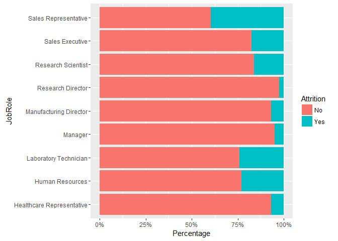
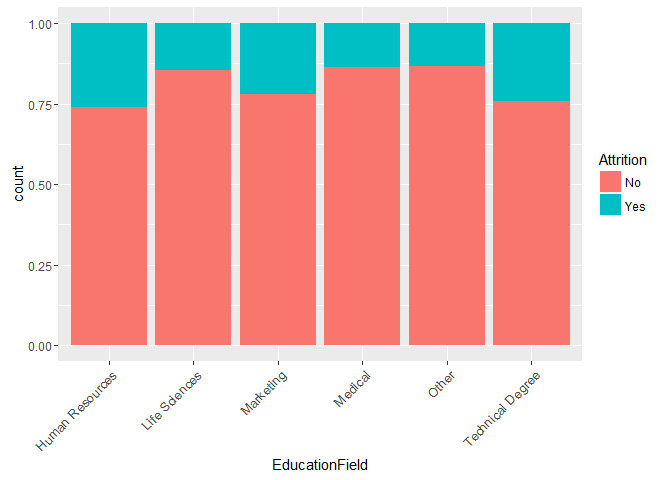

Prepare Data & Libraries and Factorize columns for analysis
-----------------------------------------------------------

``` r
##
#  md_document:
#    variant: markdown_github
##

## Reading from CaseStudy2-data.xlsx. The Excel file is on local
library("readxl")
library("tidyr")
library("devtools")
library("ggplot2")
library("dplyr")
```


    Attaching package: 'dplyr'

    The following objects are masked from 'package:stats':

        filter, lag

    The following objects are masked from 'package:base':

        intersect, setdiff, setequal, union

``` r
library("knitr")
library("caret")
```

    Loading required package: lattice

``` r
library("scales")
library("purrr")
```


    Attaching package: 'purrr'

    The following object is masked from 'package:scales':

        discard

    The following object is masked from 'package:caret':

        lift

``` r
library("grid")
library("gridExtra")
```


    Attaching package: 'gridExtra'

    The following object is masked from 'package:dplyr':

        combine

``` r
multiplot <- function(..., plotlist=NULL, file, cols=1, layout=NULL) {
  require(grid)

  # Make a list from the ... arguments and plotlist
  plots <- c(list(...), plotlist)

  numPlots = length(plots)

  # If layout is NULL, then use 'cols' to determine layout
  if (is.null(layout)) {
    # Make the panel
    # ncol: Number of columns of plots
    # nrow: Number of rows needed, calculated from # of cols
    layout <- matrix(seq(1, cols * ceiling(numPlots/cols)),
                    ncol = cols, nrow = ceiling(numPlots/cols))
  }

 if (numPlots==1) {
    print(plots[[1]])

  } else {
    # Set up the page
    grid.newpage()
    pushViewport(viewport(layout = grid.layout(nrow(layout), ncol(layout))))

    # Make each plot, in the correct location
    for (i in 1:numPlots) {
      # Get the i,j matrix positions of the regions that contain this subplot
      matchidx <- as.data.frame(which(layout == i, arr.ind = TRUE))

      print(plots[[i]], vp = viewport(layout.pos.row = matchidx$row,
                                      layout.pos.col = matchidx$col))
    }
  }
}

case_data <- data.frame(read_excel("data/CaseStudy2-data.xlsx"))

factor_cols <- c("Attrition", "BusinessTravel", "Department", "Education", "EducationField", "EnvironmentSatisfaction", "Gender", "JobInvolvement", "JobLevel", "JobRole", "JobSatisfaction", "MaritalStatus", "OverTime")
case_data[factor_cols] <- lapply(case_data[factor_cols], factor)

## Prepare attrition data

attrition_data <- case_data[which(case_data$Attrition == 'Yes'), ]
```

Univariate 1 - attrition by salary and Ratings
----------------------------------------------

``` r
uni_1_cols <- c("HourlyRate", "DailyRate", "MonthlyIncome", "MonthlyRate", "PercentSalaryHike", "StockOptionLevel", "PerformanceRating", "RelationshipSatisfaction")
attrition_data[uni_1_cols] %>%
 gather() %>%     
 ggplot(aes(x = value)) +                     
 facet_wrap(~ key, scales = "free") +  
 geom_histogram(fill = "darkgreen")
```

    `stat_bin()` using `bins = 30`. Pick better value with `binwidth`.



Univariate 2 - attrition by job functions
-----------------------------------------

``` r
uni_2_cols <- c("Department", "JobRole", "BusinessTravel", "EnvironmentSatisfaction", "JobInvolvement", "JobLevel")
attrition_data[uni_2_cols] %>%
 gather() %>%     
 ggplot(aes(x = value)) +                     
 facet_wrap(~ key, scales = "free") +  
 geom_bar(fill="brown") +
 theme(axis.text.x = element_text(size  = 10, angle = 45,hjust = 1,vjust = 1))
```

    Warning: attributes are not identical across measure variables;
    they will be dropped



Univariate 3 - attrition by employee background
-----------------------------------------------

``` r
uni_3_cols <- c("Education", "EducationField", "NumCompaniesWorked", "TotalWorkingYears", "YearsAtCompany")
attrition_data[uni_3_cols] %>%
 gather() %>%     
 ggplot(aes(x = value)) +                     
 facet_wrap(~ key, scales = "free") +  
 geom_bar(fill="purple") +
 theme(axis.text.x = element_text(size  = 10, angle = 45,hjust = 1,vjust = 1))
```

    Warning: attributes are not identical across measure variables;
    they will be dropped



Univariate 4 - attrition by stress factors
------------------------------------------

``` r
uni_4_cols <- c("WorkLifeBalance", "RelationshipSatisfaction", "OverTime", "TrainingTimesLastYear")
unit4_plot1 <- attrition_data[uni_4_cols] %>%
 gather() %>%     
 ggplot(aes(x = value)) +                     
 facet_wrap(~ key, scales = "free") +  
 geom_bar(fill="blue") +
 theme(axis.text.x = element_text(size  = 10, angle = 45,hjust = 1,vjust = 1))
```

    Warning: attributes are not identical across measure variables;
    they will be dropped

``` r
unit4_plot2 <- qplot(attrition_data$DistanceFromHome, geom="histogram")  + xlab("Distance From Home")
multiplot(unit4_plot1, cols=3)
```


Quick glance at attrition data by department
--------------------------------------------

``` r
att_by_dept_tbl <- case_data %>% select(Attrition, Department) %>% group_by(Department) %>% arrange(Department) %>% table()

knitr::kable(att_by_dept_tbl)
```

|     |  Human Resources|  Research & Development|  Sales|
|-----|----------------:|-----------------------:|------:|
| No  |               51|                     828|    354|
| Yes |               12|                     133|     92|

Univariate 1 - attrition by department
--------------------------------------

``` r
att_by_dept <- data.frame(att_by_dept_tbl)
ggplot(att_by_dept, aes(x = reorder(Department, -Freq), y=Freq, fill=Attrition)) + 
    geom_bar(stat = "identity") + 
    ggtitle('Attrition by Department') + 
    theme(plot.title = element_text(hjust = 0.5)) +
    xlab('Department') + 
    ylab('Attrition')
```



Univariate 2 - attrition with Age and Years at Company
------------------------------------------------------

``` r
featurePlot(x = case_data[, c('Age', 'YearsAtCompany')], y = case_data$Attrition, plot = "density", auto.key = list(columns = 2))
```



Univariate 3 - attrition by job role
------------------------------------

``` r
ggplot(case_data, aes(x = JobRole, fill = Attrition)) +
  stat_count(width = 0.5) +
  xlab("Job Role") +
  ylab("Count") +
  labs(fill = "Attrition") +
  coord_flip()
```


``` r
ggplot(case_data, aes(x = JobRole)) + 
  geom_bar(aes(fill = Attrition), position = 'fill') + 
  scale_y_continuous(labels = percent_format()) +
  ylab("Percentage") +
  coord_flip()
```



Univariate 4 - attrition by education field
-------------------------------------------

``` r
ggplot(case_data, aes(x = EducationField, ..count..)) +
  geom_bar(aes(fill = Attrition), position="fill") +
  theme(axis.text.x = element_text(size  = 10, angle = 45,hjust = 1,vjust = 1))
```



Summary
-------

``` r
## Summary section
```
