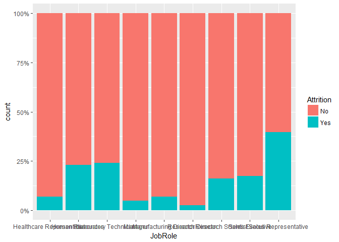

Source Documents
----------------

``` r
## Reading from CaseStudy2-data.xlsx. The Excel file is on local
library("readxl")
library("tidyr")
library("devtools")
library("ggplot2")
library("dplyr")
```


    Attaching package: 'dplyr'

    The following objects are masked from 'package:stats':

        filter, lag

    The following objects are masked from 'package:base':

        intersect, setdiff, setequal, union

``` r
library("knitr")
library("caret")
```

    Loading required package: lattice

``` r
case_data <- data.frame(read_excel("data/CaseStudy2-data.xlsx"))

factor_cols <- c("Attrition", "BusinessTravel", "Department", "Education", "EducationField", "EnvironmentSatisfaction", "Gender", "JobInvolvement", "JobLevel", "JobRole", "JobSatisfaction", "MaritalStatus", "OverTime")
case_data[factor_cols] <- lapply(case_data[factor_cols], factor)

## Quick glance at attrition data

attrition_data <- case_data[which(case_data$Attrition == 'Yes'), ]

## Quick glance at attrition data by department
att_by_dept_tbl <- case_data %>% select(Attrition, Department) %>% group_by(Department) %>% arrange(Department) %>% table()

knitr::kable(att_by_dept_tbl)
```

|     |  Human Resources|  Research & Development|  Sales|
|-----|----------------:|-----------------------:|------:|
| No  |               51|                     828|    354|
| Yes |               12|                     133|     92|

``` r
## attrition by department
att_by_dept <- data.frame(att_by_dept_tbl)
ggplot(att_by_dept, aes(x = reorder(Department, -Freq), y=Freq, fill=Attrition)) + 
    geom_bar(stat = "identity") + 
    ggtitle('Attrition by Department') + 
    theme(plot.title = element_text(hjust = 0.5)) +
    xlab('Department') + 
    ylab('Attrition')
```


``` r
## attrition with Age and Years at Company
featurePlot(x = case_data[, c('Age', 'YearsAtCompany')], y = case_data$Attrition, plot = "density", auto.key = list(columns = 2))
```


``` r
## attrition by job role
ggplot(case_data, aes(x = JobRole, fill = Attrition)) +
stat_count(width = 0.5) +
xlab("Job Role") +
ylab("Count") +
labs(fill = "Attrition") +
coord_flip()
```


``` r
## attrition by job role in percentage
library('scales')
ggplot(case_data, aes(x = JobRole)) + geom_bar(aes(fill = Attrition), position = 'fill') + scale_y_continuous(labels = percent_format())
```


