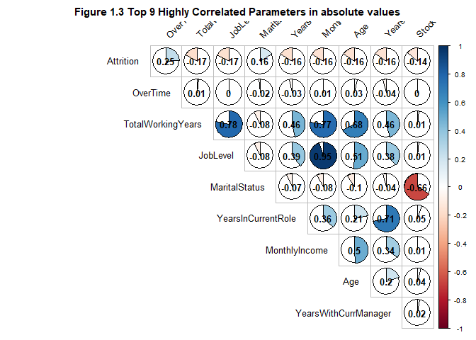
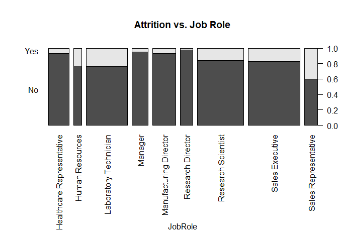

Prepare Data & Libraries and Factorize columns for analysis
-----------------------------------------------------------

``` r
##
#  md_document:
#    variant: markdown_github
##

## Reading from CaseStudy2-data.xlsx. The Excel file is on local
library("readxl")
library("tidyr")
library("devtools")
library("ggplot2")
library("dplyr")
```


    Attaching package: 'dplyr'

    The following objects are masked from 'package:stats':

        filter, lag

    The following objects are masked from 'package:base':

        intersect, setdiff, setequal, union

``` r
library("knitr")
library("caret")
```

    Loading required package: lattice

``` r
library("scales")
library("purrr")
```


    Attaching package: 'purrr'

    The following object is masked from 'package:scales':

        discard

    The following object is masked from 'package:caret':

        lift

``` r
library("grid")
library("gridExtra")
```


    Attaching package: 'gridExtra'

    The following object is masked from 'package:dplyr':

        combine

``` r
multiplot <- function(..., plotlist=NULL, file, cols=1, layout=NULL) {
  require(grid)

  # Make a list from the ... arguments and plotlist
  plots <- c(list(...), plotlist)

  numPlots = length(plots)

  # If layout is NULL, then use 'cols' to determine layout
  if (is.null(layout)) {
    # Make the panel
    # ncol: Number of columns of plots
    # nrow: Number of rows needed, calculated from # of cols
    layout <- matrix(seq(1, cols * ceiling(numPlots/cols)),
                    ncol = cols, nrow = ceiling(numPlots/cols))
  }

 if (numPlots==1) {
    print(plots[[1]])

  } else {
    # Set up the page
    grid.newpage()
    pushViewport(viewport(layout = grid.layout(nrow(layout), ncol(layout))))

    # Make each plot, in the correct location
    for (i in 1:numPlots) {
      # Get the i,j matrix positions of the regions that contain this subplot
      matchidx <- as.data.frame(which(layout == i, arr.ind = TRUE))

      print(plots[[i]], vp = viewport(layout.pos.row = matchidx$row,
                                      layout.pos.col = matchidx$col))
    }
  }
}

case_data <- data.frame(read_excel("data/CaseStudy2-data.xlsx"))

factor_cols <- c("Attrition", "BusinessTravel", "Department", "Education", "EducationField", "EnvironmentSatisfaction", "Gender", "JobInvolvement", "JobLevel", "JobRole", "JobSatisfaction", "MaritalStatus", "OverTime")
case_data[factor_cols] <- lapply(case_data[factor_cols], factor)

## Prepare attrition data

attrition_data <- case_data[which(case_data$Attrition == 'Yes'), ]
```

Univariate 1 - attrition by salary and Ratings
----------------------------------------------

``` r
uni_1_cols <- c("HourlyRate", "DailyRate", "MonthlyIncome", "MonthlyRate", "PercentSalaryHike", "StockOptionLevel", "PerformanceRating", "RelationshipSatisfaction")
attrition_data[uni_1_cols] %>%
 gather() %>%     
 ggplot(aes(x = value)) +                     
 facet_wrap(~ key, scales = "free") +  
 geom_histogram(fill = "darkgreen")
```

    `stat_bin()` using `bins = 30`. Pick better value with `binwidth`.


Univariate 2 - attrition by job functions
-----------------------------------------

``` r
uni_2_cols <- c("Department", "JobRole", "BusinessTravel", "EnvironmentSatisfaction", "JobInvolvement", "JobLevel")
attrition_data[uni_2_cols] %>%
 gather() %>%     
 ggplot(aes(x = value)) +                     
 facet_wrap(~ key, scales = "free") +  
 geom_bar(fill="brown") +
 theme(axis.text.x = element_text(size  = 10, angle = 45,hjust = 1,vjust = 1))
```

    Warning: attributes are not identical across measure variables;
    they will be dropped


Univariate 3 - attrition by employee background
-----------------------------------------------

``` r
uni_3_cols <- c("Education", "EducationField", "NumCompaniesWorked", "TotalWorkingYears", "YearsAtCompany")
attrition_data[uni_3_cols] %>%
 gather() %>%     
 ggplot(aes(x = value)) +                     
 facet_wrap(~ key, scales = "free") +  
 geom_bar(fill="purple") +
 theme(axis.text.x = element_text(size  = 10, angle = 45,hjust = 1,vjust = 1))
```

    Warning: attributes are not identical across measure variables;
    they will be dropped


Univariate 4 - attrition by stress factors
------------------------------------------

``` r
uni_4_cols <- c("WorkLifeBalance", "RelationshipSatisfaction", "OverTime", "TrainingTimesLastYear")
unit4_plot1 <- attrition_data[uni_4_cols] %>%
 gather() %>%     
 ggplot(aes(x = value)) +                     
 facet_wrap(~ key, scales = "free") +  
 geom_bar(fill="blue") +
 theme(axis.text.x = element_text(size  = 10, angle = 45,hjust = 1,vjust = 1))
```

    Warning: attributes are not identical across measure variables;
    they will be dropped

``` r
unit4_plot2 <- qplot(attrition_data$DistanceFromHome, geom="histogram")  + xlab("Distance From Home")
multiplot(unit4_plot2, plotlist=unit4_plot1, cols=3)
```

    `stat_bin()` using `bins = 30`. Pick better value with `binwidth`.

 key
value 1 WorkLifeBalance 1 2 WorkLifeBalance 3 3 WorkLifeBalance 3 4
WorkLifeBalance 3 5 WorkLifeBalance 3 6 WorkLifeBalance 3 7
WorkLifeBalance 4 8 WorkLifeBalance 2 9 WorkLifeBalance 3 10
WorkLifeBalance 2 11 WorkLifeBalance 3 12 WorkLifeBalance 3 13
WorkLifeBalance 2 14 WorkLifeBalance 2 15 WorkLifeBalance 3 16
WorkLifeBalance 3 17 WorkLifeBalance 3 18 WorkLifeBalance 3 19
WorkLifeBalance 3 20 WorkLifeBalance 3 21 WorkLifeBalance 2 22
WorkLifeBalance 2 23 WorkLifeBalance 2 24 WorkLifeBalance 3 25
WorkLifeBalance 3 26 WorkLifeBalance 4 27 WorkLifeBalance 4 28
WorkLifeBalance 2 29 WorkLifeBalance 2 30 WorkLifeBalance 3 31
WorkLifeBalance 3 32 WorkLifeBalance 2 33 WorkLifeBalance 2 34
WorkLifeBalance 3 35 WorkLifeBalance 2 36 WorkLifeBalance 2 37
WorkLifeBalance 2 38 WorkLifeBalance 1 39 WorkLifeBalance 4 40
WorkLifeBalance 1 41 WorkLifeBalance 3 42 WorkLifeBalance 4 43
WorkLifeBalance 1 44 WorkLifeBalance 2 45 WorkLifeBalance 1 46
WorkLifeBalance 3 47 WorkLifeBalance 3 48 WorkLifeBalance 3 49
WorkLifeBalance 2 50 WorkLifeBalance 2 51 WorkLifeBalance 2 52
WorkLifeBalance 2 53 WorkLifeBalance 3 54 WorkLifeBalance 3 55
WorkLifeBalance 3 56 WorkLifeBalance 3 57 WorkLifeBalance 3 58
WorkLifeBalance 2 59 WorkLifeBalance 3 60 WorkLifeBalance 3 61
WorkLifeBalance 3 62 WorkLifeBalance 3 63 WorkLifeBalance 2 64
WorkLifeBalance 4 65 WorkLifeBalance 4 66 WorkLifeBalance 4 67
WorkLifeBalance 3 68 WorkLifeBalance 3 69 WorkLifeBalance 3 70
WorkLifeBalance 3 71 WorkLifeBalance 2 72 WorkLifeBalance 3 73
WorkLifeBalance 1 74 WorkLifeBalance 3 75 WorkLifeBalance 3 76
WorkLifeBalance 4 77 WorkLifeBalance 1 78 WorkLifeBalance 3 79
WorkLifeBalance 3 80 WorkLifeBalance 3 81 WorkLifeBalance 3 82
WorkLifeBalance 3 83 WorkLifeBalance 3 84 WorkLifeBalance 3 85
WorkLifeBalance 3 86 WorkLifeBalance 2 87 WorkLifeBalance 3 88
WorkLifeBalance 3 89 WorkLifeBalance 2 90 WorkLifeBalance 3 91
WorkLifeBalance 3 92 WorkLifeBalance 3 93 WorkLifeBalance 3 94
WorkLifeBalance 2 95 WorkLifeBalance 4 96 WorkLifeBalance 2 97
WorkLifeBalance 3 98 WorkLifeBalance 2 99 WorkLifeBalance 3 100
WorkLifeBalance 1 101 WorkLifeBalance 2 102 WorkLifeBalance 2 103
WorkLifeBalance 2 104 WorkLifeBalance 4 105 WorkLifeBalance 2 106
WorkLifeBalance 1 107 WorkLifeBalance 3 108 WorkLifeBalance 4 109
WorkLifeBalance 3 110 WorkLifeBalance 3 111 WorkLifeBalance 1 112
WorkLifeBalance 3 113 WorkLifeBalance 2 114 WorkLifeBalance 3 115
WorkLifeBalance 3 116 WorkLifeBalance 3 117 WorkLifeBalance 1 118
WorkLifeBalance 3 119 WorkLifeBalance 3 120 WorkLifeBalance 1 121
WorkLifeBalance 3 122 WorkLifeBalance 3 123 WorkLifeBalance 3 124
WorkLifeBalance 2 125 WorkLifeBalance 3 126 WorkLifeBalance 3 127
WorkLifeBalance 2 128 WorkLifeBalance 4 129 WorkLifeBalance 2 130
WorkLifeBalance 3 131 WorkLifeBalance 3 132 WorkLifeBalance 3 133
WorkLifeBalance 4 134 WorkLifeBalance 2 135 WorkLifeBalance 3 136
WorkLifeBalance 3 137 WorkLifeBalance 3 138 WorkLifeBalance 3 139
WorkLifeBalance 3 140 WorkLifeBalance 3 141 WorkLifeBalance 2 142
WorkLifeBalance 1 143 WorkLifeBalance 2 144 WorkLifeBalance 2 145
WorkLifeBalance 2 146 WorkLifeBalance 3 147 WorkLifeBalance 3 148
WorkLifeBalance 1 149 WorkLifeBalance 1 150 WorkLifeBalance 4 151
WorkLifeBalance 3 152 WorkLifeBalance 3 153 WorkLifeBalance 1 154
WorkLifeBalance 3 155 WorkLifeBalance 3 156 WorkLifeBalance 3 157
WorkLifeBalance 3 158 WorkLifeBalance 3 159 WorkLifeBalance 2 160
WorkLifeBalance 4 161 WorkLifeBalance 4 162 WorkLifeBalance 2 163
WorkLifeBalance 2 164 WorkLifeBalance 4 165 WorkLifeBalance 2 166
WorkLifeBalance 2 167 WorkLifeBalance 3 168 WorkLifeBalance 3 169
WorkLifeBalance 3 170 WorkLifeBalance 3 171 WorkLifeBalance 4 172
WorkLifeBalance 3 173 WorkLifeBalance 4 174 WorkLifeBalance 4 175
WorkLifeBalance 3 176 WorkLifeBalance 1 177 WorkLifeBalance 3 178
WorkLifeBalance 4 179 WorkLifeBalance 1 180 WorkLifeBalance 4 181
WorkLifeBalance 2 182 WorkLifeBalance 2 183 WorkLifeBalance 1 184
WorkLifeBalance 1 185 WorkLifeBalance 1 186 WorkLifeBalance 3 187
WorkLifeBalance 3 188 WorkLifeBalance 3 189 WorkLifeBalance 3 190
WorkLifeBalance 3 191 WorkLifeBalance 4 192 WorkLifeBalance 3 193
WorkLifeBalance 2 194 WorkLifeBalance 1 195 WorkLifeBalance 4 196
WorkLifeBalance 3 197 WorkLifeBalance 3 198 WorkLifeBalance 3 199
WorkLifeBalance 3 200 WorkLifeBalance 3 201 WorkLifeBalance 1 202
WorkLifeBalance 3 203 WorkLifeBalance 3 204 WorkLifeBalance 2 205
WorkLifeBalance 3 206 WorkLifeBalance 2 207 WorkLifeBalance 3 208
WorkLifeBalance 3 209 WorkLifeBalance 3 210 WorkLifeBalance 3 211
WorkLifeBalance 2 212 WorkLifeBalance 3 213 WorkLifeBalance 2 214
WorkLifeBalance 1 215 WorkLifeBalance 3 216 WorkLifeBalance 4 217
WorkLifeBalance 3 218 WorkLifeBalance 3 219 WorkLifeBalance 2 220
WorkLifeBalance 2 221 WorkLifeBalance 3 222 WorkLifeBalance 2 223
WorkLifeBalance 3 224 WorkLifeBalance 3 225 WorkLifeBalance 3 226
WorkLifeBalance 3 227 WorkLifeBalance 3 228 WorkLifeBalance 3 229
WorkLifeBalance 3 230 WorkLifeBalance 2 231 WorkLifeBalance 3 232
WorkLifeBalance 2 233 WorkLifeBalance 2 234 WorkLifeBalance 4 235
WorkLifeBalance 1 236 WorkLifeBalance 3 237 WorkLifeBalance 3 238
RelationshipSatisfaction 1 239 RelationshipSatisfaction 2 240
RelationshipSatisfaction 2 241 RelationshipSatisfaction 2 242
RelationshipSatisfaction 3 243 RelationshipSatisfaction 2 244
RelationshipSatisfaction 3 245 RelationshipSatisfaction 1 246
RelationshipSatisfaction 3 247 RelationshipSatisfaction 3 248
RelationshipSatisfaction 4 249 RelationshipSatisfaction 4 250
RelationshipSatisfaction 3 251 RelationshipSatisfaction 1 252
RelationshipSatisfaction 4 253 RelationshipSatisfaction 4 254
RelationshipSatisfaction 2 255 RelationshipSatisfaction 4 256
RelationshipSatisfaction 4 257 RelationshipSatisfaction 1 258
RelationshipSatisfaction 2 259 RelationshipSatisfaction 4 260
RelationshipSatisfaction 4 261 RelationshipSatisfaction 3 262
RelationshipSatisfaction 4 263 RelationshipSatisfaction 1 264
RelationshipSatisfaction 1 265 RelationshipSatisfaction 3 266
RelationshipSatisfaction 4 267 RelationshipSatisfaction 1 268
RelationshipSatisfaction 2 269 RelationshipSatisfaction 4 270
RelationshipSatisfaction 3 271 RelationshipSatisfaction 3 272
RelationshipSatisfaction 3 273 RelationshipSatisfaction 4 274
RelationshipSatisfaction 3 275 RelationshipSatisfaction 3 276
RelationshipSatisfaction 1 277 RelationshipSatisfaction 4 278
RelationshipSatisfaction 2 279 RelationshipSatisfaction 2 280
RelationshipSatisfaction 3 281 RelationshipSatisfaction 4 282
RelationshipSatisfaction 4 283 RelationshipSatisfaction 4 284
RelationshipSatisfaction 2 285 RelationshipSatisfaction 3 286
RelationshipSatisfaction 1 287 RelationshipSatisfaction 4 288
RelationshipSatisfaction 1 289 RelationshipSatisfaction 4 290
RelationshipSatisfaction 3 291 RelationshipSatisfaction 2 292
RelationshipSatisfaction 3 293 RelationshipSatisfaction 1 294
RelationshipSatisfaction 4 295 RelationshipSatisfaction 2 296
RelationshipSatisfaction 3 297 RelationshipSatisfaction 3 298
RelationshipSatisfaction 3 299 RelationshipSatisfaction 2 300
RelationshipSatisfaction 4 301 RelationshipSatisfaction 2 302
RelationshipSatisfaction 3 303 RelationshipSatisfaction 4 304
RelationshipSatisfaction 1 305 RelationshipSatisfaction 1 306
RelationshipSatisfaction 3 307 RelationshipSatisfaction 3 308
RelationshipSatisfaction 2 309 RelationshipSatisfaction 4 310
RelationshipSatisfaction 2 311 RelationshipSatisfaction 4 312
RelationshipSatisfaction 4 313 RelationshipSatisfaction 3 314
RelationshipSatisfaction 3 315 RelationshipSatisfaction 2 316
RelationshipSatisfaction 4 317 RelationshipSatisfaction 4 318
RelationshipSatisfaction 1 319 RelationshipSatisfaction 1 320
RelationshipSatisfaction 1 321 RelationshipSatisfaction 4 322
RelationshipSatisfaction 4 323 RelationshipSatisfaction 3 324
RelationshipSatisfaction 4 325 RelationshipSatisfaction 4 326
RelationshipSatisfaction 3 327 RelationshipSatisfaction 3 328
RelationshipSatisfaction 4 329 RelationshipSatisfaction 3 330
RelationshipSatisfaction 4 331 RelationshipSatisfaction 4 332
RelationshipSatisfaction 1 333 RelationshipSatisfaction 3 334
RelationshipSatisfaction 1 335 RelationshipSatisfaction 1 336
RelationshipSatisfaction 3 337 RelationshipSatisfaction 3 338
RelationshipSatisfaction 4 339 RelationshipSatisfaction 4 340
RelationshipSatisfaction 1 341 RelationshipSatisfaction 1 342
RelationshipSatisfaction 3 343 RelationshipSatisfaction 4 344
RelationshipSatisfaction 3 345 RelationshipSatisfaction 2 346
RelationshipSatisfaction 2 347 RelationshipSatisfaction 1 348
RelationshipSatisfaction 3 349 RelationshipSatisfaction 1 350
RelationshipSatisfaction 4 351 RelationshipSatisfaction 1 352
RelationshipSatisfaction 3 353 RelationshipSatisfaction 2 354
RelationshipSatisfaction 4 355 RelationshipSatisfaction 1 356
RelationshipSatisfaction 1 357 RelationshipSatisfaction 1 358
RelationshipSatisfaction 4 359 RelationshipSatisfaction 4 360
RelationshipSatisfaction 3 361 RelationshipSatisfaction 2 362
RelationshipSatisfaction 2 363 RelationshipSatisfaction 2 364
RelationshipSatisfaction 1 365 RelationshipSatisfaction 3 366
RelationshipSatisfaction 1 367 RelationshipSatisfaction 4 368
RelationshipSatisfaction 1 369 RelationshipSatisfaction 2 370
RelationshipSatisfaction 2 371 RelationshipSatisfaction 3 372
RelationshipSatisfaction 2 373 RelationshipSatisfaction 1 374
RelationshipSatisfaction 4 375 RelationshipSatisfaction 4 376
RelationshipSatisfaction 4 377 RelationshipSatisfaction 1 378
RelationshipSatisfaction 3 379 RelationshipSatisfaction 1 380
RelationshipSatisfaction 2 381 RelationshipSatisfaction 4 382
RelationshipSatisfaction 2 383 RelationshipSatisfaction 3 384
RelationshipSatisfaction 2 385 RelationshipSatisfaction 1 386
RelationshipSatisfaction 1 387 RelationshipSatisfaction 2 388
RelationshipSatisfaction 4 389 RelationshipSatisfaction 1 390
RelationshipSatisfaction 3 391 RelationshipSatisfaction 4 392
RelationshipSatisfaction 1 393 RelationshipSatisfaction 1 394
RelationshipSatisfaction 1 395 RelationshipSatisfaction 3 396
RelationshipSatisfaction 3 397 RelationshipSatisfaction 1 398
RelationshipSatisfaction 3 399 RelationshipSatisfaction 4 400
RelationshipSatisfaction 3 401 RelationshipSatisfaction 3 402
RelationshipSatisfaction 3 403 RelationshipSatisfaction 4 404
RelationshipSatisfaction 4 405 RelationshipSatisfaction 1 406
RelationshipSatisfaction 1 407 RelationshipSatisfaction 2 408
RelationshipSatisfaction 3 409 RelationshipSatisfaction 1 410
RelationshipSatisfaction 1 411 RelationshipSatisfaction 2 412
RelationshipSatisfaction 1 413 RelationshipSatisfaction 3 414
RelationshipSatisfaction 4 415 RelationshipSatisfaction 4 416
RelationshipSatisfaction 1 417 RelationshipSatisfaction 3 418
RelationshipSatisfaction 3 419 RelationshipSatisfaction 3 420
RelationshipSatisfaction 3 421 RelationshipSatisfaction 2 422
RelationshipSatisfaction 1 423 RelationshipSatisfaction 4 424
RelationshipSatisfaction 4 425 RelationshipSatisfaction 2 426
RelationshipSatisfaction 1 427 RelationshipSatisfaction 3 428
RelationshipSatisfaction 3 429 RelationshipSatisfaction 3 430
RelationshipSatisfaction 4 431 RelationshipSatisfaction 2 432
RelationshipSatisfaction 1 433 RelationshipSatisfaction 1 434
RelationshipSatisfaction 3 435 RelationshipSatisfaction 1 436
RelationshipSatisfaction 2 437 RelationshipSatisfaction 3 438
RelationshipSatisfaction 3 439 RelationshipSatisfaction 2 440
RelationshipSatisfaction 2 441 RelationshipSatisfaction 3 442
RelationshipSatisfaction 3 443 RelationshipSatisfaction 3 444
RelationshipSatisfaction 1 445 RelationshipSatisfaction 4 446
RelationshipSatisfaction 2 447 RelationshipSatisfaction 3 448
RelationshipSatisfaction 3 449 RelationshipSatisfaction 4 450
RelationshipSatisfaction 3 451 RelationshipSatisfaction 2 452
RelationshipSatisfaction 3 453 RelationshipSatisfaction 4 454
RelationshipSatisfaction 3 455 RelationshipSatisfaction 4 456
RelationshipSatisfaction 3 457 RelationshipSatisfaction 2 458
RelationshipSatisfaction 3 459 RelationshipSatisfaction 3 460
RelationshipSatisfaction 1 461 RelationshipSatisfaction 2 462
RelationshipSatisfaction 4 463 RelationshipSatisfaction 4 464
RelationshipSatisfaction 4 465 RelationshipSatisfaction 1 466
RelationshipSatisfaction 1 467 RelationshipSatisfaction 1 468
RelationshipSatisfaction 3 469 RelationshipSatisfaction 2 470
RelationshipSatisfaction 1 471 RelationshipSatisfaction 2 472
RelationshipSatisfaction 4 473 RelationshipSatisfaction 4 474
RelationshipSatisfaction 2 475 OverTime Yes 476 OverTime Yes 477
OverTime Yes 478 OverTime No 479 OverTime No 480 OverTime Yes 481
OverTime No 482 OverTime Yes 483 OverTime Yes 484 OverTime No 485
OverTime No 486 OverTime Yes 487 OverTime Yes 488 OverTime Yes 489
OverTime No 490 OverTime Yes 491 OverTime Yes 492 OverTime Yes 493
OverTime Yes 494 OverTime Yes 495 OverTime Yes 496 OverTime No 497
OverTime Yes 498 OverTime Yes 499 OverTime No 500 OverTime No 501
OverTime No 502 OverTime No 503 OverTime Yes 504 OverTime Yes 505
OverTime Yes 506 OverTime No 507 OverTime No 508 OverTime Yes 509
OverTime No 510 OverTime No 511 OverTime Yes 512 OverTime Yes 513
OverTime No 514 OverTime Yes 515 OverTime No 516 OverTime No 517
OverTime No 518 OverTime Yes 519 OverTime Yes 520 OverTime Yes 521
OverTime Yes 522 OverTime No 523 OverTime No 524 OverTime Yes 525
OverTime Yes 526 OverTime Yes 527 OverTime Yes 528 OverTime Yes 529
OverTime No 530 OverTime Yes 531 OverTime No 532 OverTime Yes 533
OverTime No 534 OverTime Yes 535 OverTime No 536 OverTime Yes 537
OverTime No 538 OverTime No 539 OverTime No 540 OverTime Yes 541
OverTime No 542 OverTime No 543 OverTime Yes 544 OverTime No 545
OverTime Yes 546 OverTime Yes 547 OverTime Yes 548 OverTime No 549
OverTime Yes 550 OverTime No 551 OverTime No 552 OverTime No 553
OverTime No 554 OverTime Yes 555 OverTime Yes 556 OverTime No 557
OverTime Yes 558 OverTime Yes 559 OverTime Yes 560 OverTime Yes 561
OverTime Yes 562 OverTime Yes 563 OverTime No 564 OverTime Yes 565
OverTime Yes 566 OverTime No 567 OverTime Yes 568 OverTime No 569
OverTime No 570 OverTime No 571 OverTime Yes 572 OverTime Yes 573
OverTime Yes 574 OverTime Yes 575 OverTime Yes 576 OverTime No 577
OverTime No 578 OverTime Yes 579 OverTime Yes 580 OverTime Yes 581
OverTime Yes 582 OverTime Yes 583 OverTime No 584 OverTime Yes 585
OverTime No 586 OverTime No 587 OverTime Yes 588 OverTime Yes 589
OverTime Yes 590 OverTime Yes 591 OverTime Yes 592 OverTime Yes 593
OverTime No 594 OverTime No 595 OverTime No 596 OverTime No 597 OverTime
No 598 OverTime No 599 OverTime Yes 600 OverTime Yes 601 OverTime No 602
OverTime Yes 603 OverTime No 604 OverTime No 605 OverTime Yes 606
OverTime No 607 OverTime Yes 608 OverTime No 609 OverTime Yes 610
OverTime No 611 OverTime Yes 612 OverTime No 613 OverTime No 614
OverTime Yes 615 OverTime No 616 OverTime No 617 OverTime Yes 618
OverTime Yes 619 OverTime No 620 OverTime Yes 621 OverTime Yes 622
OverTime No 623 OverTime No 624 OverTime Yes 625 OverTime Yes 626
OverTime Yes 627 OverTime No 628 OverTime No 629 OverTime Yes 630
OverTime No 631 OverTime No 632 OverTime Yes 633 OverTime Yes 634
OverTime Yes 635 OverTime No 636 OverTime Yes 637 OverTime Yes 638
OverTime No 639 OverTime Yes 640 OverTime Yes 641 OverTime Yes 642
OverTime No 643 OverTime Yes 644 OverTime No 645 OverTime No 646
OverTime No 647 OverTime No 648 OverTime Yes 649 OverTime No 650
OverTime Yes 651 OverTime No 652 OverTime No 653 OverTime No 654
OverTime Yes 655 OverTime Yes 656 OverTime No 657 OverTime No 658
OverTime No 659 OverTime No 660 OverTime No 661 OverTime Yes 662
OverTime No 663 OverTime No 664 OverTime Yes 665 OverTime Yes 666
OverTime No 667 OverTime Yes 668 OverTime Yes 669 OverTime Yes 670
OverTime Yes 671 OverTime Yes 672 OverTime No 673 OverTime Yes 674
OverTime No 675 OverTime No 676 OverTime Yes 677 OverTime No 678
OverTime No 679 OverTime No 680 OverTime Yes 681 OverTime No 682
OverTime Yes 683 OverTime No 684 OverTime Yes 685 OverTime Yes 686
OverTime Yes 687 OverTime No 688 OverTime No 689 OverTime Yes 690
OverTime No 691 OverTime No 692 OverTime Yes 693 OverTime Yes 694
OverTime Yes 695 OverTime No 696 OverTime No 697 OverTime Yes 698
OverTime Yes 699 OverTime No 700 OverTime No 701 OverTime Yes 702
OverTime Yes 703 OverTime No 704 OverTime No 705 OverTime Yes 706
OverTime Yes 707 OverTime No 708 OverTime Yes 709 OverTime No 710
OverTime No 711 OverTime Yes 712 TrainingTimesLastYear 0 713
TrainingTimesLastYear 3 714 TrainingTimesLastYear 4 715
TrainingTimesLastYear 4 716 TrainingTimesLastYear 2 717
TrainingTimesLastYear 5 718 TrainingTimesLastYear 6 719
TrainingTimesLastYear 2 720 TrainingTimesLastYear 2 721
TrainingTimesLastYear 2 722 TrainingTimesLastYear 0 723
TrainingTimesLastYear 2 724 TrainingTimesLastYear 3 725
TrainingTimesLastYear 0 726 TrainingTimesLastYear 3 727
TrainingTimesLastYear 3 728 TrainingTimesLastYear 5 729
TrainingTimesLastYear 1 730 TrainingTimesLastYear 3 731
TrainingTimesLastYear 2 732 TrainingTimesLastYear 3 733
TrainingTimesLastYear 3 734 TrainingTimesLastYear 2 735
TrainingTimesLastYear 2 736 TrainingTimesLastYear 2 737
TrainingTimesLastYear 2 738 TrainingTimesLastYear 5 739
TrainingTimesLastYear 3 740 TrainingTimesLastYear 5 741
TrainingTimesLastYear 1 742 TrainingTimesLastYear 2 743
TrainingTimesLastYear 3 744 TrainingTimesLastYear 2 745
TrainingTimesLastYear 5 746 TrainingTimesLastYear 5 747
TrainingTimesLastYear 1 748 TrainingTimesLastYear 3 749
TrainingTimesLastYear 2 750 TrainingTimesLastYear 3 751
TrainingTimesLastYear 2 752 TrainingTimesLastYear 5 753
TrainingTimesLastYear 2 754 TrainingTimesLastYear 5 755
TrainingTimesLastYear 2 756 TrainingTimesLastYear 0 757
TrainingTimesLastYear 2 758 TrainingTimesLastYear 0 759
TrainingTimesLastYear 2 760 TrainingTimesLastYear 3 761
TrainingTimesLastYear 4 762 TrainingTimesLastYear 3 763
TrainingTimesLastYear 4 764 TrainingTimesLastYear 3 765
TrainingTimesLastYear 2 766 TrainingTimesLastYear 5 767
TrainingTimesLastYear 6 768 TrainingTimesLastYear 0 769
TrainingTimesLastYear 3 770 TrainingTimesLastYear 2 771
TrainingTimesLastYear 4 772 TrainingTimesLastYear 5 773
TrainingTimesLastYear 4 774 TrainingTimesLastYear 3 775
TrainingTimesLastYear 2 776 TrainingTimesLastYear 3 777
TrainingTimesLastYear 2 778 TrainingTimesLastYear 2 779
TrainingTimesLastYear 2 780 TrainingTimesLastYear 2 781
TrainingTimesLastYear 3 782 TrainingTimesLastYear 2 783
TrainingTimesLastYear 3 784 TrainingTimesLastYear 3 785
TrainingTimesLastYear 2 786 TrainingTimesLastYear 4 787
TrainingTimesLastYear 2 788 TrainingTimesLastYear 2 789
TrainingTimesLastYear 3 790 TrainingTimesLastYear 4 791
TrainingTimesLastYear 5 792 TrainingTimesLastYear 3 793
TrainingTimesLastYear 3 794 TrainingTimesLastYear 4 795
TrainingTimesLastYear 4 796 TrainingTimesLastYear 2 797
TrainingTimesLastYear 2 798 TrainingTimesLastYear 2 799
TrainingTimesLastYear 2 800 TrainingTimesLastYear 2 801
TrainingTimesLastYear 2 802 TrainingTimesLastYear 1 803
TrainingTimesLastYear 3 804 TrainingTimesLastYear 2 805
TrainingTimesLastYear 3 806 TrainingTimesLastYear 3 807
TrainingTimesLastYear 3 808 TrainingTimesLastYear 2 809
TrainingTimesLastYear 3 810 TrainingTimesLastYear 3 811
TrainingTimesLastYear 2 812 TrainingTimesLastYear 3 813
TrainingTimesLastYear 3 814 TrainingTimesLastYear 3 815
TrainingTimesLastYear 3 816 TrainingTimesLastYear 1 817
TrainingTimesLastYear 2 818 TrainingTimesLastYear 2 819
TrainingTimesLastYear 3 820 TrainingTimesLastYear 2 821
TrainingTimesLastYear 6 822 TrainingTimesLastYear 2 823
TrainingTimesLastYear 4 824 TrainingTimesLastYear 2 825
TrainingTimesLastYear 0 826 TrainingTimesLastYear 5 827
TrainingTimesLastYear 2 828 TrainingTimesLastYear 2 829
TrainingTimesLastYear 2 830 TrainingTimesLastYear 3 831
TrainingTimesLastYear 2 832 TrainingTimesLastYear 6 833
TrainingTimesLastYear 3 834 TrainingTimesLastYear 1 835
TrainingTimesLastYear 3 836 TrainingTimesLastYear 2 837
TrainingTimesLastYear 3 838 TrainingTimesLastYear 6 839
TrainingTimesLastYear 2 840 TrainingTimesLastYear 2 841
TrainingTimesLastYear 1 842 TrainingTimesLastYear 2 843
TrainingTimesLastYear 4 844 TrainingTimesLastYear 3 845
TrainingTimesLastYear 0 846 TrainingTimesLastYear 0 847
TrainingTimesLastYear 2 848 TrainingTimesLastYear 4 849
TrainingTimesLastYear 4 850 TrainingTimesLastYear 0 851
TrainingTimesLastYear 3 852 TrainingTimesLastYear 5 853
TrainingTimesLastYear 3 854 TrainingTimesLastYear 2 855
TrainingTimesLastYear 4 856 TrainingTimesLastYear 2 857
TrainingTimesLastYear 4 858 TrainingTimesLastYear 5 859
TrainingTimesLastYear 2 860 TrainingTimesLastYear 3 861
TrainingTimesLastYear 2 862 TrainingTimesLastYear 4 863
TrainingTimesLastYear 2 864 TrainingTimesLastYear 2 865
TrainingTimesLastYear 2 866 TrainingTimesLastYear 2 867
TrainingTimesLastYear 3 868 TrainingTimesLastYear 2 869
TrainingTimesLastYear 2 870 TrainingTimesLastYear 2 871
TrainingTimesLastYear 2 872 TrainingTimesLastYear 4 873
TrainingTimesLastYear 0 874 TrainingTimesLastYear 2 875
TrainingTimesLastYear 3 876 TrainingTimesLastYear 0 877
TrainingTimesLastYear 3 878 TrainingTimesLastYear 2 879
TrainingTimesLastYear 2 880 TrainingTimesLastYear 1 881
TrainingTimesLastYear 3 882 TrainingTimesLastYear 3 883
TrainingTimesLastYear 2 884 TrainingTimesLastYear 1 885
TrainingTimesLastYear 2 886 TrainingTimesLastYear 2 887
TrainingTimesLastYear 2 888 TrainingTimesLastYear 0 889
TrainingTimesLastYear 3 890 TrainingTimesLastYear 4 891
TrainingTimesLastYear 2 892 TrainingTimesLastYear 2 893
TrainingTimesLastYear 2 894 TrainingTimesLastYear 2 895
TrainingTimesLastYear 3 896 TrainingTimesLastYear 2 897
TrainingTimesLastYear 4 898 TrainingTimesLastYear 2 899
TrainingTimesLastYear 4 900 TrainingTimesLastYear 2 901
TrainingTimesLastYear 3 902 TrainingTimesLastYear 2 903
TrainingTimesLastYear 3 904 TrainingTimesLastYear 2 905
TrainingTimesLastYear 3 906 TrainingTimesLastYear 2 907
TrainingTimesLastYear 2 908 TrainingTimesLastYear 3 909
TrainingTimesLastYear 2 910 TrainingTimesLastYear 2 911
TrainingTimesLastYear 2 912 TrainingTimesLastYear 3 913
TrainingTimesLastYear 3 914 TrainingTimesLastYear 2 915
TrainingTimesLastYear 0 916 TrainingTimesLastYear 3 917
TrainingTimesLastYear 2 918 TrainingTimesLastYear 2 919
TrainingTimesLastYear 4 920 TrainingTimesLastYear 3 921
TrainingTimesLastYear 6 922 TrainingTimesLastYear 2 923
TrainingTimesLastYear 2 924 TrainingTimesLastYear 3 925
TrainingTimesLastYear 4 926 TrainingTimesLastYear 3 927
TrainingTimesLastYear 2 928 TrainingTimesLastYear 4 929
TrainingTimesLastYear 3 930 TrainingTimesLastYear 3 931
TrainingTimesLastYear 3 932 TrainingTimesLastYear 2 933
TrainingTimesLastYear 3 934 TrainingTimesLastYear 2 935
TrainingTimesLastYear 2 936 TrainingTimesLastYear 3 937
TrainingTimesLastYear 3 938 TrainingTimesLastYear 0 939
TrainingTimesLastYear 2 940 TrainingTimesLastYear 2 941
TrainingTimesLastYear 2 942 TrainingTimesLastYear 4 943
TrainingTimesLastYear 2 944 TrainingTimesLastYear 3 945
TrainingTimesLastYear 3 946 TrainingTimesLastYear 4 947
TrainingTimesLastYear 3 948 TrainingTimesLastYear 3 \[\[1\]\] geom\_bar:
width = NULL, na.rm = FALSE stat\_count: width = NULL, na.rm = FALSE
position\_stack

<ggproto object: Class ScalesList> add: function clone: function find:
function get\_scales: function has\_scale: function input: function n:
function non\_position\_scales: function scales: list super:
<ggproto object: Class ScalesList> \* x -&gt; value List of 1 $
axis.text.x:List of 11 ..$ family : NULL ..$ face : NULL ..$ colour :
NULL ..$ size : num 10 ..$ hjust : num 1 ..$ vjust : num 1 ..$ angle :
num 45 ..$ lineheight : NULL ..$ margin :Classes ‘margin’, ‘unit’ atomic
\[1:4\] 2.2 0 0 0 .. .. ..- attr(*, “valid.unit”)= int 8 .. .. ..-
attr(*, “unit”)= chr “pt” ..$ debug : NULL ..$ inherit.blank: logi FALSE
..- attr(*, “class”)= chr \[1:2\] “element\_text” “element” - attr(*,
“class”)= chr \[1:2\] “theme” “gg” - attr(*, “complete”)= logi FALSE -
attr(*, “validate”)= logi FALSE &lt;ggproto object: Class
CoordCartesian, Coord&gt; aspect: function distance: function expand:
TRUE is\_linear: function labels: function limits: list range: function
render\_axis\_h: function render\_axis\_v: function render\_bg: function
render\_fg: function train: function transform: function super:
&lt;ggproto object: Class CoordCartesian, Coord&gt; &lt;ggproto object:
Class FacetWrap, Facet&gt; compute\_layout: function draw\_back:
function draw\_front: function draw\_labels: function draw\_panels:
function finish\_data: function init\_scales: function map: function
map\_data: function params: list render\_back: function render\_front:
function render\_panels: function setup\_data: function setup\_params:
function shrink: TRUE train: function train\_positions: function
train\_scales: function super: &lt;ggproto object: Class FacetWrap,
Facet&gt; &lt;environment: 0x0000000023f942b8&gt; $x \[1\] “value”

$y \[1\] “count”

$weight \[1\] “1”

Quick glance at attrition data by department
--------------------------------------------

``` r
att_by_dept_tbl <- case_data %>% select(Attrition, Department) %>% group_by(Department) %>% arrange(Department) %>% table()

knitr::kable(att_by_dept_tbl)
```

|     |  Human Resources|  Research & Development|  Sales|
|-----|----------------:|-----------------------:|------:|
| No  |               51|                     828|    354|
| Yes |               12|                     133|     92|

Univariate 1 - attrition by department
--------------------------------------

``` r
att_by_dept <- data.frame(att_by_dept_tbl)
ggplot(att_by_dept, aes(x = reorder(Department, -Freq), y=Freq, fill=Attrition)) + 
    geom_bar(stat = "identity") + 
    ggtitle('Attrition by Department') + 
    theme(plot.title = element_text(hjust = 0.5)) +
    xlab('Department') + 
    ylab('Attrition')
```



Univariate 2 - attrition with Age and Years at Company
------------------------------------------------------

``` r
featurePlot(x = case_data[, c('Age', 'YearsAtCompany')], y = case_data$Attrition, plot = "density", auto.key = list(columns = 2))
```



Univariate 3 - attrition by job role
------------------------------------

``` r
ggplot(case_data, aes(x = JobRole, fill = Attrition)) +
  stat_count(width = 0.5) +
  xlab("Job Role") +
  ylab("Count") +
  labs(fill = "Attrition") +
  coord_flip()
```


``` r
ggplot(case_data, aes(x = JobRole)) + 
  geom_bar(aes(fill = Attrition), position = 'fill') + 
  scale_y_continuous(labels = percent_format()) +
  ylab("Percentage") +
  coord_flip()
```


Univariate 4 - attrition by education field
-------------------------------------------

``` r
ggplot(case_data, aes(x = EducationField, ..count..)) +
  geom_bar(aes(fill = Attrition), position="fill") +
  theme(axis.text.x = element_text(size  = 10, angle = 45,hjust = 1,vjust = 1))
```


Summary
-------

``` r
## Summary section
```
