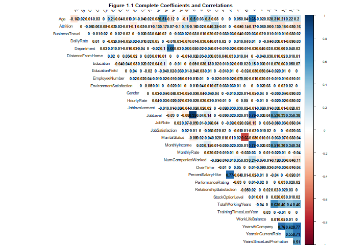
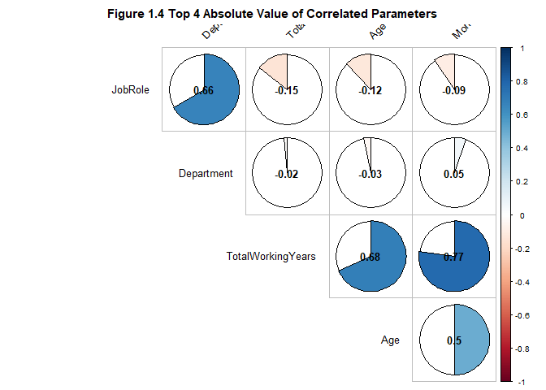

Exploratory Data Analysis
=========================

The Exploratory Data Analysis (EDA) and extensive analysis have been
employeed throughout this analysis and mainly consist of 3 large steps
as below:

**1. Exploratory Data Analysis** \* Explore: Attrition vs all variables
\* Quick identification of involved variables and visible trends \*
Clean and transform the information to a numeric dataset **2. Model
Creation** \* Evaluate Prediciton Models against requirements \* Split
dataset into training and test dataset \* Create model and reduced model
**3. Cross Validation** \* Create Predictions using a test dataset \*
Cross validation with test dataset \* Study Results

In addtion, the report includes an analyis of Job Role specific trends
and recommended actions

Loading data file from GitHub
-----------------------------

1.  Saved the excel fie into GitHub. The code below reads straight from
    GitHubs URL.

``` r
#load requeried library
suppressWarnings(suppressMessages(library("readxl")))
suppressWarnings(suppressMessages(library(RCurl)))


## After unziping the provided datafile, the .xlsl document was loaded on GitHub, the code below process information from GitHub instead of our local computers.

download.file("https://raw.githubusercontent.com/cyberkoolman/msds.6306.case.study.2/master/Data/CaseStudy2-data.xlsx", "Data/data2.xlsx", mode="wb")

## Assign file to object 

case_data <- data.frame(read_excel("Data/data2.xlsx"))
```

Clean data
----------

1.  Remove non-value added variables from the dataset

-   **EmployeeCount**: Always 1, since the data set is by employee.
-   **Over18**: All employees are “Y”. Age is a more meaningful and
    relevant variable.
-   **StandardHours**: All are “80”.

``` r
#Remove redundandt info: EmployeeCount, Over18, StandardHours

df <- case_data[,-c(9,22,27)]
```

1.  Covert character variables to factors and factors to numeric
    variables as need

-   To evaluate correlations we need to use numeric variables, and
    evaluate whether the correlations were positive or negative for
    character variables. Later we will use the factor variables for
    further analysis. Here we create two data frames, one with level
    plus numeric variables and the other with only numeric variables.

``` r
# First load required libraries.

suppressWarnings(suppressMessages(library(purrr)))
suppressWarnings(suppressMessages(library(dplyr)))
suppressWarnings(suppressMessages(library(knitr)))
suppressWarnings(suppressMessages(library(pander)))


# Convert characters to factors.
df %>% map_if(is.character, as.factor) %>% as_data_frame -> df

#Adjust factor levels as needed
levels(df$BusinessTravel)<-c("Non-Travel","Travel_Rarely","Travel_Frequently")

#Make all variable numeric
numdf<-data.frame(sapply(df,as.numeric))
```

Analysis of Attrition
---------------------

Determin the attrition count and percentage

``` r
#Calculate attrition in data set
AT <- table(df$Attrition)
pander(AT)
```

<table style="width:19%;">
<colgroup>
<col style="width: 9%" />
<col style="width: 9%" />
</colgroup>
<thead>
<tr class="header">
<th style="text-align: center;">No</th>
<th style="text-align: center;">Yes</th>
</tr>
</thead>
<tbody>
<tr class="odd">
<td style="text-align: center;">1233</td>
<td style="text-align: center;">237</td>
</tr>
</tbody>
</table>

``` r
#And percentages
at<-data.frame(table(df$Attrition))
pander(prop.table(at[,2]))
```

*0.8388* and *0.1612*

Correlation coeffientes between parameters and attrition
--------------------------------------------------------

Calculate correlation coefficients to locate highest correating
coeffients with Attrition

``` r
#Correlate variables
Attcor<-data.frame(cor(numdf))

#Create Attrition object for Attrition correlation coefficients 
Attrition<- data.frame(Attcor$Attrition)

#Name attrition rows
Attrition$Parameter<-row.names(Attcor)

#Rename titles Attrition
names(Attrition)<-c("Correlation", "Parameter")

#Sort positive Attrition
SortAtt <- Attrition[order(-Attrition$Correlation),]

#Display top 10 Positively Correlated Parameters
row.names(SortAtt)<-NULL
knitr::kable(head(SortAtt,10))
```

|  Correlation| Parameter          |
|------------:|:-------------------|
|    1.0000000| Attrition          |
|    0.2461180| OverTime           |
|    0.1620702| MaritalStatus      |
|    0.0779236| DistanceFromHome   |
|    0.0671515| JobRole            |
|    0.0639906| Department         |
|    0.0434937| NumCompaniesWorked |
|    0.0294533| Gender             |
|    0.0268455| EducationField     |
|    0.0151702| MonthlyRate        |

Visualize coeffiecients and correlations
----------------------------------------

``` r
# Load library to visualize correlations
library(corrplot)
```

    ## corrplot 0.84 loaded

``` r
#Display graphic with all correlations
par(cex=.5)
corrplot(as.matrix(Attcor), method="color", 
         type="upper", 
         addCoef.col = "black",
         tl.col="black", tl.srt=45,
         sig.level = 0.05, insig = "blank", 
         diag=FALSE)
```



``` r
#Display graphic with the top 10 positively correlated parameter
par(cex=.8)
SA10<-c(head(SortAtt$Parameter,10))
corrplot(as.matrix(Attcor[SA10,SA10]), method="pie", 
         type="upper", 
         addCoef.col = "black",
         tl.col="black", tl.srt=45,
         sig.level = 0.05, insig = "blank", 
         diag=FALSE)
```


``` r
# Further look at top 10 positively correlated parameters with Attrition
par(mfrow=c(3,3), las=2)
plot(Attrition~OverTime, data=df, main="Attrition vs Overtime")
plot(Attrition~MaritalStatus, data=df, main="Attrition vs Marital Status")
plot(Attrition~DistanceFromHome, data=df, main="Attrition vs Distance From Home")
plot(Attrition~JobRole, data=df, main="Attrition vs Job Role")
plot(Attrition~Department, data=df, main="Attrition vs Department")
plot(Attrition~NumCompaniesWorked, data=df, main= "Attrition vs Number of Companies Worked")
plot(Attrition~Gender, data=df, main= "Attrition vs Gender" )
plot(Attrition~EducationField, data=df, main="Attrition vs Eduaction Field")
plot(Attrition~MonthlyRate, data=df, main="Attrition vs Monlthly Rate")
```


Absolute values of the highly correlated parameters with attrition
------------------------------------------------------------------

Because the level variables were converted to numeric variables, it is
possible that strong correlations are reported as negative correlations.
To account for this fact, we look at the correlation absolute values as
well.

``` r
##Calculate absolute value coefficients
Attrition$AbsAtt <- (Attrition$Correlation^2)^(1/2)
SortAbstAtt<- Attrition[order(-Attrition$AbsAtt),]

#Display top 10 Absolute Correlated Parameters
row.names(SortAbstAtt)<-NULL
knitr::kable(head(SortAbstAtt,10))
```

|  Correlation| Parameter            |     AbsAtt|
|------------:|:---------------------|----------:|
|    1.0000000| Attrition            |  1.0000000|
|    0.2461180| OverTime             |  0.2461180|
|   -0.1710632| TotalWorkingYears    |  0.1710632|
|   -0.1691048| JobLevel             |  0.1691048|
|    0.1620702| MaritalStatus        |  0.1620702|
|   -0.1605450| YearsInCurrentRole   |  0.1605450|
|   -0.1598396| MonthlyIncome        |  0.1598396|
|   -0.1592050| Age                  |  0.1592050|
|   -0.1561993| YearsWithCurrManager |  0.1561993|
|   -0.1371449| StockOptionLevel     |  0.1371449|

``` r
#Display graphic with top 10 Absolute Correlated Parameters
par(cex=.8)
SAA10<-c(head(SortAbstAtt$Parameter,10))
corrplot(as.matrix(Attcor[SAA10,SAA10]), method="pie", 
         type="upper", 
         addCoef.col = "black",
         tl.col="black", tl.srt=45,
         sig.level = 0.05, insig = "blank", 
         diag=FALSE)
```


``` r
#Further look at top 10 absolute correlated parameters with Attrition
par(mfrow=c(3,3), las=2)
plot(Attrition~OverTime, data=df, main="Attrition vs Overtime")
plot(Attrition~TotalWorkingYears, data=df, main="Attrition vs Total Working Years")
plot(Attrition~JobLevel, data=df, main="Attrition vs Job Level")
plot(Attrition~ MaritalStatus, data=df, main="Attrition vs Marital Status")
plot(Attrition~YearsInCurrentRole, data=df, main="Attrition vs Years in Current Role")
plot(Attrition~MonthlyIncome, data=df, main="Attrition vs Monthly Income")
plot(Attrition~Age, data=df, main="Attrition vs Age")
plot(Attrition~YearsWithCurrManager, data=df, main="Attrition vs Years with Current Manager")
plot(Attrition~StockOptionLevel, data=df, main="Attrition vs Stock Option Level")
```


Job Role Specific Trends
========================

First, we look at the Job Role and its relation with attrition, then
look at correlations between the other parameters and the Job Role

``` r
# Display Job Role and Attrition correlation bar graph
par(mar=c(12, 5, 5, 2.1),mgp=c(10, 1, 0),las=2)
plot(Attrition~JobRole, data=df, main="Attrition vs. Job Role")
```


``` r
#Generate object for Job Role correlation coefficients 
JobRole<- data.frame(Attcor$JobRole)

#Name JobRole rows
JobRole$Parameter<-row.names(Attcor)

#Rename titles Attrition
names(JobRole)<-c("Correlation", "Parameter")

##Calculate absolute value coefficients
JobRole$Abs <- (JobRole$Correlation^2)^(1/2)
SortJobRole<- JobRole[order(-JobRole$Abs),]

#Display top 5 Absolute Correlated Parameters
row.names(SortJobRole)<-NULL
knitr::kable(head(SortJobRole))
```

|  Correlation| Parameter         |        Abs|
|------------:|:------------------|----------:|
|    1.0000000| JobRole           |  1.0000000|
|    0.6624312| Department        |  0.6624312|
|   -0.1454391| TotalWorkingYears |  0.1454391|
|   -0.1224267| Age               |  0.1224267|
|   -0.0939511| MonthlyIncome     |  0.0939511|
|   -0.0854574| JobLevel          |  0.0854574|

``` r
#Display graphic with top 4 Absolute Correlated Parameters
par(cex=.8)
SJR5<-c(head(SortJobRole$Parameter,5))
corrplot(as.matrix(Attcor[SJR5,SJR5]), method="pie", 
         type="upper", 
         addCoef.col = "black",
         tl.col="black", tl.srt=45,
         sig.level = 0.05, insig = "blank", 
         diag=FALSE)
```



``` r
#Further look at top 4 absolute correlated parameters with Job ROle
par(las=2)
par(mar=c(12, 12, 5, 2.1),mgp=c(10, 1, 0),las=2)
plot(TotalWorkingYears~JobRole, data=df, main="Total Working Years vs Job Role")
```


``` r
plot(Age~JobRole, data=df, main="Age vs Job Role")
```


``` r
plot(MonthlyIncome~JobRole, data=df, main= "Montly Income vs Job Role")
```


Logistic Regression Model
=========================

Creating Sampling Set
---------------------

Generating traing and testing data as sampling set

``` r
# Converting numeric variables (of level parametets) to factors as needed
LM <- df
LM$Education <- as.factor(LM$Education)
LM$EnvironmentSatisfaction <- as.factor(LM$EnvironmentSatisfaction)
LM$JobInvolvement <- as.factor(LM$JobInvolvement)
LM$JobSatisfaction <- as.factor(LM$JobSatisfaction)
LM$PerformanceRating <- as.factor(LM$PerformanceRating)
LM$RelationshipSatisfaction <- as.factor(LM$RelationshipSatisfaction)
LM$WorkLifeBalance <- as.factor(LM$WorkLifeBalance)

## Creating a Training and Testing data set from sampling as a random 80% of the data set provided
smp<-floor(0.9*nrow(LM))
set.seed(123)
ind <- sample(seq_len(nrow(LM)),size=smp)
train <- LM[ind,]
test <- LM[-ind,]
```

Start with a preliminary model
------------------------------

Start with a preliminary model with all the variables

``` r
## Load requiered libraries

library(psych)
library(pander)

#Logistic Regression
model <- glm(Attrition ~ ., family = 'binomial', data = train)

pander(model)
```

<table>
<caption>Fitting generalized (binomial/logit) linear model: Attrition ~ . (continued below)</caption>
<colgroup>
<col style="width: 51%" />
<col style="width: 17%" />
<col style="width: 17%" />
<col style="width: 13%" />
</colgroup>
<thead>
<tr class="header">
<th style="text-align: center;"> </th>
<th style="text-align: center;">Estimate</th>
<th style="text-align: center;">Std. Error</th>
<th style="text-align: center;">z value</th>
</tr>
</thead>
<tbody>
<tr class="odd">
<td style="text-align: center;"><strong>(Intercept)</strong></td>
<td style="text-align: center;">-11.75</td>
<td style="text-align: center;">657.4</td>
<td style="text-align: center;">-0.01787</td>
</tr>
<tr class="even">
<td style="text-align: center;"><strong>Age</strong></td>
<td style="text-align: center;">-0.02799</td>
<td style="text-align: center;">0.01492</td>
<td style="text-align: center;">-1.877</td>
</tr>
<tr class="odd">
<td style="text-align: center;"><strong>BusinessTravelTravel_Rarely</strong></td>
<td style="text-align: center;">2.062</td>
<td style="text-align: center;">0.4638</td>
<td style="text-align: center;">4.447</td>
</tr>
<tr class="even">
<td style="text-align: center;"><strong>BusinessTravelTravel_Frequently</strong></td>
<td style="text-align: center;">1.209</td>
<td style="text-align: center;">0.4274</td>
<td style="text-align: center;">2.829</td>
</tr>
<tr class="odd">
<td style="text-align: center;"><strong>DailyRate</strong></td>
<td style="text-align: center;">-0.0003337</td>
<td style="text-align: center;">0.0002423</td>
<td style="text-align: center;">-1.377</td>
</tr>
<tr class="even">
<td style="text-align: center;"><strong>DepartmentResearch &amp; Development</strong></td>
<td style="text-align: center;">13.58</td>
<td style="text-align: center;">657.4</td>
<td style="text-align: center;">0.02066</td>
</tr>
<tr class="odd">
<td style="text-align: center;"><strong>DepartmentSales</strong></td>
<td style="text-align: center;">13.2</td>
<td style="text-align: center;">657.4</td>
<td style="text-align: center;">0.02008</td>
</tr>
<tr class="even">
<td style="text-align: center;"><strong>DistanceFromHome</strong></td>
<td style="text-align: center;">0.05529</td>
<td style="text-align: center;">0.01171</td>
<td style="text-align: center;">4.723</td>
</tr>
<tr class="odd">
<td style="text-align: center;"><strong>Education2</strong></td>
<td style="text-align: center;">0.106</td>
<td style="text-align: center;">0.3502</td>
<td style="text-align: center;">0.3025</td>
</tr>
<tr class="even">
<td style="text-align: center;"><strong>Education3</strong></td>
<td style="text-align: center;">0.1081</td>
<td style="text-align: center;">0.31</td>
<td style="text-align: center;">0.3487</td>
</tr>
<tr class="odd">
<td style="text-align: center;"><strong>Education4</strong></td>
<td style="text-align: center;">0.1473</td>
<td style="text-align: center;">0.342</td>
<td style="text-align: center;">0.4307</td>
</tr>
<tr class="even">
<td style="text-align: center;"><strong>Education5</strong></td>
<td style="text-align: center;">-0.7129</td>
<td style="text-align: center;">0.7575</td>
<td style="text-align: center;">-0.9411</td>
</tr>
<tr class="odd">
<td style="text-align: center;"><strong>EducationFieldLife Sciences</strong></td>
<td style="text-align: center;">-1.089</td>
<td style="text-align: center;">0.888</td>
<td style="text-align: center;">-1.227</td>
</tr>
<tr class="even">
<td style="text-align: center;"><strong>EducationFieldMarketing</strong></td>
<td style="text-align: center;">-0.397</td>
<td style="text-align: center;">0.9422</td>
<td style="text-align: center;">-0.4214</td>
</tr>
<tr class="odd">
<td style="text-align: center;"><strong>EducationFieldMedical</strong></td>
<td style="text-align: center;">-0.9872</td>
<td style="text-align: center;">0.885</td>
<td style="text-align: center;">-1.115</td>
</tr>
<tr class="even">
<td style="text-align: center;"><strong>EducationFieldOther</strong></td>
<td style="text-align: center;">-1.08</td>
<td style="text-align: center;">0.9613</td>
<td style="text-align: center;">-1.123</td>
</tr>
<tr class="odd">
<td style="text-align: center;"><strong>EducationFieldTechnical Degree</strong></td>
<td style="text-align: center;">-0.2024</td>
<td style="text-align: center;">0.9086</td>
<td style="text-align: center;">-0.2228</td>
</tr>
<tr class="even">
<td style="text-align: center;"><strong>EmployeeNumber</strong></td>
<td style="text-align: center;">-0.0002118</td>
<td style="text-align: center;">0.0001665</td>
<td style="text-align: center;">-1.272</td>
</tr>
<tr class="odd">
<td style="text-align: center;"><strong>EnvironmentSatisfaction2</strong></td>
<td style="text-align: center;">-1.2</td>
<td style="text-align: center;">0.3049</td>
<td style="text-align: center;">-3.936</td>
</tr>
<tr class="even">
<td style="text-align: center;"><strong>EnvironmentSatisfaction3</strong></td>
<td style="text-align: center;">-1.167</td>
<td style="text-align: center;">0.2705</td>
<td style="text-align: center;">-4.316</td>
</tr>
<tr class="odd">
<td style="text-align: center;"><strong>EnvironmentSatisfaction4</strong></td>
<td style="text-align: center;">-1.352</td>
<td style="text-align: center;">0.2733</td>
<td style="text-align: center;">-4.947</td>
</tr>
<tr class="even">
<td style="text-align: center;"><strong>GenderMale</strong></td>
<td style="text-align: center;">0.4234</td>
<td style="text-align: center;">0.2039</td>
<td style="text-align: center;">2.076</td>
</tr>
<tr class="odd">
<td style="text-align: center;"><strong>HourlyRate</strong></td>
<td style="text-align: center;">0.001549</td>
<td style="text-align: center;">0.004869</td>
<td style="text-align: center;">0.3181</td>
</tr>
<tr class="even">
<td style="text-align: center;"><strong>JobInvolvement2</strong></td>
<td style="text-align: center;">-1.291</td>
<td style="text-align: center;">0.3966</td>
<td style="text-align: center;">-3.256</td>
</tr>
<tr class="odd">
<td style="text-align: center;"><strong>JobInvolvement3</strong></td>
<td style="text-align: center;">-1.394</td>
<td style="text-align: center;">0.3702</td>
<td style="text-align: center;">-3.766</td>
</tr>
<tr class="even">
<td style="text-align: center;"><strong>JobInvolvement4</strong></td>
<td style="text-align: center;">-2.132</td>
<td style="text-align: center;">0.5103</td>
<td style="text-align: center;">-4.177</td>
</tr>
<tr class="odd">
<td style="text-align: center;"><strong>JobLevel</strong></td>
<td style="text-align: center;">-0.07578</td>
<td style="text-align: center;">0.3421</td>
<td style="text-align: center;">-0.2215</td>
</tr>
<tr class="even">
<td style="text-align: center;"><strong>JobRoleHuman Resources</strong></td>
<td style="text-align: center;">14.82</td>
<td style="text-align: center;">657.4</td>
<td style="text-align: center;">0.02255</td>
</tr>
<tr class="odd">
<td style="text-align: center;"><strong>JobRoleLaboratory Technician</strong></td>
<td style="text-align: center;">1.568</td>
<td style="text-align: center;">0.5123</td>
<td style="text-align: center;">3.061</td>
</tr>
<tr class="even">
<td style="text-align: center;"><strong>JobRoleManager</strong></td>
<td style="text-align: center;">0.1484</td>
<td style="text-align: center;">0.9581</td>
<td style="text-align: center;">0.1549</td>
</tr>
<tr class="odd">
<td style="text-align: center;"><strong>JobRoleManufacturing Director</strong></td>
<td style="text-align: center;">0.219</td>
<td style="text-align: center;">0.5629</td>
<td style="text-align: center;">0.389</td>
</tr>
<tr class="even">
<td style="text-align: center;"><strong>JobRoleResearch Director</strong></td>
<td style="text-align: center;">-0.7706</td>
<td style="text-align: center;">1.014</td>
<td style="text-align: center;">-0.7596</td>
</tr>
<tr class="odd">
<td style="text-align: center;"><strong>JobRoleResearch Scientist</strong></td>
<td style="text-align: center;">0.5726</td>
<td style="text-align: center;">0.5268</td>
<td style="text-align: center;">1.087</td>
</tr>
<tr class="even">
<td style="text-align: center;"><strong>JobRoleSales Executive</strong></td>
<td style="text-align: center;">1.277</td>
<td style="text-align: center;">1.201</td>
<td style="text-align: center;">1.064</td>
</tr>
<tr class="odd">
<td style="text-align: center;"><strong>JobRoleSales Representative</strong></td>
<td style="text-align: center;">2.41</td>
<td style="text-align: center;">1.263</td>
<td style="text-align: center;">1.908</td>
</tr>
<tr class="even">
<td style="text-align: center;"><strong>JobSatisfaction2</strong></td>
<td style="text-align: center;">-0.5971</td>
<td style="text-align: center;">0.2948</td>
<td style="text-align: center;">-2.025</td>
</tr>
<tr class="odd">
<td style="text-align: center;"><strong>JobSatisfaction3</strong></td>
<td style="text-align: center;">-0.7368</td>
<td style="text-align: center;">0.265</td>
<td style="text-align: center;">-2.78</td>
</tr>
<tr class="even">
<td style="text-align: center;"><strong>JobSatisfaction4</strong></td>
<td style="text-align: center;">-1.397</td>
<td style="text-align: center;">0.2849</td>
<td style="text-align: center;">-4.903</td>
</tr>
<tr class="odd">
<td style="text-align: center;"><strong>MaritalStatusMarried</strong></td>
<td style="text-align: center;">0.4147</td>
<td style="text-align: center;">0.2928</td>
<td style="text-align: center;">1.416</td>
</tr>
<tr class="even">
<td style="text-align: center;"><strong>MaritalStatusSingle</strong></td>
<td style="text-align: center;">1.32</td>
<td style="text-align: center;">0.3766</td>
<td style="text-align: center;">3.504</td>
</tr>
<tr class="odd">
<td style="text-align: center;"><strong>MonthlyIncome</strong></td>
<td style="text-align: center;">5.143e-05</td>
<td style="text-align: center;">9.026e-05</td>
<td style="text-align: center;">0.5698</td>
</tr>
<tr class="even">
<td style="text-align: center;"><strong>MonthlyRate</strong></td>
<td style="text-align: center;">7.881e-06</td>
<td style="text-align: center;">1.363e-05</td>
<td style="text-align: center;">0.578</td>
</tr>
<tr class="odd">
<td style="text-align: center;"><strong>NumCompaniesWorked</strong></td>
<td style="text-align: center;">0.1921</td>
<td style="text-align: center;">0.04186</td>
<td style="text-align: center;">4.589</td>
</tr>
<tr class="even">
<td style="text-align: center;"><strong>OverTimeYes</strong></td>
<td style="text-align: center;">2.14</td>
<td style="text-align: center;">0.2142</td>
<td style="text-align: center;">9.992</td>
</tr>
<tr class="odd">
<td style="text-align: center;"><strong>PercentSalaryHike</strong></td>
<td style="text-align: center;">-0.02394</td>
<td style="text-align: center;">0.04223</td>
<td style="text-align: center;">-0.5669</td>
</tr>
<tr class="even">
<td style="text-align: center;"><strong>PerformanceRating4</strong></td>
<td style="text-align: center;">0.03686</td>
<td style="text-align: center;">0.443</td>
<td style="text-align: center;">0.08322</td>
</tr>
<tr class="odd">
<td style="text-align: center;"><strong>RelationshipSatisfaction2</strong></td>
<td style="text-align: center;">-1.004</td>
<td style="text-align: center;">0.3158</td>
<td style="text-align: center;">-3.181</td>
</tr>
<tr class="even">
<td style="text-align: center;"><strong>RelationshipSatisfaction3</strong></td>
<td style="text-align: center;">-0.9231</td>
<td style="text-align: center;">0.2766</td>
<td style="text-align: center;">-3.337</td>
</tr>
<tr class="odd">
<td style="text-align: center;"><strong>RelationshipSatisfaction4</strong></td>
<td style="text-align: center;">-1.059</td>
<td style="text-align: center;">0.2795</td>
<td style="text-align: center;">-3.787</td>
</tr>
<tr class="even">
<td style="text-align: center;"><strong>StockOptionLevel</strong></td>
<td style="text-align: center;">-0.1941</td>
<td style="text-align: center;">0.1681</td>
<td style="text-align: center;">-1.155</td>
</tr>
<tr class="odd">
<td style="text-align: center;"><strong>TotalWorkingYears</strong></td>
<td style="text-align: center;">-0.0836</td>
<td style="text-align: center;">0.0324</td>
<td style="text-align: center;">-2.58</td>
</tr>
<tr class="even">
<td style="text-align: center;"><strong>TrainingTimesLastYear</strong></td>
<td style="text-align: center;">-0.2473</td>
<td style="text-align: center;">0.08062</td>
<td style="text-align: center;">-3.068</td>
</tr>
<tr class="odd">
<td style="text-align: center;"><strong>WorkLifeBalance2</strong></td>
<td style="text-align: center;">-0.5997</td>
<td style="text-align: center;">0.4069</td>
<td style="text-align: center;">-1.474</td>
</tr>
<tr class="even">
<td style="text-align: center;"><strong>WorkLifeBalance3</strong></td>
<td style="text-align: center;">-1.219</td>
<td style="text-align: center;">0.382</td>
<td style="text-align: center;">-3.192</td>
</tr>
<tr class="odd">
<td style="text-align: center;"><strong>WorkLifeBalance4</strong></td>
<td style="text-align: center;">-0.6353</td>
<td style="text-align: center;">0.4539</td>
<td style="text-align: center;">-1.4</td>
</tr>
<tr class="even">
<td style="text-align: center;"><strong>YearsAtCompany</strong></td>
<td style="text-align: center;">0.08745</td>
<td style="text-align: center;">0.0431</td>
<td style="text-align: center;">2.029</td>
</tr>
<tr class="odd">
<td style="text-align: center;"><strong>YearsInCurrentRole</strong></td>
<td style="text-align: center;">-0.1328</td>
<td style="text-align: center;">0.05035</td>
<td style="text-align: center;">-2.638</td>
</tr>
<tr class="even">
<td style="text-align: center;"><strong>YearsSinceLastPromotion</strong></td>
<td style="text-align: center;">0.191</td>
<td style="text-align: center;">0.04669</td>
<td style="text-align: center;">4.091</td>
</tr>
<tr class="odd">
<td style="text-align: center;"><strong>YearsWithCurrManager</strong></td>
<td style="text-align: center;">-0.1399</td>
<td style="text-align: center;">0.05048</td>
<td style="text-align: center;">-2.771</td>
</tr>
</tbody>
</table>

<table style="width:68%;">
<colgroup>
<col style="width: 52%" />
<col style="width: 15%" />
</colgroup>
<thead>
<tr class="header">
<th style="text-align: center;"> </th>
<th style="text-align: center;">Pr(&gt;|z|)</th>
</tr>
</thead>
<tbody>
<tr class="odd">
<td style="text-align: center;"><strong>(Intercept)</strong></td>
<td style="text-align: center;">0.9857</td>
</tr>
<tr class="even">
<td style="text-align: center;"><strong>Age</strong></td>
<td style="text-align: center;">0.06054</td>
</tr>
<tr class="odd">
<td style="text-align: center;"><strong>BusinessTravelTravel_Rarely</strong></td>
<td style="text-align: center;">8.707e-06</td>
</tr>
<tr class="even">
<td style="text-align: center;"><strong>BusinessTravelTravel_Frequently</strong></td>
<td style="text-align: center;">0.004668</td>
</tr>
<tr class="odd">
<td style="text-align: center;"><strong>DailyRate</strong></td>
<td style="text-align: center;">0.1684</td>
</tr>
<tr class="even">
<td style="text-align: center;"><strong>DepartmentResearch &amp; Development</strong></td>
<td style="text-align: center;">0.9835</td>
</tr>
<tr class="odd">
<td style="text-align: center;"><strong>DepartmentSales</strong></td>
<td style="text-align: center;">0.984</td>
</tr>
<tr class="even">
<td style="text-align: center;"><strong>DistanceFromHome</strong></td>
<td style="text-align: center;">2.324e-06</td>
</tr>
<tr class="odd">
<td style="text-align: center;"><strong>Education2</strong></td>
<td style="text-align: center;">0.7622</td>
</tr>
<tr class="even">
<td style="text-align: center;"><strong>Education3</strong></td>
<td style="text-align: center;">0.7273</td>
</tr>
<tr class="odd">
<td style="text-align: center;"><strong>Education4</strong></td>
<td style="text-align: center;">0.6667</td>
</tr>
<tr class="even">
<td style="text-align: center;"><strong>Education5</strong></td>
<td style="text-align: center;">0.3466</td>
</tr>
<tr class="odd">
<td style="text-align: center;"><strong>EducationFieldLife Sciences</strong></td>
<td style="text-align: center;">0.22</td>
</tr>
<tr class="even">
<td style="text-align: center;"><strong>EducationFieldMarketing</strong></td>
<td style="text-align: center;">0.6735</td>
</tr>
<tr class="odd">
<td style="text-align: center;"><strong>EducationFieldMedical</strong></td>
<td style="text-align: center;">0.2646</td>
</tr>
<tr class="even">
<td style="text-align: center;"><strong>EducationFieldOther</strong></td>
<td style="text-align: center;">0.2613</td>
</tr>
<tr class="odd">
<td style="text-align: center;"><strong>EducationFieldTechnical Degree</strong></td>
<td style="text-align: center;">0.8237</td>
</tr>
<tr class="even">
<td style="text-align: center;"><strong>EmployeeNumber</strong></td>
<td style="text-align: center;">0.2035</td>
</tr>
<tr class="odd">
<td style="text-align: center;"><strong>EnvironmentSatisfaction2</strong></td>
<td style="text-align: center;">8.292e-05</td>
</tr>
<tr class="even">
<td style="text-align: center;"><strong>EnvironmentSatisfaction3</strong></td>
<td style="text-align: center;">1.588e-05</td>
</tr>
<tr class="odd">
<td style="text-align: center;"><strong>EnvironmentSatisfaction4</strong></td>
<td style="text-align: center;">7.547e-07</td>
</tr>
<tr class="even">
<td style="text-align: center;"><strong>GenderMale</strong></td>
<td style="text-align: center;">0.03785</td>
</tr>
<tr class="odd">
<td style="text-align: center;"><strong>HourlyRate</strong></td>
<td style="text-align: center;">0.7504</td>
</tr>
<tr class="even">
<td style="text-align: center;"><strong>JobInvolvement2</strong></td>
<td style="text-align: center;">0.00113</td>
</tr>
<tr class="odd">
<td style="text-align: center;"><strong>JobInvolvement3</strong></td>
<td style="text-align: center;">0.0001656</td>
</tr>
<tr class="even">
<td style="text-align: center;"><strong>JobInvolvement4</strong></td>
<td style="text-align: center;">2.948e-05</td>
</tr>
<tr class="odd">
<td style="text-align: center;"><strong>JobLevel</strong></td>
<td style="text-align: center;">0.8247</td>
</tr>
<tr class="even">
<td style="text-align: center;"><strong>JobRoleHuman Resources</strong></td>
<td style="text-align: center;">0.982</td>
</tr>
<tr class="odd">
<td style="text-align: center;"><strong>JobRoleLaboratory Technician</strong></td>
<td style="text-align: center;">0.002206</td>
</tr>
<tr class="even">
<td style="text-align: center;"><strong>JobRoleManager</strong></td>
<td style="text-align: center;">0.8769</td>
</tr>
<tr class="odd">
<td style="text-align: center;"><strong>JobRoleManufacturing Director</strong></td>
<td style="text-align: center;">0.6973</td>
</tr>
<tr class="even">
<td style="text-align: center;"><strong>JobRoleResearch Director</strong></td>
<td style="text-align: center;">0.4475</td>
</tr>
<tr class="odd">
<td style="text-align: center;"><strong>JobRoleResearch Scientist</strong></td>
<td style="text-align: center;">0.2771</td>
</tr>
<tr class="even">
<td style="text-align: center;"><strong>JobRoleSales Executive</strong></td>
<td style="text-align: center;">0.2875</td>
</tr>
<tr class="odd">
<td style="text-align: center;"><strong>JobRoleSales Representative</strong></td>
<td style="text-align: center;">0.05645</td>
</tr>
<tr class="even">
<td style="text-align: center;"><strong>JobSatisfaction2</strong></td>
<td style="text-align: center;">0.04283</td>
</tr>
<tr class="odd">
<td style="text-align: center;"><strong>JobSatisfaction3</strong></td>
<td style="text-align: center;">0.005431</td>
</tr>
<tr class="even">
<td style="text-align: center;"><strong>JobSatisfaction4</strong></td>
<td style="text-align: center;">9.455e-07</td>
</tr>
<tr class="odd">
<td style="text-align: center;"><strong>MaritalStatusMarried</strong></td>
<td style="text-align: center;">0.1567</td>
</tr>
<tr class="even">
<td style="text-align: center;"><strong>MaritalStatusSingle</strong></td>
<td style="text-align: center;">0.0004577</td>
</tr>
<tr class="odd">
<td style="text-align: center;"><strong>MonthlyIncome</strong></td>
<td style="text-align: center;">0.5688</td>
</tr>
<tr class="even">
<td style="text-align: center;"><strong>MonthlyRate</strong></td>
<td style="text-align: center;">0.5633</td>
</tr>
<tr class="odd">
<td style="text-align: center;"><strong>NumCompaniesWorked</strong></td>
<td style="text-align: center;">4.448e-06</td>
</tr>
<tr class="even">
<td style="text-align: center;"><strong>OverTimeYes</strong></td>
<td style="text-align: center;">1.656e-23</td>
</tr>
<tr class="odd">
<td style="text-align: center;"><strong>PercentSalaryHike</strong></td>
<td style="text-align: center;">0.5708</td>
</tr>
<tr class="even">
<td style="text-align: center;"><strong>PerformanceRating4</strong></td>
<td style="text-align: center;">0.9337</td>
</tr>
<tr class="odd">
<td style="text-align: center;"><strong>RelationshipSatisfaction2</strong></td>
<td style="text-align: center;">0.001468</td>
</tr>
<tr class="even">
<td style="text-align: center;"><strong>RelationshipSatisfaction3</strong></td>
<td style="text-align: center;">0.000847</td>
</tr>
<tr class="odd">
<td style="text-align: center;"><strong>RelationshipSatisfaction4</strong></td>
<td style="text-align: center;">0.0001522</td>
</tr>
<tr class="even">
<td style="text-align: center;"><strong>StockOptionLevel</strong></td>
<td style="text-align: center;">0.2481</td>
</tr>
<tr class="odd">
<td style="text-align: center;"><strong>TotalWorkingYears</strong></td>
<td style="text-align: center;">0.009881</td>
</tr>
<tr class="even">
<td style="text-align: center;"><strong>TrainingTimesLastYear</strong></td>
<td style="text-align: center;">0.002156</td>
</tr>
<tr class="odd">
<td style="text-align: center;"><strong>WorkLifeBalance2</strong></td>
<td style="text-align: center;">0.1405</td>
</tr>
<tr class="even">
<td style="text-align: center;"><strong>WorkLifeBalance3</strong></td>
<td style="text-align: center;">0.001415</td>
</tr>
<tr class="odd">
<td style="text-align: center;"><strong>WorkLifeBalance4</strong></td>
<td style="text-align: center;">0.1616</td>
</tr>
<tr class="even">
<td style="text-align: center;"><strong>YearsAtCompany</strong></td>
<td style="text-align: center;">0.04247</td>
</tr>
<tr class="odd">
<td style="text-align: center;"><strong>YearsInCurrentRole</strong></td>
<td style="text-align: center;">0.008347</td>
</tr>
<tr class="even">
<td style="text-align: center;"><strong>YearsSinceLastPromotion</strong></td>
<td style="text-align: center;">4.286e-05</td>
</tr>
<tr class="odd">
<td style="text-align: center;"><strong>YearsWithCurrManager</strong></td>
<td style="text-align: center;">0.005595</td>
</tr>
</tbody>
</table>

``` r
cat(model$aic)
```

853.6726

Refine model - Reduced Model
----------------------------

Refine Logistic Regression Model by removing not statistically
significant variables (p-value &gt;0.05) to reduce AIC value.

``` r
## Model 2 

model2 <- glm(Attrition ~ Age + BusinessTravel + DistanceFromHome + EnvironmentSatisfaction +   JobInvolvement + JobRole + JobSatisfaction + MaritalStatus + NumCompaniesWorked + OverTime +   RelationshipSatisfaction + TrainingTimesLastYear + WorkLifeBalance + YearsAtCompany + YearsInCurrentRole + YearsSinceLastPromotion + YearsWithCurrManager, family = 'binomial', data = train)

pander(model2)
```

<table style="width:100%;">
<caption>Fitting generalized (binomial/logit) linear model: Attrition ~ Age + BusinessTravel + DistanceFromHome + EnvironmentSatisfaction + JobInvolvement + JobRole + JobSatisfaction + MaritalStatus + NumCompaniesWorked + OverTime + RelationshipSatisfaction + TrainingTimesLastYear + WorkLifeBalance + YearsAtCompany + YearsInCurrentRole + YearsSinceLastPromotion + YearsWithCurrManager</caption>
<colgroup>
<col style="width: 45%" />
<col style="width: 13%" />
<col style="width: 15%" />
<col style="width: 12%" />
<col style="width: 13%" />
</colgroup>
<thead>
<tr class="header">
<th style="text-align: center;"> </th>
<th style="text-align: center;">Estimate</th>
<th style="text-align: center;">Std. Error</th>
<th style="text-align: center;">z value</th>
<th style="text-align: center;">Pr(&gt;|z|)</th>
</tr>
</thead>
<tbody>
<tr class="odd">
<td style="text-align: center;"><strong>(Intercept)</strong></td>
<td style="text-align: center;">0.4845</td>
<td style="text-align: center;">0.9487</td>
<td style="text-align: center;">0.5107</td>
<td style="text-align: center;">0.6096</td>
</tr>
<tr class="even">
<td style="text-align: center;"><strong>Age</strong></td>
<td style="text-align: center;">-0.04915</td>
<td style="text-align: center;">0.01252</td>
<td style="text-align: center;">-3.926</td>
<td style="text-align: center;">8.627e-05</td>
</tr>
<tr class="odd">
<td style="text-align: center;"><strong>BusinessTravelTravel_Rarely</strong></td>
<td style="text-align: center;">1.97</td>
<td style="text-align: center;">0.4478</td>
<td style="text-align: center;">4.399</td>
<td style="text-align: center;">1.088e-05</td>
</tr>
<tr class="even">
<td style="text-align: center;"><strong>BusinessTravelTravel_Frequently</strong></td>
<td style="text-align: center;">1.158</td>
<td style="text-align: center;">0.4146</td>
<td style="text-align: center;">2.793</td>
<td style="text-align: center;">0.005217</td>
</tr>
<tr class="odd">
<td style="text-align: center;"><strong>DistanceFromHome</strong></td>
<td style="text-align: center;">0.05029</td>
<td style="text-align: center;">0.01122</td>
<td style="text-align: center;">4.482</td>
<td style="text-align: center;">7.381e-06</td>
</tr>
<tr class="even">
<td style="text-align: center;"><strong>EnvironmentSatisfaction2</strong></td>
<td style="text-align: center;">-1.136</td>
<td style="text-align: center;">0.2928</td>
<td style="text-align: center;">-3.879</td>
<td style="text-align: center;">0.0001048</td>
</tr>
<tr class="odd">
<td style="text-align: center;"><strong>EnvironmentSatisfaction3</strong></td>
<td style="text-align: center;">-1.046</td>
<td style="text-align: center;">0.2576</td>
<td style="text-align: center;">-4.061</td>
<td style="text-align: center;">4.889e-05</td>
</tr>
<tr class="even">
<td style="text-align: center;"><strong>EnvironmentSatisfaction4</strong></td>
<td style="text-align: center;">-1.301</td>
<td style="text-align: center;">0.2647</td>
<td style="text-align: center;">-4.914</td>
<td style="text-align: center;">8.92e-07</td>
</tr>
<tr class="odd">
<td style="text-align: center;"><strong>JobInvolvement2</strong></td>
<td style="text-align: center;">-1.095</td>
<td style="text-align: center;">0.3759</td>
<td style="text-align: center;">-2.914</td>
<td style="text-align: center;">0.003567</td>
</tr>
<tr class="even">
<td style="text-align: center;"><strong>JobInvolvement3</strong></td>
<td style="text-align: center;">-1.28</td>
<td style="text-align: center;">0.3497</td>
<td style="text-align: center;">-3.658</td>
<td style="text-align: center;">0.0002537</td>
</tr>
<tr class="odd">
<td style="text-align: center;"><strong>JobInvolvement4</strong></td>
<td style="text-align: center;">-2.009</td>
<td style="text-align: center;">0.4867</td>
<td style="text-align: center;">-4.128</td>
<td style="text-align: center;">3.665e-05</td>
</tr>
<tr class="even">
<td style="text-align: center;"><strong>JobRoleHuman Resources</strong></td>
<td style="text-align: center;">1.871</td>
<td style="text-align: center;">0.5834</td>
<td style="text-align: center;">3.208</td>
<td style="text-align: center;">0.001338</td>
</tr>
<tr class="odd">
<td style="text-align: center;"><strong>JobRoleLaboratory Technician</strong></td>
<td style="text-align: center;">1.712</td>
<td style="text-align: center;">0.4486</td>
<td style="text-align: center;">3.816</td>
<td style="text-align: center;">0.0001356</td>
</tr>
<tr class="even">
<td style="text-align: center;"><strong>JobRoleManager</strong></td>
<td style="text-align: center;">0.15</td>
<td style="text-align: center;">0.6702</td>
<td style="text-align: center;">0.2238</td>
<td style="text-align: center;">0.8229</td>
</tr>
<tr class="odd">
<td style="text-align: center;"><strong>JobRoleManufacturing Director</strong></td>
<td style="text-align: center;">0.2321</td>
<td style="text-align: center;">0.5533</td>
<td style="text-align: center;">0.4194</td>
<td style="text-align: center;">0.6749</td>
</tr>
<tr class="even">
<td style="text-align: center;"><strong>JobRoleResearch Director</strong></td>
<td style="text-align: center;">-0.8238</td>
<td style="text-align: center;">0.8721</td>
<td style="text-align: center;">-0.9445</td>
<td style="text-align: center;">0.3449</td>
</tr>
<tr class="odd">
<td style="text-align: center;"><strong>JobRoleResearch Scientist</strong></td>
<td style="text-align: center;">0.7388</td>
<td style="text-align: center;">0.4541</td>
<td style="text-align: center;">1.627</td>
<td style="text-align: center;">0.1038</td>
</tr>
<tr class="even">
<td style="text-align: center;"><strong>JobRoleSales Executive</strong></td>
<td style="text-align: center;">1.275</td>
<td style="text-align: center;">0.4418</td>
<td style="text-align: center;">2.887</td>
<td style="text-align: center;">0.003894</td>
</tr>
<tr class="odd">
<td style="text-align: center;"><strong>JobRoleSales Representative</strong></td>
<td style="text-align: center;">2.377</td>
<td style="text-align: center;">0.5223</td>
<td style="text-align: center;">4.551</td>
<td style="text-align: center;">5.334e-06</td>
</tr>
<tr class="even">
<td style="text-align: center;"><strong>JobSatisfaction2</strong></td>
<td style="text-align: center;">-0.5114</td>
<td style="text-align: center;">0.2854</td>
<td style="text-align: center;">-1.792</td>
<td style="text-align: center;">0.07313</td>
</tr>
<tr class="odd">
<td style="text-align: center;"><strong>JobSatisfaction3</strong></td>
<td style="text-align: center;">-0.675</td>
<td style="text-align: center;">0.2534</td>
<td style="text-align: center;">-2.663</td>
<td style="text-align: center;">0.007734</td>
</tr>
<tr class="even">
<td style="text-align: center;"><strong>JobSatisfaction4</strong></td>
<td style="text-align: center;">-1.345</td>
<td style="text-align: center;">0.2744</td>
<td style="text-align: center;">-4.902</td>
<td style="text-align: center;">9.488e-07</td>
</tr>
<tr class="odd">
<td style="text-align: center;"><strong>MaritalStatusMarried</strong></td>
<td style="text-align: center;">0.4699</td>
<td style="text-align: center;">0.2774</td>
<td style="text-align: center;">1.694</td>
<td style="text-align: center;">0.09024</td>
</tr>
<tr class="even">
<td style="text-align: center;"><strong>MaritalStatusSingle</strong></td>
<td style="text-align: center;">1.518</td>
<td style="text-align: center;">0.2866</td>
<td style="text-align: center;">5.295</td>
<td style="text-align: center;">1.191e-07</td>
</tr>
<tr class="odd">
<td style="text-align: center;"><strong>NumCompaniesWorked</strong></td>
<td style="text-align: center;">0.156</td>
<td style="text-align: center;">0.03903</td>
<td style="text-align: center;">3.996</td>
<td style="text-align: center;">6.434e-05</td>
</tr>
<tr class="even">
<td style="text-align: center;"><strong>OverTimeYes</strong></td>
<td style="text-align: center;">2.022</td>
<td style="text-align: center;">0.2041</td>
<td style="text-align: center;">9.907</td>
<td style="text-align: center;">3.865e-23</td>
</tr>
<tr class="odd">
<td style="text-align: center;"><strong>RelationshipSatisfaction2</strong></td>
<td style="text-align: center;">-0.9077</td>
<td style="text-align: center;">0.3025</td>
<td style="text-align: center;">-3.001</td>
<td style="text-align: center;">0.00269</td>
</tr>
<tr class="even">
<td style="text-align: center;"><strong>RelationshipSatisfaction3</strong></td>
<td style="text-align: center;">-0.7546</td>
<td style="text-align: center;">0.2632</td>
<td style="text-align: center;">-2.867</td>
<td style="text-align: center;">0.004142</td>
</tr>
<tr class="odd">
<td style="text-align: center;"><strong>RelationshipSatisfaction4</strong></td>
<td style="text-align: center;">-0.8598</td>
<td style="text-align: center;">0.2676</td>
<td style="text-align: center;">-3.213</td>
<td style="text-align: center;">0.001314</td>
</tr>
<tr class="even">
<td style="text-align: center;"><strong>TrainingTimesLastYear</strong></td>
<td style="text-align: center;">-0.2477</td>
<td style="text-align: center;">0.07848</td>
<td style="text-align: center;">-3.156</td>
<td style="text-align: center;">0.0016</td>
</tr>
<tr class="odd">
<td style="text-align: center;"><strong>WorkLifeBalance2</strong></td>
<td style="text-align: center;">-0.6561</td>
<td style="text-align: center;">0.3973</td>
<td style="text-align: center;">-1.651</td>
<td style="text-align: center;">0.0987</td>
</tr>
<tr class="even">
<td style="text-align: center;"><strong>WorkLifeBalance3</strong></td>
<td style="text-align: center;">-1.18</td>
<td style="text-align: center;">0.3737</td>
<td style="text-align: center;">-3.157</td>
<td style="text-align: center;">0.001593</td>
</tr>
<tr class="odd">
<td style="text-align: center;"><strong>WorkLifeBalance4</strong></td>
<td style="text-align: center;">-0.627</td>
<td style="text-align: center;">0.4467</td>
<td style="text-align: center;">-1.404</td>
<td style="text-align: center;">0.1604</td>
</tr>
<tr class="even">
<td style="text-align: center;"><strong>YearsAtCompany</strong></td>
<td style="text-align: center;">0.03607</td>
<td style="text-align: center;">0.03675</td>
<td style="text-align: center;">0.9813</td>
<td style="text-align: center;">0.3264</td>
</tr>
<tr class="odd">
<td style="text-align: center;"><strong>YearsInCurrentRole</strong></td>
<td style="text-align: center;">-0.12</td>
<td style="text-align: center;">0.04793</td>
<td style="text-align: center;">-2.504</td>
<td style="text-align: center;">0.01228</td>
</tr>
<tr class="even">
<td style="text-align: center;"><strong>YearsSinceLastPromotion</strong></td>
<td style="text-align: center;">0.1928</td>
<td style="text-align: center;">0.04429</td>
<td style="text-align: center;">4.354</td>
<td style="text-align: center;">1.336e-05</td>
</tr>
<tr class="odd">
<td style="text-align: center;"><strong>YearsWithCurrManager</strong></td>
<td style="text-align: center;">-0.1411</td>
<td style="text-align: center;">0.04864</td>
<td style="text-align: center;">-2.9</td>
<td style="text-align: center;">0.003726</td>
</tr>
</tbody>
</table>

``` r
#run anova on model2

pander(anova(model2, test = 'Chisq'))
```

<table>
<caption>Analysis of Deviance Table</caption>
<colgroup>
<col style="width: 36%" />
<col style="width: 5%" />
<col style="width: 12%" />
<col style="width: 14%" />
<col style="width: 15%" />
<col style="width: 15%" />
</colgroup>
<thead>
<tr class="header">
<th style="text-align: center;"> </th>
<th style="text-align: center;">Df</th>
<th style="text-align: center;">Deviance</th>
<th style="text-align: center;">Resid. Df</th>
<th style="text-align: center;">Resid. Dev</th>
<th style="text-align: center;">Pr(&gt;Chi)</th>
</tr>
</thead>
<tbody>
<tr class="odd">
<td style="text-align: center;"><strong>NULL</strong></td>
<td style="text-align: center;">NA</td>
<td style="text-align: center;">NA</td>
<td style="text-align: center;">1322</td>
<td style="text-align: center;">1158</td>
<td style="text-align: center;">NA</td>
</tr>
<tr class="even">
<td style="text-align: center;"><strong>Age</strong></td>
<td style="text-align: center;">1</td>
<td style="text-align: center;">32.95</td>
<td style="text-align: center;">1321</td>
<td style="text-align: center;">1125</td>
<td style="text-align: center;">9.464e-09</td>
</tr>
<tr class="odd">
<td style="text-align: center;"><strong>BusinessTravel</strong></td>
<td style="text-align: center;">2</td>
<td style="text-align: center;">18.81</td>
<td style="text-align: center;">1319</td>
<td style="text-align: center;">1106</td>
<td style="text-align: center;">8.221e-05</td>
</tr>
<tr class="even">
<td style="text-align: center;"><strong>DistanceFromHome</strong></td>
<td style="text-align: center;">1</td>
<td style="text-align: center;">10.98</td>
<td style="text-align: center;">1318</td>
<td style="text-align: center;">1095</td>
<td style="text-align: center;">0.0009187</td>
</tr>
<tr class="odd">
<td style="text-align: center;"><strong>EnvironmentSatisfaction</strong></td>
<td style="text-align: center;">3</td>
<td style="text-align: center;">21.53</td>
<td style="text-align: center;">1315</td>
<td style="text-align: center;">1074</td>
<td style="text-align: center;">8.162e-05</td>
</tr>
<tr class="even">
<td style="text-align: center;"><strong>JobInvolvement</strong></td>
<td style="text-align: center;">3</td>
<td style="text-align: center;">19.21</td>
<td style="text-align: center;">1312</td>
<td style="text-align: center;">1054</td>
<td style="text-align: center;">0.0002468</td>
</tr>
<tr class="odd">
<td style="text-align: center;"><strong>JobRole</strong></td>
<td style="text-align: center;">8</td>
<td style="text-align: center;">49.79</td>
<td style="text-align: center;">1304</td>
<td style="text-align: center;">1005</td>
<td style="text-align: center;">4.494e-08</td>
</tr>
<tr class="even">
<td style="text-align: center;"><strong>JobSatisfaction</strong></td>
<td style="text-align: center;">3</td>
<td style="text-align: center;">19.18</td>
<td style="text-align: center;">1301</td>
<td style="text-align: center;">985.3</td>
<td style="text-align: center;">0.0002512</td>
</tr>
<tr class="odd">
<td style="text-align: center;"><strong>MaritalStatus</strong></td>
<td style="text-align: center;">2</td>
<td style="text-align: center;">28.59</td>
<td style="text-align: center;">1299</td>
<td style="text-align: center;">956.7</td>
<td style="text-align: center;">6.202e-07</td>
</tr>
<tr class="even">
<td style="text-align: center;"><strong>NumCompaniesWorked</strong></td>
<td style="text-align: center;">1</td>
<td style="text-align: center;">15.34</td>
<td style="text-align: center;">1298</td>
<td style="text-align: center;">941.4</td>
<td style="text-align: center;">8.977e-05</td>
</tr>
<tr class="odd">
<td style="text-align: center;"><strong>OverTime</strong></td>
<td style="text-align: center;">1</td>
<td style="text-align: center;">107.1</td>
<td style="text-align: center;">1297</td>
<td style="text-align: center;">834.3</td>
<td style="text-align: center;">4.292e-25</td>
</tr>
<tr class="even">
<td style="text-align: center;"><strong>RelationshipSatisfaction</strong></td>
<td style="text-align: center;">3</td>
<td style="text-align: center;">10.16</td>
<td style="text-align: center;">1294</td>
<td style="text-align: center;">824.2</td>
<td style="text-align: center;">0.01722</td>
</tr>
<tr class="odd">
<td style="text-align: center;"><strong>TrainingTimesLastYear</strong></td>
<td style="text-align: center;">1</td>
<td style="text-align: center;">10.26</td>
<td style="text-align: center;">1293</td>
<td style="text-align: center;">813.9</td>
<td style="text-align: center;">0.001362</td>
</tr>
<tr class="even">
<td style="text-align: center;"><strong>WorkLifeBalance</strong></td>
<td style="text-align: center;">3</td>
<td style="text-align: center;">13.88</td>
<td style="text-align: center;">1290</td>
<td style="text-align: center;">800</td>
<td style="text-align: center;">0.003068</td>
</tr>
<tr class="odd">
<td style="text-align: center;"><strong>YearsAtCompany</strong></td>
<td style="text-align: center;">1</td>
<td style="text-align: center;">1.466</td>
<td style="text-align: center;">1289</td>
<td style="text-align: center;">798.6</td>
<td style="text-align: center;">0.226</td>
</tr>
<tr class="even">
<td style="text-align: center;"><strong>YearsInCurrentRole</strong></td>
<td style="text-align: center;">1</td>
<td style="text-align: center;">5.519</td>
<td style="text-align: center;">1288</td>
<td style="text-align: center;">793</td>
<td style="text-align: center;">0.01881</td>
</tr>
<tr class="odd">
<td style="text-align: center;"><strong>YearsSinceLastPromotion</strong></td>
<td style="text-align: center;">1</td>
<td style="text-align: center;">17.65</td>
<td style="text-align: center;">1287</td>
<td style="text-align: center;">775.4</td>
<td style="text-align: center;">2.658e-05</td>
</tr>
<tr class="even">
<td style="text-align: center;"><strong>YearsWithCurrManager</strong></td>
<td style="text-align: center;">1</td>
<td style="text-align: center;">8.282</td>
<td style="text-align: center;">1286</td>
<td style="text-align: center;">767.1</td>
<td style="text-align: center;">0.004004</td>
</tr>
</tbody>
</table>

``` r
cat(model2$aic)
```

841.1039

Evaluate top 3 parameters
-------------------------

Evaluate Logistic Regression Model with top 3 statisticaly significant
variables (p-value &lt;0.05)

``` r
# Model 3 - Logistic Regression Model with the top 3 statistially significant parameters 

model3 <- glm(Attrition ~ JobSatisfaction + MaritalStatus + OverTime , family = 'binomial', data = train)

cat(model3$aic)
```

1030.523

Reduced Model Evaluation
------------------------

``` r
#Prediction for the test data

predmodel <- round(predict(model2,test,type='response'),digits=0)
comparison <- data.frame(predmodel,test$Attrition,test$EmployeeNumber)
names(comparison)<- c("Predicted","Actual","EmployeeNumber")
pred <- ifelse(predmodel>0.5,2,1)

#Loading required libraries
library(ROCR)
```

    Loading required package: gplots


    Attaching package: 'gplots'

    The following object is masked from 'package:stats':

        lowess

``` r
library(Metrics)
library(pROC)
```

    Type 'citation("pROC")' for a citation.


    Attaching package: 'pROC'

    The following object is masked from 'package:Metrics':

        auc

    The following objects are masked from 'package:stats':

        cov, smooth, var

``` r
pr <- prediction(pred,test$Attrition)
perf <- performance(pr,measure = "tpr",x.measure = "fpr")
plot(perf)
```


``` r
auc(test$Attrition,pred)
```

Area under the curve: 0.7157

Prediction probabilities and results in comparison with actuals
---------------------------------------------------------------

``` r
#Prediction probabilities and results in comparison with actuals

comparison2 <- cbind(predmodel,pred,test$Attrition,test$EmployeeNumber)
colnames(comparison2) <- c("Probability Greater Than .5 is Yes and Lower than .5 is No ", "Prediction - 2 Yes and 1 is No","Actual - 2 Yes and 1 is No","Employee Number")

#Missclassification error 
tabb <- table(Predicted = pred, Actual = test$Attrition)
row.names(tabb) <- c("total number","total missclassifications")
knitr::kable(head(tabb))
```

|                           |   No|  Yes|
|---------------------------|----:|----:|
| total number              |  114|   14|
| total missclassifications |    6|   13|

``` r
#Missclassification percentage
cat(1-sum(diag(tabb))/sum(tabb))
```

0.1360544

``` r
#Goodness of fit test

cat(with(model2,pchisq(null.deviance-deviance,df.null-df.residual,lower.tail = F)))
```

3.959023e-61

Executive Summary
=================

After cleaning up the file, the variables were characterized as ether
numbers or parameters with levels. The levels were then transformed to
numbers to find correlations with the Attrition. Once those correlations
were calculated, the correlation coefficients were sorted from highest
to lowest. The top 3 parameters with the highest positive correlation
coefficients were:

1.  Overtime  
2.  Marital Status  
3.  Distance from Home

Since two of these variables were factors converted to numbers a visual
evaluation was recommended. Also, it was important to consider the
absolute values of the correlations. Since several variables were
factors. When studying the correlation bar graphs, there is a clear
correlation between the first two parameters, over time and marital
status with attrition, whereas the distance from home is not as evident.
Regarding the usefulness of this information, the company can probably
address overtime. Marital status and distance from home are a little
more difficult. When evaluating the absolute value of the correlations,
the top three parameters are:

1.  Overtime  
2.  Total working years
3.  Job Level

Here it is clear that the negative correlation provides useful
information because identifies a strong correlation between the few
years" total working years“,”job level" and “years with current manager”
and attrition. Another interesting trend can be observed in the “years
in current role”. Where the trend shows a trend, looking like there is
probably an expectation of promotion or salary increase. The data obtain
here is data from variables that can be address from an organizational
perspective. Having few total working years and a low job level might be
related but required further analysis. Employees with few total working
years and a low job level might be an easily trained or target group for
retention. Other variables showed similar trends and similar behavior,
years in current role, years with current manager, and monthly income.  
Another question looking to answer were trends related to job specific
roles. When looking at the job roles. We get that Role with the highest
attrition is Sales Representative and the one with the least is the
Research Director. And in agreement with the previously discuss
observations the Sales Representatives are, on average, the youngest
with the less total working years and the lower monthly income. As data
scientist the team provided a logistic regression model to help predict
the probability of an employee to leave the company. The model requires
refining with a data learning algorithm but at the moment presets an
approximate accuracy of 70% AUC-ROC with a miscalculation of about 14%
of the data provided. The model was developed with a train test ratio of
90% of the data set.

From the logistic regression model, the parameters with the highest
logistic regression coefficients were

1.  Overtime  
2.  Job Satisfaction  
3.  Marital Status

The first parameter (overtime) presents itself as an overwhelming factor
as for the second and third the models disagree. Job satisfaction is
definitively an important parameter and if an employee satisfaction
level is low the employee is more likely to leave than otherwise.
However, the number of employees that leave and report low job
satisfaction is significantly lower than the single employees. That
said, the company can address employee satisfaction but can do little
about the employee marital status. The regression model is intended to
help identify areas of improvement and way to lower attrition rates.

Conclusion
==========

The data science team identified

1.  Overtime  
2.  Total working years
3.  Job Level

As the top three factor that lead to turnover.And observed that the
Sales Representative were the most sensitive Job Role to attrition
affected with factors such as total working years, job level and age.

Ref.:
<https://www.hackerearth.com/practice/machine-learning/machine-learning-algorithms/logistic-regression-analysis-r/tutorial/>
