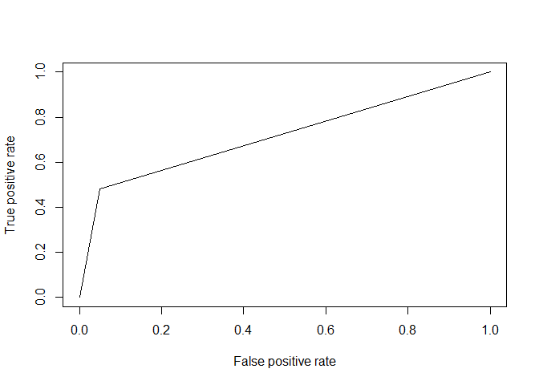

Prepare Data & Libraries and Factorize columns for analysis
-----------------------------------------------------------

``` r
## Reading from CaseStudy2-data.xlsx. The Excel file is on local
library("readxl")
library("tidyr")
library("devtools")
library("ggplot2")
suppressWarnings(suppressMessages(library("dplyr")))
library("knitr")
library("caret")
library("scales")
suppressWarnings(suppressMessages(library("purrr")))
library("grid")
suppressWarnings(suppressMessages(library("gridExtra")))
```

``` r
case_data <- data.frame(read_excel("data/CaseStudy2-data.xlsx"))

factor_cols <- c("Attrition", "BusinessTravel", "Department", "Education", "EducationField", "EnvironmentSatisfaction", "Gender", "JobInvolvement", "JobLevel", "JobRole", "JobSatisfaction", "MaritalStatus", "OverTime")
case_data[factor_cols] <- lapply(case_data[factor_cols], factor)

## Prepare attrition data

attrition_data <- case_data[which(case_data$Attrition == 'Yes'), ]
```

Univariate 1 - attrition by salary and Ratings
----------------------------------------------

``` r
uni_1_cols <- c("HourlyRate", "DailyRate", "MonthlyIncome", "MonthlyRate", "PercentSalaryHike", "StockOptionLevel", "PerformanceRating")
attrition_data[uni_1_cols] %>%
 gather() %>%     
 ggplot(aes(x = value)) +                     
 facet_wrap(~ key, scales = "free") +  
 geom_histogram(fill = "darkgreen") +
 xlab('Attrition By') + 
 ylab('Salary and Ratings')
```

    `stat_bin()` using `bins = 30`. Pick better value with `binwidth`.


<table>
<colgroup>
<col style="width: 17%" />
<col style="width: 75%" />
<col style="width: 6%" />
</colgroup>
<thead>
<tr class="header">
<th>Relevant Features</th>
<th>Initial Observation</th>
<th>Compare</th>
</tr>
</thead>
<tbody>
<tr class="odd">
<td>Monthly Income</td>
<td><strong>Less</strong> the Monthly Income, employees are <strong>far more</strong> likely to leave</td>
<td>Fig 1.1</td>
</tr>
<tr class="even">
<td>Percent Salary Hike</td>
<td>Less the Salary increase received, employes are more likely to leave</td>
<td>Fig 1.2</td>
</tr>
<tr class="odd">
<td>Performance Rating</td>
<td><strong>Lower</strong> the Performance rating received, employees are <strong>far more</strong> likely to leave</td>
<td>Fig 1.3</td>
</tr>
<tr class="even">
<td>Stock Option Level</td>
<td>Less the stock option, employees are more likely to leave</td>
<td>Fig 1.4</td>
</tr>
</tbody>
</table>

Univariate 1 - further attrition analysis
-----------------------------------------

``` r
ggplot(case_data, aes(x = MonthlyIncome, fill=Attrition)) + 
    geom_histogram(position="stack", bins=30) +
    ggtitle('Figure 1.1 Monthly Income') + 
    theme(plot.title = element_text(hjust = 0.5)) +
    xlab('Monthly Income') + 
    ylab('Attrition')
```


``` r
ggplot(case_data, aes(x = PercentSalaryHike, fill=Attrition)) + 
    geom_histogram(position="stack", bins=10) +
    ggtitle('Figure 1.2 Percent Salary Hike') + 
    theme(plot.title = element_text(hjust = 0.5)) +
    xlab('Percent Salary Hike') + 
    ylab('Attrition')
```


``` r
ggplot(case_data, aes(x = PerformanceRating, fill=Attrition)) + 
    geom_histogram(position="stack", bins=10) +
    ggtitle('Figure 1.3 Performance Rating') + 
    theme(plot.title = element_text(hjust = 0.5)) +
    xlab('Performance Rating') + 
    ylab('Attrition')
```


``` r
ggplot(case_data, aes(x = StockOptionLevel, fill=Attrition)) + 
    geom_histogram(position="stack", bins=10) +
    ggtitle('Figure 1.4 Stock Option Level') + 
    theme(plot.title = element_text(hjust = 0.5)) +
    xlab('Stock Option Level') + 
    ylab('Attrition')
```


<table>
<colgroup>
<col style="width: 21%" />
<col style="width: 79%" />
</colgroup>
<thead>
<tr class="header">
<th>Relevant Features</th>
<th>Comparison Observation</th>
</tr>
</thead>
<tbody>
<tr class="odd">
<td>Monthly Income</td>
<td>Could be the attrition factor, but <strong>not</strong> an univariate cause</td>
</tr>
<tr class="even">
<td>Percent Salary Hike</td>
<td>Not a factor</td>
</tr>
<tr class="odd">
<td>Performance Rating</td>
<td>Could be the attrition factor, but <strong>not</strong> an univariate cause</td>
</tr>
<tr class="even">
<td>Stock Option Level</td>
<td>Not a factor</td>
</tr>
</tbody>
</table>

Univariate 2 - attrition by job functions
-----------------------------------------

``` r
uni_2_cols <- c("Department", "JobRole", "BusinessTravel", "EnvironmentSatisfaction", "JobInvolvement", "JobLevel")
attrition_data[uni_2_cols] %>%
 gather() %>%     
 ggplot(aes(x = value)) +                     
 facet_wrap(~ key, scales = "free") +  
 geom_bar(fill="brown") +
 theme(axis.text.x = element_text(size  = 10, angle = 45,hjust = 1,vjust = 1))
```

    Warning: attributes are not identical across measure variables; they will
    be dropped


Univariate 3 - attrition by employee background
-----------------------------------------------

``` r
uni_3_cols <- c("Education", "EducationField", "NumCompaniesWorked")
unit3_p1 <- attrition_data[uni_3_cols] %>%
 gather() %>%     
 ggplot(aes(x = value)) +                     
 facet_wrap(~ key, scales = "free") +  
 geom_bar(fill="purple") +
 theme(axis.text.x = element_text(size  = 10, angle = 45,hjust = 1,vjust = 1))
```

    Warning: attributes are not identical across measure variables; they will
    be dropped

``` r
uni_3b_cols <- c("Age", "TotalWorkingYears", "YearsAtCompany")
unit3_p2 <- attrition_data[uni_3b_cols] %>%
 gather() %>%     
 ggplot(aes(x = value)) +                     
 facet_wrap(~ key, scales = "free") +  
 geom_histogram(fill = "purple", binwidth=1)

unit3_ps <- list(unit3_p1, unit3_p2)
multiplot(unit3_ps, cols=3)
```

\[\[1\]\]

\[\[2\]\]


Univariate 4 - attrition by stress factors
------------------------------------------

``` r
uni_4_cols <- c("WorkLifeBalance", "RelationshipSatisfaction", "OverTime", "TrainingTimesLastYear")
unit4_p1 <- attrition_data[uni_4_cols] %>%
 gather() %>%     
 ggplot(aes(x = value)) +                     
 facet_wrap(~ key, scales = "free") +  
 geom_bar(fill="blue") +
 theme(axis.text.x = element_text(size  = 10, angle = 45,hjust = 1,vjust = 1))
```

    Warning: attributes are not identical across measure variables; they will
    be dropped

``` r
unit4_p2 <- ggplot(data = attrition_data) + geom_histogram(aes(x = DistanceFromHome), fill = "blue", binwidth=1)
unit4_ps <- list(unit4_p1, unit4_p2)
multiplot(unit4_ps, cols=3)
```

\[\[1\]\]

\[\[2\]\]


Quick glance at attrition data by department
--------------------------------------------

``` r
att_by_dept_tbl <- case_data %>% select(Attrition, Department) %>% group_by(Department) %>% arrange(Department) %>% table()

knitr::kable(att_by_dept_tbl)
```

|     |  Human Resources|  Research & Development|  Sales|
|-----|----------------:|-----------------------:|------:|
| No  |               51|                     828|    354|
| Yes |               12|                     133|     92|

Univariate 1 - attrition by department
--------------------------------------

``` r
att_by_dept <- data.frame(att_by_dept_tbl)
ggplot(att_by_dept, aes(x = reorder(Department, -Freq), y=Freq, fill=Attrition)) + 
    geom_bar(stat = "identity") + 
    ggtitle('Attrition by Department') + 
    theme(plot.title = element_text(hjust = 0.5)) +
    xlab('Department') + 
    ylab('Attrition')
```


Univariate 2 - attrition with Age and Years at Company
------------------------------------------------------

``` r
featurePlot(x = case_data[, c('Age', 'YearsAtCompany')], y = case_data$Attrition, plot = "density", auto.key = list(columns = 2))
```


Univariate 3 - attrition by job role
------------------------------------

``` r
ggplot(case_data, aes(x = JobRole, fill = Attrition)) +
  stat_count(width = 0.5) +
  xlab("Job Role") +
  ylab("Count") +
  labs(fill = "Attrition") +
  coord_flip()
```


``` r
ggplot(case_data, aes(x = JobRole)) + 
  geom_bar(aes(fill = Attrition), position = 'fill') + 
  scale_y_continuous(labels = percent_format()) +
  ylab("Percentage") +
  coord_flip()
```


Univariate 4 - attrition by education field
-------------------------------------------

``` r
ggplot(case_data, aes(x = EducationField, ..count..)) +
  geom_bar(aes(fill = Attrition), position="fill") +
  theme(axis.text.x = element_text(size  = 10, angle = 45,hjust = 1,vjust = 1))
```



Summary
-------

``` r
## Summary section
```
